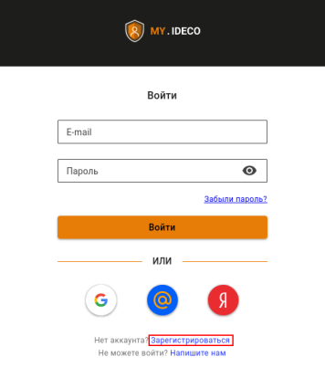
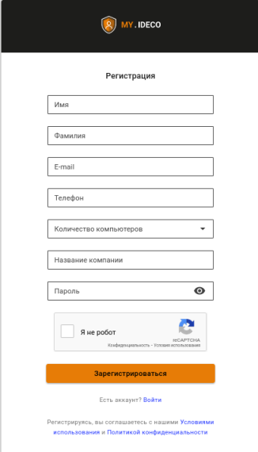

# Личный кабинет my.ideco



Личный кабинет my.ideco.ru позволяет пользователю получить информацию:

* об имеющихся лицензиях;
* о сроке окончания подписки на обновления модулей и технической поддержки.



## Регистрация на my.ideco

Перед загрузкой образа системы зарегистрируйтесь на [my.ideco.ru](https://my.ideco.ru/):

1\. Зайдите на [my.ideco.ru](https://my.ideco.ru/) и нажмите **Зарегистрироваться**:

2\. Укажите свои личные данные и данные компании:

3\. Подтвердите электронную почту, следуя инструкциям в письме.



Адрес электронной почты используется в качестве логина на **my.ideco.ru** и для восстановления пароля.



## Загрузка образа Ideco NGFW 

Перед установкой на устройство скачайте образ системы с [my.ideco.ru](https://my.ideco.ru/):

1\. Перейдите в раздел **NGFW** на вкладку **Скачать**.

2\. Найдите образ Ideco NGFW и нажмите **Скачать**.

Для установки на устройство следуйте шагам в [статье](../../ngfw/installation/preparation-install.md).
