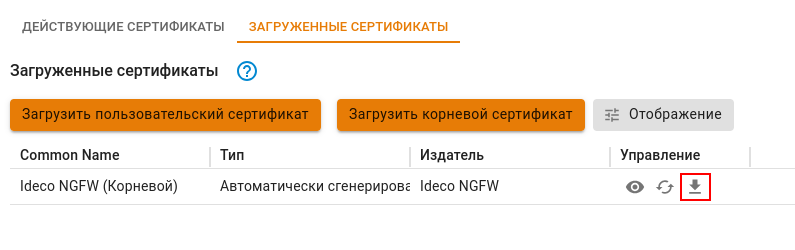
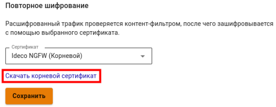
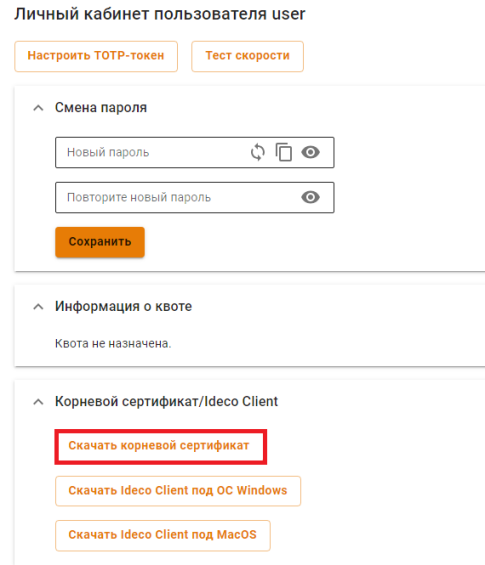
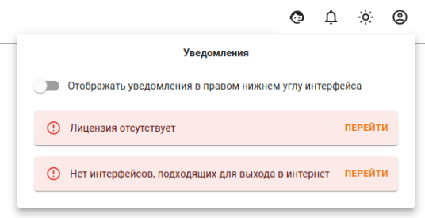
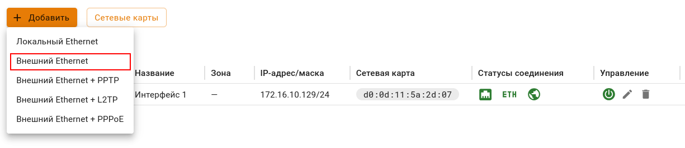

# Первоначальная настройка



Для [получения доступа в интернет](../../ngfw/installation/get-internet.md) через Ideco NGFW необходимо создать учетную запись (администратора/пользователя) и настроить авторизацию. В противном случае доступ в интернет для устройства с установленным Ideco NGFW будет заблокирован.



## Подключение к веб-интерфейсу Ideco NGFW

1\. Запустите на любом компьютере в локальной сети поддерживаемый интернет-браузер (современные версии браузеров Firefox, Chrome и браузеров, основанных на Chromium).

2\. Введите в адресной строке IP-адрес, указанный при настройке локального интерфейса, и порт 8443.\
   **Пример:** `192.168.100.2:8443`

3\. Введите логин и пароль от учетной записи, созданной при установке NGFW.

## Импорт корневого сертификата NGFW в браузер

Для устранения предупреждения в браузере при входе в веб-интерфейс импортируйте корневой сертификат NGFW или добавьте в доверенные корневые центры сертификации устройства, скачав сертификат одним из способов:

{#top}



В разделе **Сервисы -> Сертификаты -> Загруженные сертификаты** нажмите на стрелку для скачивания:



{#top}



В разделе **Правила трафика -> Контент-фильтр -> Настройки** нажмите **Скачать корневой сертификат**:



{#top}



В личном кабинете Ideco NGFW под учетной записью одного из пользователей перейдите на вкладку **Корневой сертификат/Ideco Client** и нажмите **Скачать корневой сертификат**:

Для публикации личного кабинета пользователя воспользуйтесь [статьей](../../ngfw/settings/services/user-personal-account.md).



После первого входа в веб-интерфейс появится уведомления, которые помогут настроить подключение к провайдеру и зарегистрировать сервер для корректной работы Ideco NGFW:

## Настройка **Ethernet-подключения**



При создании, редактировании или удалении сетевого интерфейса перевыпускается [SSL-сертификат](../../ngfw/settings/services/certificates/README.md), поэтому вероятно снижение скорости работы веб-интерфейса Ideco NGFW. В этом случае рекомендуем нажать F5.



Этот тип подключения требует настройки параметров, описанных ниже в таблице.

<table><thead><tr><th width="176">Параметр</th><th>Примечание</th></tr></thead><tbody><tr><td>Сетевая карта</td><td>Укажите сетевой адаптер, который будет использоваться для подключения к интернет-провайдеру. Для идентификации адаптера ориентируйтесь на наименование производителя или MAC-адрес</td></tr><tr><td>IP-адрес и маска</td><td>Укажите сетевые реквизиты, которые были назначены провайдером. Укажите IP-адрес и сетевую маску в формате CIDR или четырех октетов</td></tr><tr><td>Шлюз по умолчанию</td><td>Укажите IP-адрес шлюза интернет-провайдера, через который будет осуществляться подключение к сети интернет</td></tr></tbody></table>

Для настройки Ethernet-подключения выполните:

1\. Перейдите в раздел **Сервисы -> Сетевые интерфейсы**.

2\. Нажмите **Добавить** и выберите пункт **Внешний Ethernet**.



**Будьте внимательны!**

При выборе пункта **Локальный Ethernet** и заполнении поля **Шлюз** доступ в интернет будет отсутствовать. Шлюз указывается для маршрутизации внутри локальной сети или в режиме прямого прокси.



3\. Выберите подходящую сетевую карту.

4\. Заполните необходимые поля и нажмите **Добавить**.



Включите опцию _Автоматическая конфигурация через DHCP_ если провайдер поддерживает автоматическое конфигурирование внешнего сетевого интерфейса с помощью протокола DHCP.



### Настройка других типов подключений

Если провайдер использует другой тип подключения, ознакомиться с остальными инструкциями по настройке можно по ссылкам:

* [Подключение по протоколу PPPoE](../../ngfw/settings/services/connection-to-provider/pppoe-connection.md);
* [Подключение по технологии VPN (с использованием протокола PPTP)](../../ngfw/settings/services/connection-to-provider/pptp-connection.md);
* [Подключение по L2TP](../../ngfw/settings/services/connection-to-provider/l2tp-connection.md);
* [Подключение Локального Ethernet](../../ngfw/settings/services/connection-to-provider/local-ethernet.md);
* [Подключение по 3G и 4G](../../ngfw/settings/services/connection-to-provider/3g-4g-connection.md);
* [Одновременное подключение к нескольким провайдерам](../../ngfw/settings/services/multiple-simultaneous-connections.md).
