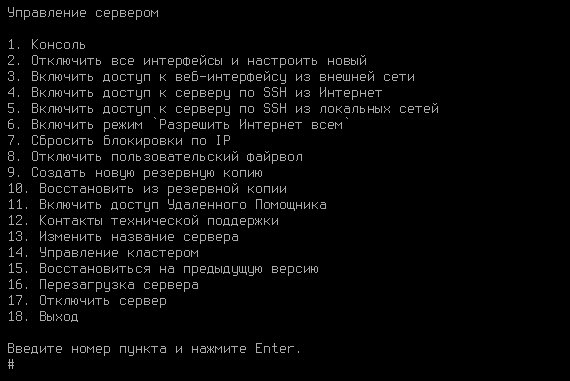

# Установка

## Процесс установки



При установке Ideco UTM с загрузочного USB диска выберите загрузку с USB диска в настройках UEFI компьютера.



{% embed url="https://www.youtube.com/watch?ab_channel=%D0%90%D0%B9%D0%B4%D0%B5%D0%BA%D0%BE&index=25&list=PLQJTQf4Vb3wD2bhYMhsdbgMXk4PnSfY10&v=sy_ANcdgrxk

Для установки Ideco UTM выполните действия:

1\. Перейдите к установке, нажав **Install Ideco UTM**.

2\. Выберите диск и ознакомьтесь с **предупреждением об уничтожении данных на диске**:

3\. Выберите временную зону, в которой вы находитесь:

4\. Настройте дату и время в соответствии с вашей временной зоной. **Обязательно проверьте правильность даты и времени**:



Не забудьте извлечь USB диск после установки Ideco UTM, чтобы загрузка с USB диска не началась заново.



## Создание учетной записи администратора

Для входа в веб-интерфейс (после уведомления "*Создание аккаунта администратора*"), создайте учетную запись администратора с соблюдением требований к паролю:

{#top}



* **Минимальная длина пароля** - 12 символов;
* **Cодержит только строчные и заглавные латинские буквы**;
* **Содержит цифры**;
* **Содержит специальные символы** (! # $ % & ' \* + и другие).





Если пароль не соответствует требованиям политики безопасности, то появится надпись с информацией, что пароль ненадежен. Потребуется ввести новый пароль с учетом требований к нему.

Не используйте Numpad при введении пароля, поскольку в будущем это может привести к проблемам при авторизации администратора.



## Настройка второй ноды кластера

1\. Введите **y** для начала настройки UTM как второй ноды кластера:

2\. Для продолжения настройки воспользуйтесь статьей [Кластеризация](../settings/server-management/cluster.md).

## Настройка локального интерфейса



При использовании сетевых карт одного производителя могут возникнуть трудности при идентификации сетевой карты для настройки сетевого интерфейса. Для корректной идентификации сетевой карты используйте ее MAC-адрес.



Для настройки Ideco UTM через веб-интерфейс нужно настроить локальный интерфейс в локальном меню шлюза:

1\. Введите номер сетевого адаптера под локальный интерфейс:

2\. Настройте локальную сеть автоматически через DHCP введя **y** или настройте вручную, введя **n**:

3\. Введите локальный IP-адрес и маску подсети в формате `ip/маска` и нажмите **Enter**:

4\. Введите адрес шлюза или оставьте пустым:

*   пустым - при настройке Ideco UTM в качестве **шлюза**:

    
*   введите шлюз с доступом в интернет - при настройке Ideco UTM в качестве **прокси**:

    

5\. Задайте тег VLAN (стандарт VLAN 802.3q) или оставьте поле пустым:

После создания локального интерфейса откроется локальное меню управления сервером:



Если в Ideco UTM настроен кластер, то в локальном меню будут отсутствовать пункты _Восстановиться на предыдущую версию_ и _Создание кластера_.



