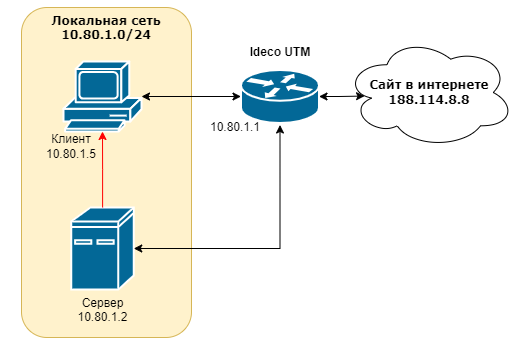
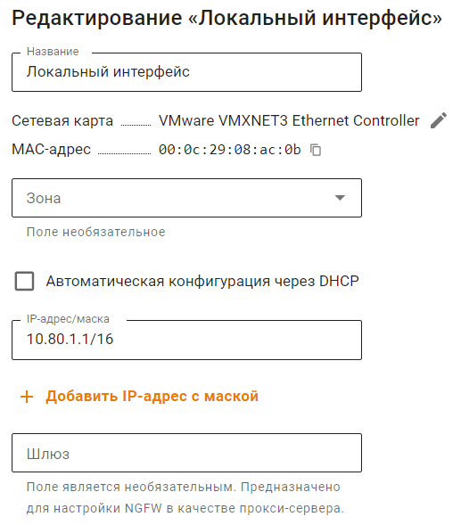
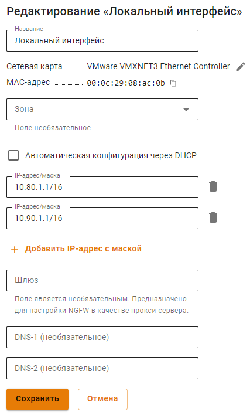
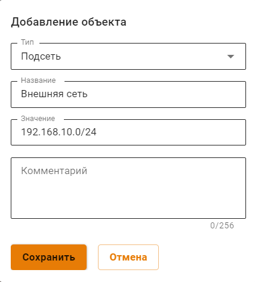
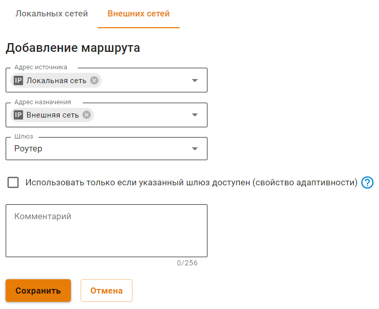
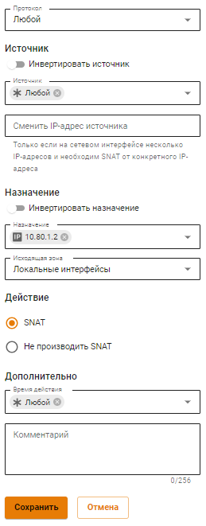

# Как избавиться от асимметричной маршрутизации трафика

При попытке настроить доступ в удаленные сети через роутер в локальной сети может возникнуть асимметричная маршрутизация, препятствующая прохождению пакетов между двумя локальными сетями. В этой статье описаны случаи возникновения асимметричной маршрутизации и способы предотвращения.

**Пример**. В локальной сети UTM используется роутер, устанавливающий связь с другими сетями. UTM - шлюз по умолчанию для клиентов сети. Требуется настроить маршрутизацию на UTM так, чтобы клиенты сети `10.80.1.0/24` получали доступ в удаленную сеть `192.168.10.0/24` и обратно через роутер.

## Асимметричная маршрутизация при наличии роутера в локальной сети

Неправильная топология сети, способствующая асимметричной маршрутизации:

 
* **`10.80.1.1`** - шлюз для локальной сети `10.80.1.0/24`;
* **`10.80.1.2`** - роутер, имеющий доступ в удаленную сеть `192.168.10.0/24`;
* **`10.80.1.5`** - адрес хоста в локальной сети;
* **Красные стрелки** - двусторонняя связь роутера с удаленным шлюзом или роутером, обеспечивающая доступ к удаленной сети `192.168.10.0/24` (туннель к шлюзу, маршрут до роутера в соседнюю сеть предприятия);
* **Черные стрелки** - трафик от хостов локальной сети `10.80.1.0/24` до удаленной сети `192.168.10.0/24` через шлюз UTM (`10.80.1.1`) и роутер (`10.80.1.2`);
* **Пунктирная стрелка** - трафик, который роутер возвращает хостам локальной сети в обход UTM, поэтому хосты этот трафик обратно не принимают.



Часть трафика от клиентов до роутера идет через шлюз, а часть - непосредственно от роутера до абонентов сети. Разная маршрутизация на разных участках делает прохождение пакетов между двумя локальными сетями невозможной.



## Асимметричная маршрутизация при публикации сайтов через DNAT

Асимметричная маршрутизация также возникает, когда в одной локальной сети находится хост и сервер, на котором расположен опубликованный при помощи DNAT-правила ресурс:

* **`10.80.1.1`** - адрес Ideco UTM в локальной сети;
* **`10.80.1.2`** - адрес сервера в локальной сети;
* **`10.80.1.5`** - адрес хоста в локальной сети;
* **`188.114.8.8`** - адрес сайта в интернете;
* **Красная стрелка** - ответ напрямую от сервера хосту в локальной сети.

Когда хост `10.80.1.5` обращается на сайт по внешнему адресу `188.114.8.8` (например, в случае обращения по доменному имени, которое разрешено во внешнем IP), трафик проходит через UTM. На UTM срабатывает правило DNAT и перенаправляет трафик на сервер `10.80.1.2`, а сервер отвечает хосту, минуя UTM.

## Правильная топология сети:

Для правильной работы схемы нужно: 

1\. Вынести роутер в отдельную локальную сеть (DMZ `10.90.1.0/24`), чтобы избежать асимметричной маршрутизации между роутером и клиентами локальной сети:

2\. Настроить DMZ на UTM, добавив на локальный интерфейс UTM еще один IP-адрес (`10.90.1.0/24`), к локальной сети которого подключен роутер. 

3\. На роутере настроить IP-адрес из адресного пространства новой сети `10.90.1.2`. Шлюзом указать дополнительный IP-адрес, настроенный на локальном интерфейсе UTM из этой сети `10.90.1.1`.

Физически роутер и клиенты локальной сети будут находиться в одном сегменте сети, имея при этом разную IP-адресацию и шлюзы. Как правило, схемы с виртуальной изоляцией сетей на основе одного физического интерфейса достаточно.



Для физической изоляции локальной сети клиентов UTM и роутера: 

* Подключите к Ideco UTM дополнительную сетевую карту;
* Настройте на сетевой карте дополнительный локальный интерфейс и отдельную IP-адресацию в этой сети;
* Укажите в качестве шлюза для роутера адрес, настроенный на дополнительном локальном интерфейсе.

Физически роутер будет находиться в сегменте дополнительной сетевой карты.



{#top}



Для настройки нескольких виртуальных локальных сетей на одном физическом локальном интерфейсе UTM перейдите в раздел **Сервисы -> Сетевые интерфейсы** и выполните действия:

1\. Откройте в режиме редактирования **Локальный интерфейс**, к которому подключены пользователи нужной вам локальной сети (`10.80.1.1/24`), нажав на  напротив его названия.

2\. Если IP-адрес вашей локальной сети был автоматически сконфигурирован через DHCP, снимите галку и введите его вручную:

3\. Нажмите на  и введите IP-адрес DMZ для изоляции роутера:

4\. Нажмите **Сохранить**.

После изоляции роутера в DMZ нужно указать маршрут на UTM до удаленной сети. Для этого перейдите в **Сервисы -> Маршрутизация** и выполните действия:

1\. Перейдите на вкладку **Внешних сетей** нажмите кнопку **Добавить**.

2\. В поле **Адрес источника** нажмите **Добавить объект**, выберите тип **Подсеть** и введите адрес вашей локальной сети (`10.80.1.0/24`):

Выберите в качестве источника только что созданный объект.

3\. В поле **Адрес назначения** нажмите **Добавить объект**, выберите тип **Подсеть** и введите адрес внешней сети (`192.168.10.0/24`), в которую нужно настроить доступ:

Выберите в качестве назначения только что созданный объект.

4\. В поле **Шлюз** нажмите **Добавить объект**, выберите тип **IP-адрес** и введите адрес роутера в DMZ (`10.90.1.2`):

5\. Сохраните маршрут вида:

Теперь трафик между сетями UTM (`10.80.1.0/24` и `192.168.10.0/24`) во всех направлениях будет направляться через UTM и роутер.



{#top}



Хосты сетей, которые теперь обслуживает UTM (`10.80.1.0/24` и `10.90.1.0/24`), физически включены в один Ethernet-сегмент. Чтобы шлюзом и DNS-сервером для хостов этих сетей был соответствующий адрес на локальном интерфейсе UTM, укажите:

1\. Для хостов из подсети `10.80.1.0/24` значение шлюза и DNS-сервера - `10.80.1.1`.

2\. Для хостов из подсети `10.90.1.0/24` значение шлюза и DNS-сервера - `10.90.1.1`.





Если по какой-то причине изолировать сервер в DMZ невозможно, создайте на UTM специальное SNAT-правило.



{#top}



Чтобы сервер `10.80.1.2` не отвечал напрямую на `10.80.1.5`, а посылал ответ на UTM `10.80.1.1`, нужно в разделе **Правила трафика -> Файрвол -> SNAT** создать правило вида:

Заполните поля:

* Адрес назначения - `10.80.1.2`;
* Исходящая зона - Локальные интерфейсы.
  
В этом случае трафик хоста `10.80.1.5` на внешний адрес сайта `188.114.8.8` будет перенаправлен на адрес сервера `10.80.1.2` правилом DNAT. При этом созданное правило SNAT заменит адрес источника `10.80.1.5` на адрес UTM - пакет приобретет вид: `scr 10.80.1.1 dst 10.80.1.2`. Ответ от сервера также пройдет через UTM - пакет `scr 10.80.1.2 dst 10.80.1.1`.



