# Блокировка популярных ресурсов

{#top}



**Ammyy Admin** - это система, удаленного доступа и администрирования. Чтобы заблокировать систему, выполните следующие настройки:

1\. Откройте раздел **Правила трафика -> Объекты** и создайте объект типа **Домен** с доменным именем rl.ammyy.com:

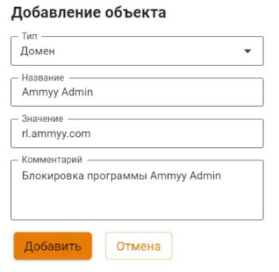

2\. Перейдите на вкладку **Правила трафика -> Файрвол -> FORWARD**, создайте и включите правило запрета для нужных пользователей или групп. В поле **Назначение** выберите объект, созданный в пункте 1:

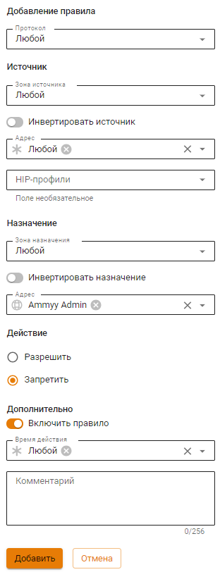



{#top}



**TeamViewer** - это программное обеспечение для удаленного доступа и управления компьютерами. Его можно заблокировать с помощью [Контроля приложений](../../../ngfw/settings/security-profiles/application-control/README.md).

1\. Перейдите в раздел **Профили безопасности -> Контроль приложений**. Создайте новый профиль для TeamViewer с действием **Запретить**:

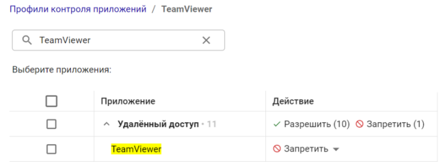

2\. В разделе **Правила трафика -> Файрвол** добавьте и включите разрешающее правило с профилем, созданным в пункте 1.



{#top}



Заблокировать анонимайзеры можно в разделе **Правила трафика** тремя способами:

1\. Анонимайзеры, работающие по протоколам HTTP(S), блокируются в разделе **Правила трафика -> [Контент-фильтр](../../../ngfw/settings/access-rules/content-filter/)**. Для этого создайте правило, в котором запретите категорию сайтов **Анонимайзеры**:

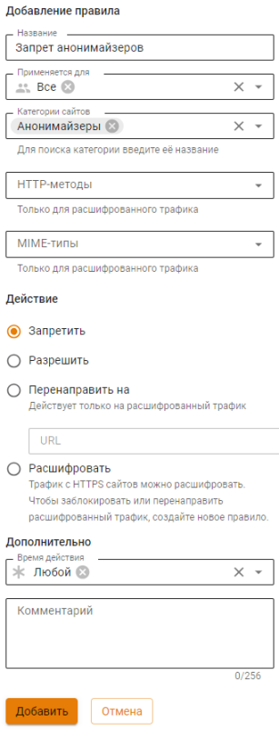

2\. Чтобы предотвратить обход **Контент-фильтра**, создайте правило, которое будет блокировать прямые обращения по IP-адресам в Контент-фильтре:

3\. Для блокировки VPN-анонимайзеров, использующих протокол PPTP, достаточно заблокировать протокол GRE в правилах **[Файрвола](../../../ngfw/settings/access-rules/firewall.md)**:

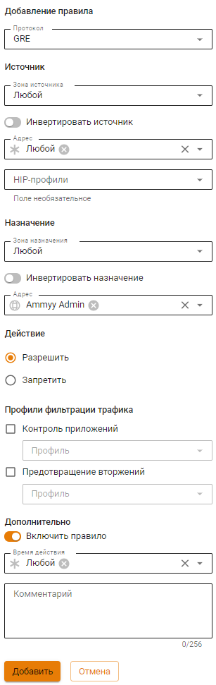



{#top}



Чтобы заблокировать функции браузеров, которые используются для обхода контентной фильтрации, воспользуйтесь модулем [Предотвращение вторжений](../../../ngfw/settings/access-rules/ips/README.md).

1\. Перейдите в раздел **Профили безопасности -> Предотвращение вторжений**. Создайте новый профиль.

2\. Нажмите **Добавить сигнатуру** и создайте правило, блокирующее группу сигнатур **Анонимайзеры**:

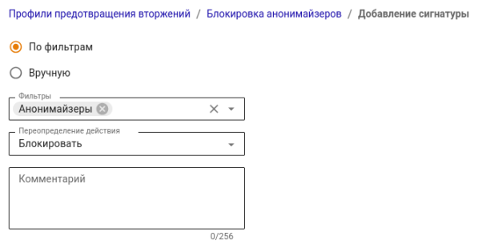

3\. Нажмите **Добавить**.

4\. В разделе **Правила трафика -> Файрвол** добавьте и включите разрешающее правило с профилем, созданным ранее.



{#top}



**Tor** - специально разработанное программное обеспечение и среда прокси-серверов, предназначенная для обхода различного рода блокировок, поэтому полностью заблокировать его сейчас невозможно.

Для противодействия использованию сети Tor, а также для журналирования попыток подключения к ней и ее использования выполните следующие настройки:

1\. В разделе **Профили безопасности -> [Предотвращение вторжений](../../../ngfw/settings/security-profiles/ips-profiles/README.md)** создайте профиль.

2\. Нажмите **Добавить сигнатуру** и создайте правило для группы сигнатур **Блокирование атак**:

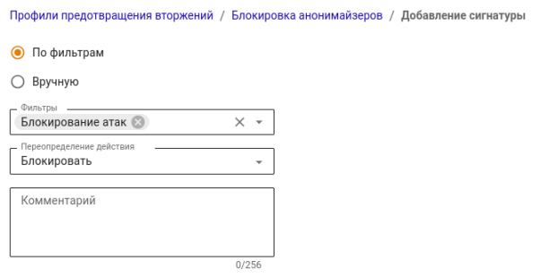

3\. В разделе **Профили безопасности -> [Контроль приложений](../../../ngfw/settings/security-profiles/application-control/README.md)** добавьте профиль, запрещающий приложение Tor:

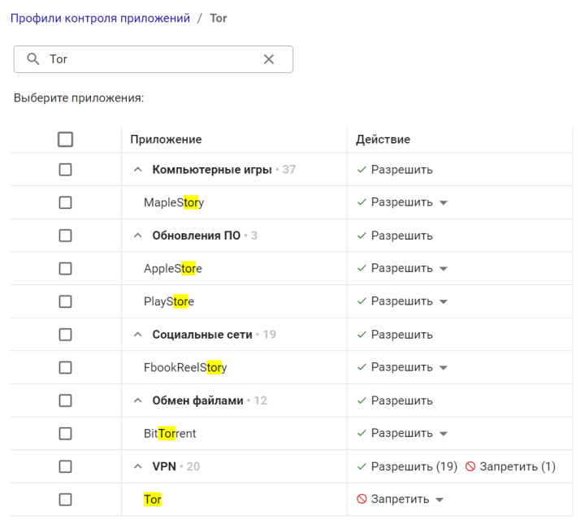

4\. В разделе **Правила трафика -> Файрвол** добавьте и включите разрешающее правило с профилями **Предотвращения вторжений** и **Контроля приложений**, созданными ранее.



{#top}



**BitTorrent** - P2P-протокол, предназначенный для обмена файлами через интернет.

Для ограничения возможности использования торрентов выполните следующие настройки:

1\. Запретите протокол BitTorrent с помощью правила в разделе **Профили безопасности -> [Контроль приложений](../../../ngfw/settings/security-profiles/application-control/README.md)**:

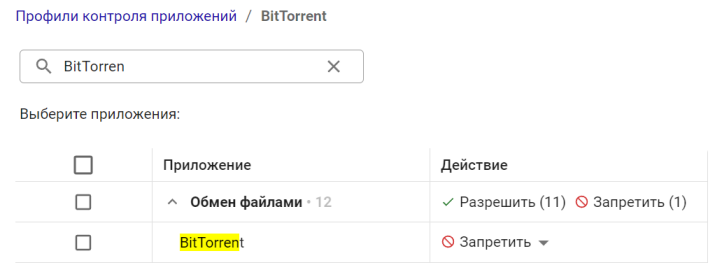

2\. В разделе **Правила трафика -> Файрвол** добавьте и включите разрешающее правило с профилем, созданным в пункте 1.

3\. Разрешите нужные TCP и UDP порты пользователям. Затем создайте и включите в разделе **Правила трафика -> Файрвол -> FORWARD** правило, которое запрещает все протоколы (правила действуют сверху вниз).

4\. В разделе [Контент-фильтр](../../../ngfw/settings/access-rules/content-filter/) заблокируйте доступ к сайтам-каталогам и торрент-файлам. Для этого запретите категории **Торрент-трекеры** и **Torrent-файлы**:

5\. В разделе **Профили безопасности -> [Предотвращение вторжений](../../../ngfw/settings/security-profiles/ips-profiles/README.md)** создайте профиль, блокирующий группу сигнатур **Запросы на скомпрометированные ресурсы**, которая позволяет блокировать активность P2P-программ:

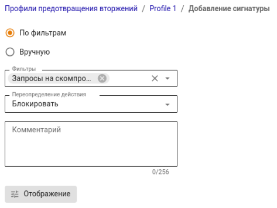



{#top}



**Telegram** - облачный мессенджер для мобильных устройств и компьютеров (приложение и веб-версия).

Telegram не блокируется **Контролем приложений**, если в приложении настроить опцию **Использовать собственный прокси** в разделе **Настройки -> Продвинутые настройки -> Тип соединения**:

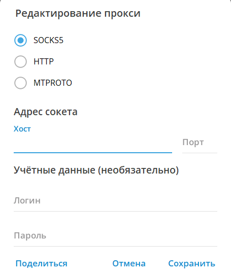

При необходимости рекомендуем блокировать доступ к приложению Telegram на рабочих станциях: запрещать установку и запуск приложения политиками безопасности или антивирусом.

Веб-версию Telegram можно заблокировать с помощью **[Контент-фильтра](../../../ngfw/settings/access-rules/content-filter/rules.md)**. Для этого выполните следующие действия:

1\. Создайте пользовательскую категорию, включающую значение `web.telegram.org`, или отредактируйте уже существующую:

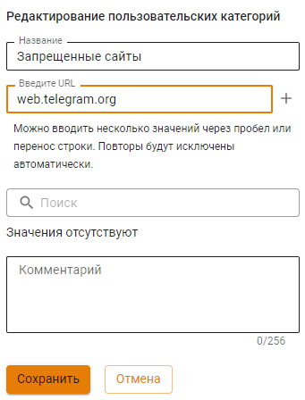

2\. Укажите созданную или отредактированную пользовательскую категорию при добавлении правила **Контент-фильтра** с действием **Запретить**:

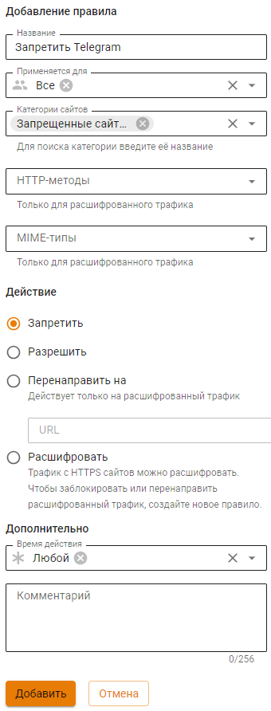



