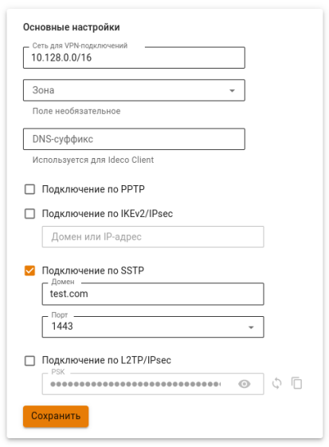

# Инструкция по созданию подключения в Mac OS



Перед настройкой VPN-подключения перейдите в раздел **Пользователи -> VPN-подключения -> Доступ по VPN** и создайте разрешающее VPN-подключение правило.





Не рекомендуем использовать для VPN-подключений кириллические логины.





При проблемах с подключением на IOS требуется:

1\. Проверить, что в качестве VPN-сервера указано его доменное имя в разделе **Пользователи -> VPN-подключения**.

2\. Проверить, что на доменное имя VPN-сервера выдан сертификат Let's Encrypt.



{#top}



Для настройки Ideco NGFW перейдите в раздел **Пользователи -> VPN-подключение -> Основное** и установите флаг **Подключение по PPPoE**:


**Создание подключения в MacOS**

1\. Перейдите в раздел **Системные настройки -> Сеть**;

2\. Нажмите **Добавить** в левом нижнем углу (иконка );

3\. В появившемся окне заполните:

* **Интерфейс** - PPPoE;
* **Ethernet** - например, Wi-Fi;
* **Имя службы** - имя подключения.


4\. Нажмите **Создать** и заполните:

* **Имя службы PPPoE** - имя службы;
* **Имя учетной записи** - логин;
* **Пароль** - пароль.


5\. Нажмите **Подключить**.



{#top}



**Настройка Ideco NGFW:**

1\. Перейдите в раздел **Пользователи -> VPN-подключение -> Основное**.

2\. Установите флаг **Подключение по IKEv2/IPsec** и заполните поля **Домен**:


3\. Скачайте корневой сертификат Ideco NGFW в разделе **Сервисы -> Сертификаты -> Загруженные сертификаты** в веб-интерфейсе NGFW или в личном кабинете пользователя по кнопке **Скачать корневой сертификат**.

Корневой сертификат потребуется для настройки подключения рабочей станции пользователя, если не был получен корневой сертификат через Let\`s Encrypt. При необходимости перенесите файл сертификата на рабочую станцию.\
Если для VPN-подключения используется сертификат, выданный Let\`s Encrypt, то установка корневого сертификата на устройство не требуется.

**Создание подключения в MacOS:**

1\. Перейдите в раздел **Системные настройки -> Сеть**.

2\. Нажмите **Добавить** в левом нижнем углу (иконка ).

3\. Заполните поля:

* **Интерфейс** - VPN;
* **Тип VPN** - IKEv2;
* **Имя службы** - имя подключения.


4\. Нажмите **Создать**;

5\. Установите параметры подключения:

* **Адрес сервера** - адрес VPN-сервера;
* **Удаленный ID** - продублируйте адрес VPN-сервера.


6\. Выберите **Настройки аутентификации**.

7\. Укажите идентификационные данные и нажмите **OK**:

* **Имя пользователя** - имя пользователя, которому разрешено подключение по VPN;
* **Пароль** - пароль пользователя.


8\. Нажмите **ОК**.

9\. Поставьте флаг в пункте **Показывать статус VPN в строке меню**, нажмите **Применить**  и включите соединение.



{#top}



**Настройка Ideco NGFW:**

1\. Перейдите в раздел **Пользователи -> VPN-подключения -> Основное**.

2\. Установите флаг **Подключение по SSTP** и заполните поля **Домен** и **Порт**:



3\. Скачайте корневой сертификат Ideco NGFW в разделе **Сервисы -> Сертификаты -> Загруженные сертификаты** в веб-интерфейсе NGFW или в личном кабинете пользователя по кнопке **Скачать корневой сертификат**.

Корневой сертификат потребуется для настройки подключения рабочей станции пользователя, если не был получен корневой сертификат через Let\`s Encrypt. При необходимости перенесите файл сертификата на рабочую станцию.\
Если для VPN-подключения используется сертификат, выданный Let\`s Encrypt, то установка корневого сертификата на устройство не требуется.

**Создание подключения в MacOS:**

1\. Откройте терминал и установите `sstp-client`, выполнив команды:

```
brew update
brew install sstp-client
```

2\. Создайте и включите SSTP-подключение командой:

```
sudo /usr/local/sbin/sstpc --cert-warn --tls-ext --user <логин пользователя Ideco NGFW> --password <Пароль пользователя Ideco NGFW> <домен:порт> usepeerdns require-mschap-v2 noauth noipdefault noccp refuse-eap refuse-pap refuse-mschap defaultroute
```

* Если указан параметр `defaultroute`, в VPN-туннель будет заворачиваться весь трафик. 
* Чтобы через VPN-туннель проходил только трафик до определенных сетей, используйте параметр `nodefaultroute` и добавьте маршруты в таблицу машрутизации вкручную, например: `sudo route add -net "172.16.0.0/12" -interface ppp0`.

3\. Для проверки подключения откройте новую вкладку или окно терминала и введите команду `ifconfig -a`. Если в выводе присутствует строка вида `ppp0: flags=8051 mtu 1500 inet 10.128.0.0 –> 10.128.0.1 netmask 0xff000000`, подключение установлено.

4\. Чтобы отключить соединение, перейдите в терминал, из которого оно было установлено, и нажмите **Ctrl+C**.



{#top}



**Важно:** L2TP IPsec-клиенты, находящиеся за одним NAT'ом, могут испытывать проблемы подключения, если их более одного. Рекомендуем вместо L2TP IPsec использовать IKEv2 IPsec.

**Настройка Ideco NGFW:**

1\. Перейдите в раздел **Пользователи -> VPN-подключение -> Основное**.

2\. Установите флаг **Подключение по L2TP/IPsec** и скопируйте **PSK**-ключ:


**Создание подключения в MacOS:**

1\. Перейдите в раздел **Системные настройки -> Сеть** и нажмите **Добавить** в левом нижнем углу.


2\. В появившемся окне заполните:

* **Интерфейс** - VPN;
* **Тип VPN** - L2TP через IPsec;
* **Имя службы** - имя подключения.


3\. Нажмите **Создать**.

4\. Заполните **Адрес сервера** и **Имя учетной записи**:


5\. Поставьте флаг на пункте **Показывать статус VPN в строке меню** и выберите **Настройки аутентификации**.

6\. В **Аутентификации пользователя** заполните **Пароль**, в **Аутентификации компьютера** - **Общий ключ (Shared Secret)**:


7\. Нажмите **ОК -> Применить** и включите соединение.



