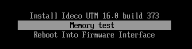
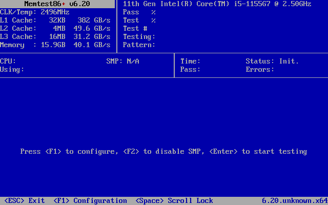
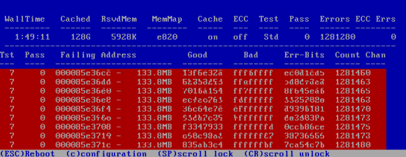

# Тестирование оперативной памяти сервера

Для корректной работы сервера требуется, чтобы все его аппаратные составляюшие работали исправно.
Тестирование памяти позволяет исключить из рассмотрения часть возможных проблем с памятью сервера при поиске неисправностей.

При загрузке GRUB для тестирования оперативной памяти используйте Memtest86+.
Для запуска тестирования памяти выполните действия:

1\. При загрузке сервера выберите **Memory test**:
   

2\. Для начала тестов нажмите **Enter** или подождите 5 секунд до автоматического запуска тестирования:



Для выбора режима диагностики **Fail-Safe Mode** нажмите **F1**.\
Для выбора режима диагностики **Multi-Threading(SMP)** нажмите **F2**.



* Если появится запись **PASS**, тесты памяти пройдены успешно:

    

* При ошибке памяти появится запись вида:
    
    
