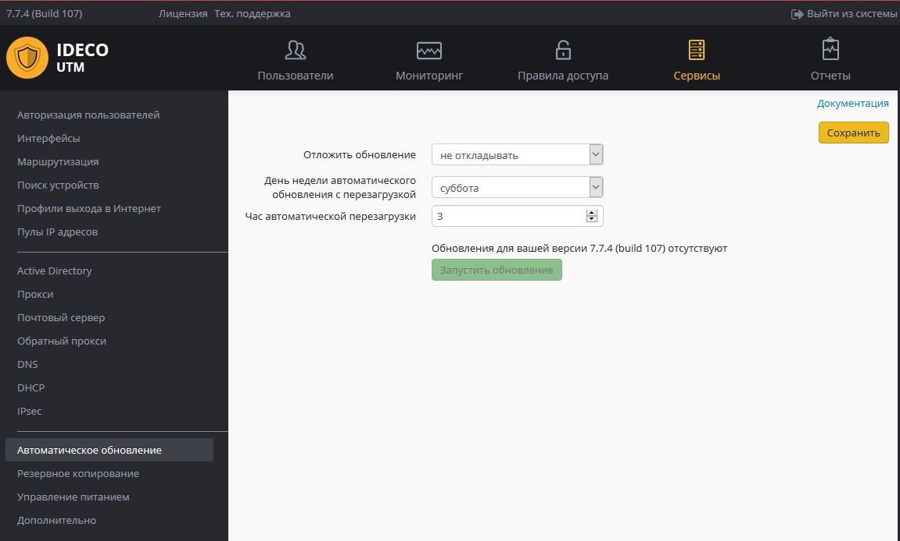
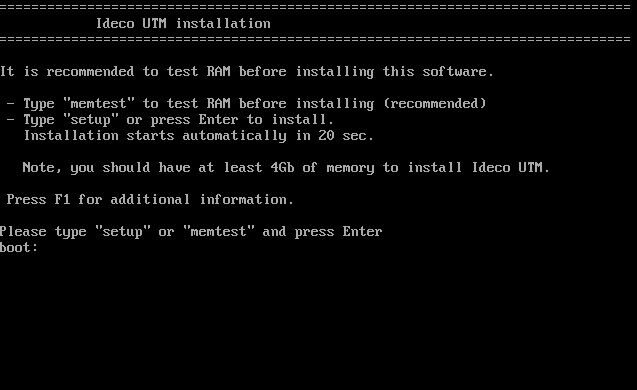
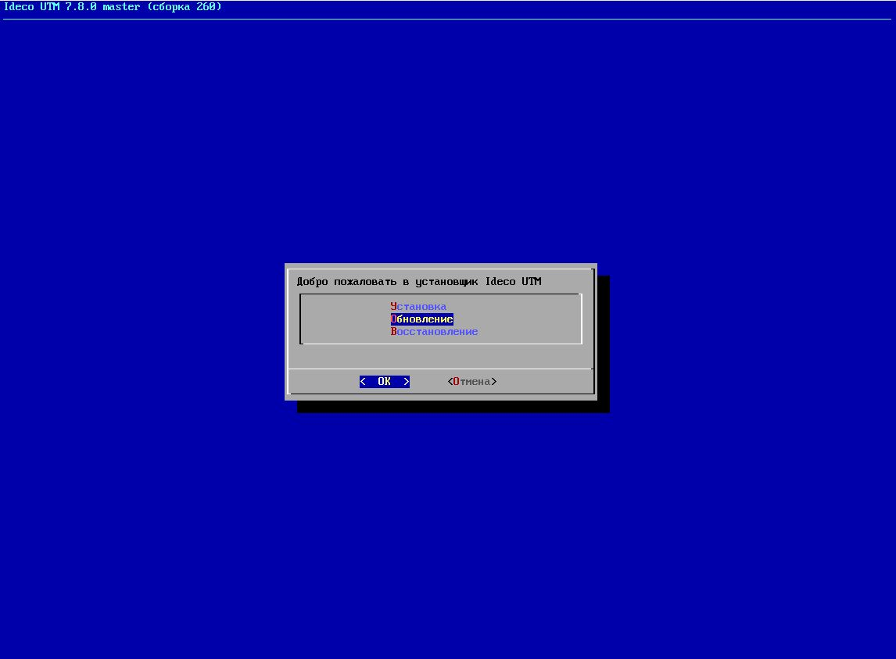
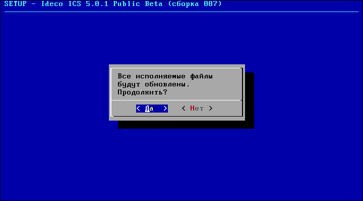

# Обновление сервера



Обновление с версий 6.х и более ранних, до актуальной версии невозможно. Рекомендуется чистая установка новой версии. Обновление до версии 7.1.0 и более новых возможно только с версии [7.0.4](http://iso-images.ideco.ru/ics/IdecoICS\_704\_109\_all.iso) и после [регистрации сервера](server-registration.md) в личном кабинете.



## Автоматическое обновление

Автоматическое обновление инкрементальное - не требуется скачивание объема целого образа, загружаются только измененные данные.



Автоматическое обновления происходит с ближайших версий до текущей. Обновление с относительно старой версии на текущую может происходить поэтапно с промежуточными версиями. В этом случае требуется производить обновление до тех пор, пока интерфейс не сообщит "На сервере нет обновлений для вашей версии".



Параметры автоматического обновления настраиваются в разделе **Сервер -> Автоматические обновления**. Выберите день недели и час автоматического обновления (в это время сервер будет перезагружен). Можно отложить обновления на срок до 6 месяцев, с даты выхода нового релиза. Также есть возможность запустить механизм принудительного обновления, не дожидаясь расписания, нажав на кнопку в интерфейсе **Запустить обновление**.

При инициировании принудительного обновления будет произведена загрузка обновления, после чего потребуется полная перезагрузка UTM.



* Во время обновления сервера может происходить реструктуризация базы данных. Не допускайте перезагрузку сервера в этот момент - это приведет к увеличению времени на данную процедуру.&#x20;
* Во время применения патчей при перезагрузки сервера на локальном экране могут появляться вопросы о замене файлов. На них требуется отвечать клавишей "Y", если вы хотите продолжить обновление с заменой всех ручных изменений конфигурационных файлов.



После проведения обновления номер новой версии будет отображаться в верхних левых углах локальной консоли и веб-интерфейса администратора.

После обновления сервера обязательно **очистите кэш браузера** до входа в веб-интерфейс Ideco UTM, иначе он может работать не корректно.



Автоматическое обновление на последнюю версию всегда выходит после выпуска версии, а не одновременно. Если на сайте имеется новая версия, а интерфейс сообщает, что на сервере нет новых обновлений, то нужно подождать выхода обновления, оно становится постепенно, а не одновременно доступным всем пользователям.



## Обновление сервера с помощью установочного диска

Прежде всего вам нужно скачать CD-образ (.iso) с сайта нашей компании и записать его на CD или USB-flash.

Также возможно обновление системы с USB-Flash: [инструкция](../usb.md) по созданию загрузочного USB-flash диска.



Для проверки того, что ваша копия образа была скачана с сайта без ошибок и корректно записана на CD, нужно сравнить полученный образ и образ, записанный на диск, на соответствие хеш-суммы MD5. MD5-хеш опубликованного файла образа указан на странице загрузки iso-образа.



Записанный установочный диск вставьте в DVD-ROM вашего сервера, либо вставьте USB-flash диск в USB-порт.



Убедитесь, что в BIOS выбрана загрузка с DVD-ROM / USB.



В начале процесса обновления вы увидите приглашение загрузчика Ideco UTM. Не выбирайте никаких дополнительных опций, нажмите **Enter**. Загрузчик показан на снимке экрана ниже.

Далее система предлагает вам выбрать тип установки. Подробную информацию о возможных вариантах загрузки вы можете найти в разделе **Установка**. В случае обновления сервера выберите пункт **Обновление** и нажмите **OK**. Меню выбора типа установки показано ниже.

Система предупреждает о том, что в процессе обновления старые версии всех системных файлов заменяются на новые с установочного диска. Предупреждение об обновлении файлов приведено ниже. Все настройки, которые были произведены на сервере (настройки сервера и пользователей, контент сайтов на сервере, статистика и т.д.), останутся неизменными. Конфигурационные файлы будут обновлены при первой загрузке сервера. Для продолжения нажмите **Да**.

Процесс обновления файлов запустится в автоматическом режиме и может занять несколько минут.

Завершающим шагом является перезагрузка компьютера. Нажмите кнопку **OK**.
