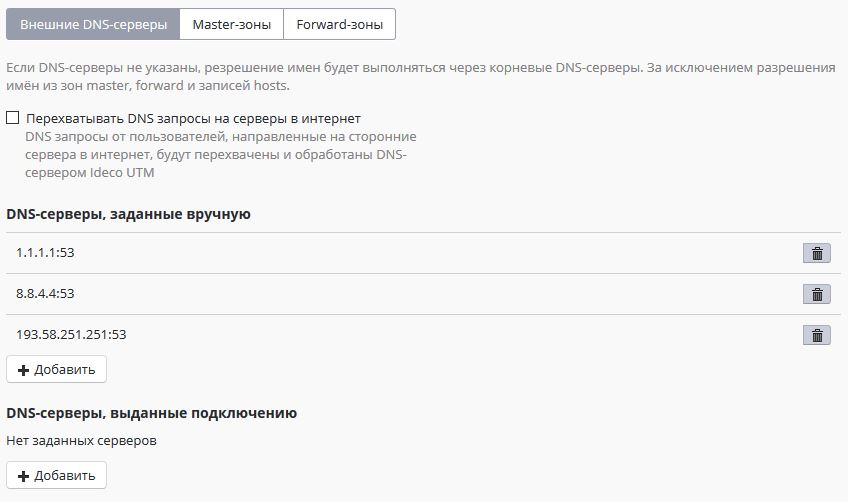
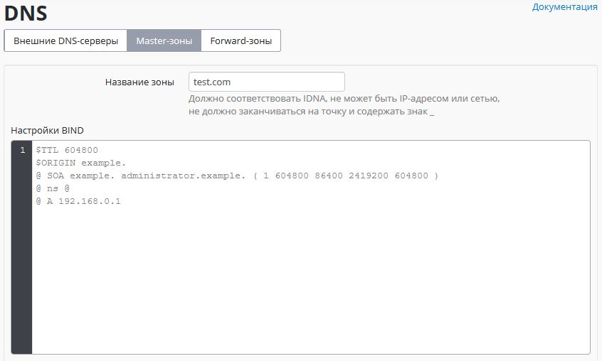
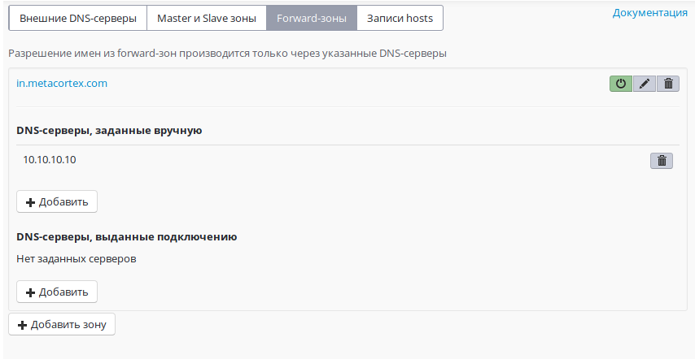

# DNS

Сервер DNS играет одну из важнейших ролей в работе сети Интернет: он преобразует человеко-читаемые имена серверов в IP-адреса. В состав Ideco UTM входит полнофункциональный DNS-сервер, не требующий дополнительной настройки для работы базовой функциональности. В частности, если провайдер не выдал DNS-серверы вашему шлюзу, или они не работают, или вас не устраивает их работа, то разрешение доменных имен в сети Интернет будет возможно даже в случае, если DNS-сервера не указаны в настройках Ideco UTM.

Служба DNS на сервере Ideco UTM служит для нескольких целей и настраивается в одном разделе веб-интерфейса: **Сервер &gt; DNS-сервер**. Помимо основного своего назначения - создания и обслуживания DNS-зон доменов \(вкладка **Master-зоны**\), служба DNS позволяет указать DNS-серверы во внешних сетях, через которые принудительно будут разрешаться все имена в сети Интернет \(вкладка **Внешние DNS-серверы**\), запрашиваемые клиентами локальных сетей, обслуживаемых Ideco UTM. Также функциональность DNS-сервера была расширена возможностью указывать сторонние DNS-серверы \(в локальных или внешних сетях относительно UTM\) с указанием конкретных DNS-зон, которые эти сервера обслуживают \(вкладка **Forward-зоны**\). Перечисленные возможности DNS-сервера не являются взаимоисключающими, дополняют друг друга и могут использоваться совместно, в зависимости от поставленных перед Вами задач. Рассмотрим все возможные стороны конфигурации службы DNS подробнее.

## Внешние DNS-серверы

Для нормальной работы резолвинга имен в сети Интернет через Ideco UTM указывать DNS-серверы в этом разделе не требуется. Сервер будет разрешать имена в сети Интернет, используя корневые DNS-серверы при наличии подключения к Интернет. Также администратор может указать DNS-серверы провайдера в этом разделе. DNS-серверы, полученные от провайдера, автоматически отображаются в подразделе **DNS-серверы, выданные подключению**. DNS-серверы, требующие явного указания, можно прописать в подразделе **DNS-серверы, заданные вручную**. Однако иногда, вне зависимости от полученных от провайдера DNS-серверов, возникает необходимость использовать для разрешения имен ресурсов сети Интернет только определенные DNS-серверы, игнорируя все остальные. Это может быть полезным при использовании фильтрации контента в сети Интернет на основе безопасных DNS-сервисов, например, [SkyDNS](../integraciya_utm_i_skydns.md).

В продукте имеется также возможность перехвата DNS-запросов на сторонние серверы, указанные пользователями на рабочих станциях с целью обхода блокировок web-ресурсов. Для её задействования необходимо включить признак **Перехватывать DNS запросы на серверы в Интернет** \([см. окончание данной статьи](dns.md#perekhvat-dns-zaprosov)\).



## Master-зоны DNS

С помощью DNS-сервера Ideco UTM вы можете создавать master-зоны для вашей внутренней инфраструктуры. Master-зоны с настроенными в них DNS-записями позволят вам использовать Ideco UTM как сервер имен внутри вашей сетевой инфраструктуры для обращения к IP-адресам хостов в сети по доменным именам. Создавая, например, зону `.office` на сервере Ideco UTM и наполняя ее DNS-записями соответствия имен хостов в зоне`.local` их IP-адресам, вы получите полнофункциональный DNS-сервер, разрешающий имена \(например _printer.office_\) в IP-адресах сетевых устройств в локальной сети \(например: _172.16.15.10_\).

DNS-сервер в Ideco UTM не доступен из вне, по соображениям безопасности. Для поддержки внешних DNS-зон мы рекомендуем использовать сторонние DNS-хостинги.

Формат записей для настройки Master-зоны соответствует формату записей DNS-сервера BIND.



Текст для вставки:

```text
$TTL 604800
$ORIGIN test.com.
@ SOA test.com. administrator.test.com. ( 1 604800 86400 2419200 604800 )
@ ns 
@ @ A 192.168.0.1
```

## Forward-зоны

В этом разделе можно явно задать DNS-сервер для разрешения имен конкретной DNS-зоны. Указав DNS-сервер, доступный в сети и зону, которую он обслуживает, клиенты сети Ideco UTM получают возможность обращаться к ресурсам этой зоны по именам домена, обслуживаемого ей. Например, IT-отдел предприятия предоставляет ресурсы для сотрудников в зоне `.in.metacortex.com` под именами `realm1.in.metacortex.com, sandbox.metacortex.com` и использует для этого DNS-сервер 10.10.10.10. Для возможности доступа к этим ресурсам по доменным именам укажите forward-зону провайдера как isp и далее задайте DNS-сервер 10.10.10.10 в подразделе **DNS-серверы, заданные вручную**.



## Перехват DNS-запросов

В разделе **Внешние DNS-серверы** вы можете включить опцию перехвата сервером UTM пользовательских DNS-запросов в Интернет на сторонние DNS-серверы. Опция включается глобально для всех хостов в локальной сети, выходящих в Интернет через сервер UTM. Это позволяет избежать возможной подмены адреса ресурса при резолвинге его домена в целях обхода блокировок ресурсов в Интернет. Также перехват всех DNS-запросов пользователей позволит контролировать процесс резолвинга доменных имен в Интернет исключительно средствами UTM.

Перехваченный запрос будет направлен на DNS-сервер UTM, и хосту в локальной сети будет отдан IP-адрес запрашиваемого ресурса DNS-сервером UTM, а не сторонним DNS-сервером в Интернет. Также перехват DNS-запросов блокирует возможность туннелирования через DNS \(DNS-tunneling\).

Вы можете использовать следующие сторонние DNS-сервера, для дополнительной фильтрации трафика и ускорения работы интернет-ресурсов:

* [SkyDNS](https://www.skydns.ru/) **193.58.251.251;**
* [Yandex DNS](https://dns.yandex.ru/) **77.88.8.88, 77.88.8.2;**
* Google DNS **8.8.8.8, 8.8.4.4;**
* Open DNS **208.67.222.222, 208.67.220.220, 208.67.222.220, 208.67.220.222**;
* Cloudflare DNS **1.1.1.1, 1.0.0.1.**

