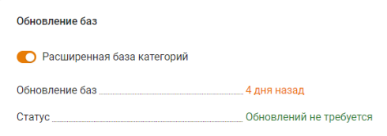
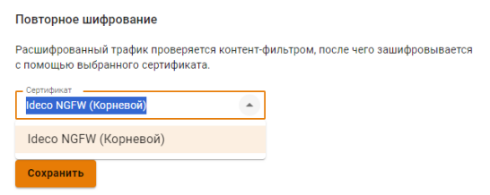
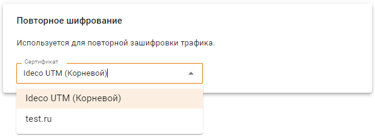

## Настройки

Если включить опцию **Расширенная база категорий**, то будет включена работа более 140 категорий, автоматически обновляемых сервером. Эти категории работают только при активной подписке на обновления в коммерческих редакциях:



Если отключить опцию **Расширенная база категорий**, то все правила, включающие в себя расширенные категории, перестанут срабатывать.



На вкладке **Настройки** можно настроить дополнительные параметры фильтрации:

* **Блокировать протоколы QUIC и HTTP/3.** Протокол, используемый современными браузерами для доступа к некоторым ресурсам (например, Google, YouTube). Рекомендуется блокировать его, т. к. иначе фильтрация ресурсов, работающих по этому протоколу, будет невозможна. Заблокированный трафик нельзя исключить, добавив IP-адрес в списки исключений на вкладке **Прокси -> Исключения**;
* **Безопасный поиск.** Принудительно включает безопасный поиск в поисковых системах (Google, Yandex, YouTube, Yahoo, Bing, Rambler). **Для работы этой функции нужно включить HTTPS-фильтрацию методом подмены сертификата для данных ресурсов**.

Если для повторного шифрования требуется использовать сертификат, отличный от корневого в NGFW, загрузите нужный сертификат в разделе **Сервисы -> Сертификаты -> Загруженные сертификаты** и выберите его для повторного шифрования:

