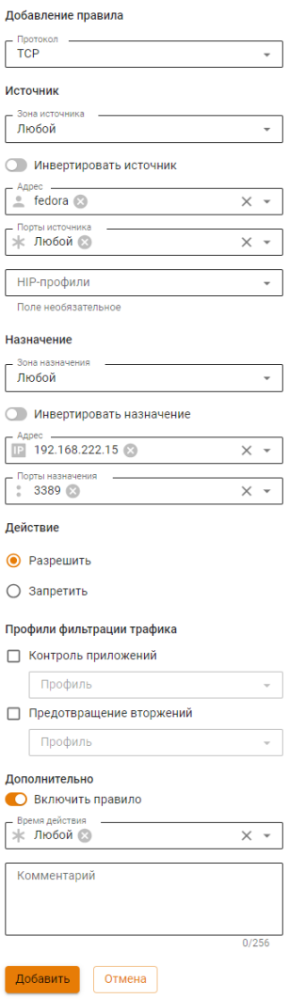
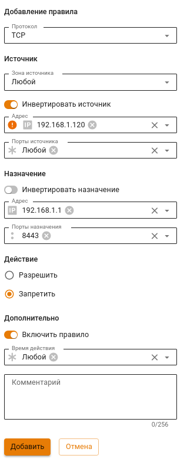
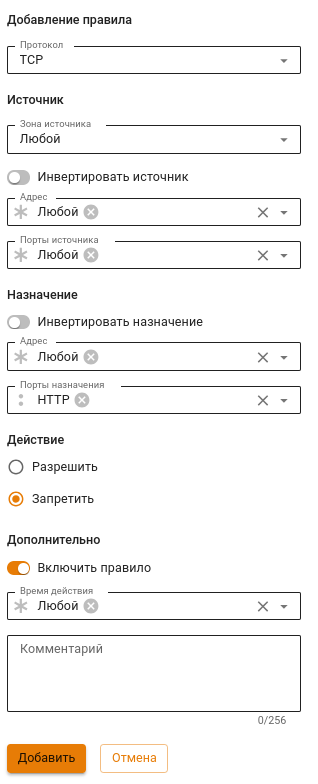
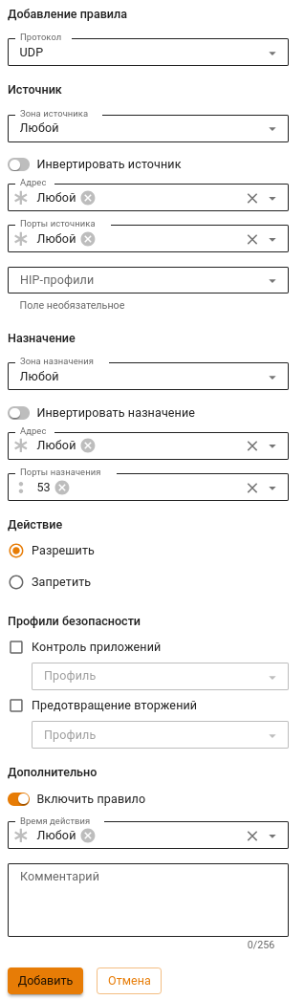
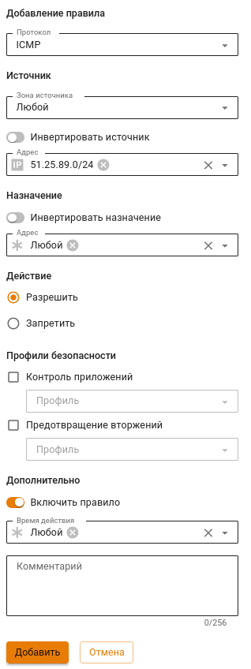
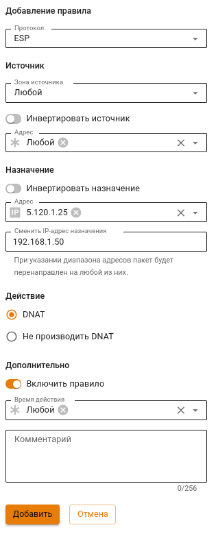

# Примеры создания правил файрвола

{#top}



Чтобы настроить правило файрвола для IPsec-подключений, выберите в поле **Зона источника** или **Зона назначения** настроенное IPsec-подключение.



{#top}



Примеры данных настроек подробно описаны в статьях раздела [Публикация ресурсов](../../../ngfw/settings/publishing-resources/README.md).



{#top}



Вопросы блокировки различных ресурсов: программ удаленного управления (AmmyAdmin и TeamViewer), мессенджеров и другого ПО - описаны в разделе [Блокировка популярных ресурсов](../../../ngfw/recipes/popular-recipes/blocking-popular-resources.md).



{#top}



1\. На вкладке **FORWARD** нажмите **Добавить**.

2\. Заполните следующие поля:

* **Протокол** - выберите TCP;
* **Адрес** - выберите пользователя или группу пользователей;
* **Назначения** - укажите адрес терминального сервера;
* **Порты назначения** - укажите порт 3389;
* **Действие** - Разрешить;
* **Дополнительно** - включите правило.

3\. Нажмите **Добавить**.



{#top}



1\. Перейдите в раздел **Правил трафика -> Файрвол**.

2\. Перейдите на вкладку **INPUT**.

3\. Создайте правило, заполнив поля, как на скриншоте, и включите его:

* Доступ к веб-интерфейсу будет разрешен только с IP-адреса **192.168.1.120**.
* **192.168.1.1** - IP-адрес Ideco NGFW в локальной сети.



{#top}



**80 TCP порт используется для выпуска сертификатов Let`s Encrypt**.

1\. Перейдите в раздел **Правил трафика -> Файрвол**.

2\. Перейдите на вкладку **INPUT**.

3\. Создайте правило, заполнив поля, как на скриншоте, и включите его:



{#top}



1\. Перейдите в раздел **Правил трафика -> Файрвол**.

2\. Перейдите на вкладку **FORWARD**.

3\. Создайте правило, заполнив поля, как на скриншоте, и включите его:

**Для работы протокола DNS может быть не достаточно правила с протоколом UDP, поскольку DNS использует в качестве транспорта не только UDP, но и TCP**. Для решения задачи создайте аналогичное правило с протоколом TCP, используя кнопку **Клонировать** в таблице правил.



{#top}



1\. Перейдите в раздел **Правил трафика -> Файрвол**.

2\. Перейдите на вкладку **INPUT**.

3\. Создайте правило, заполнив поля, как на скриншоте, и включите его:

**Правило разрешит трафик до Ideco NGFW из внешней сети 51.25.89.0/24**.



{#top}



1\. Перейдите в раздел **Правил трафика -> Файрвол**.

2\. Перейдите на вкладку **DNAT**.

3\. Создайте правило, заполнив поля, как на скриншоте, и включите его:

* **5.120.1.25** - IP-адрес Ideco NGFW во внешней сети.
* **192.168.1.50** - IP-адрес устройства в локальной сети.

**Для полноценной работы IPsec создайте такое же правило с протоколом AH, нажав Клонировать**. Помимо этого нужно создать DNAT-правило с протоколом UDP и портами 500,4500.



