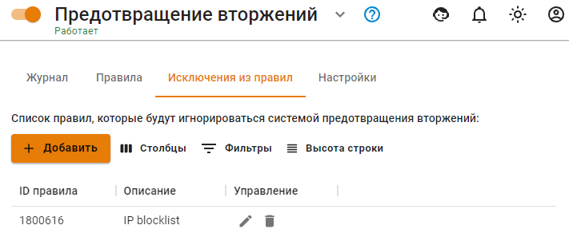

# Исключения

Таблица содержит список отключенных правил службы предотвращения вторжений в случае их ложных срабатываний или по другим причинам.

Отключить правила можно по кнопке **Добавить**, указав в соответствующем поле ID правила, или на вкладке **Журнал**, нажав **Добавить в исключения**. 



Со временем при обновлении баз службы предотвращения вторжений ID правил могут меняться.



