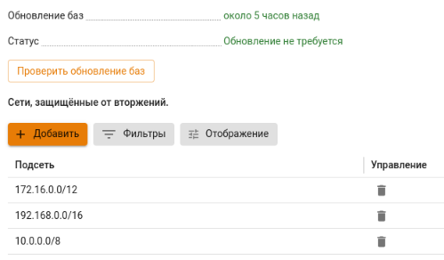

# Настройки

На вкладке можно проверить статус обновления баз системы **Предотвращение вторжений** и отредактировать список сетей, защищенных от вторжений:

Для добавления подсети в список защищенных нажмите **Добавить** и в поле **Подсеть** укажите локальные сети, обслуживаемые NGFW (сети локальных интерфейсов NGFW, маршрутизируемые на них сети удаленных сегментов локальной сети предприятия).

При наличии большого количества подсетей в таблице воспользуйтесь кнопкой **Фильтры**.



**Не указывайте** сети, принадлежащие внешним сетевым интерфейсам NGFW и внешним сетям. Указанные здесь сети участвуют в правилах системы **Предотвращения вторжений** как локальные. 





При работе системы **Предотвращения вторжений** **не используйте** сторонние DNS-серверы для компьютеров, т.к служба определяет зараженные устройства по DNS-запросам, проходящим через нее. \
При использовании внутреннего домена AD рекомендуется:

* В компьютерах указать DNS-сервер Ideco NGFW в качестве единственного DNS-сервера;
* В настройках DNS-сервера на NGFW указать Forward-зону для локального домена.



