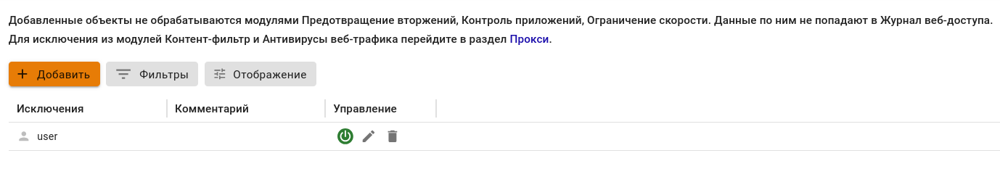

# Исключения 

Правила в разделе **Исключения** отключают трафик из обработки системы [Предотвращения вторжений](README.md), [Контроля приложений](../../../../ngfw/settings/security-profiles/application-control/README.md) и [Ограничение скорости](../../../../ngfw/settings/access-rules/shaper.md), данные по ним не попадают в монитор трафика.

Если после исключения объекта из обработки доступ к ресурсу не появился, проверьте, не блокируется ли DNS-запрос. Для этого перейдите в раздел **Отчеты и журналы -> События безопасности -> Журнал IPS**. Если запрос блокируется, то в журнале срабатываний наведите на строку и нажмите .

При наличии большого количества исключений в таблице воспользуйтесь кнопкой **Фильтры**.



Если в качестве DNS-сервера у пользователя указан локальный адрес сервера Ideco NGFW, то исключения работать не будут. Весь трафик, идущий на адреса локальных и VPN-интерфейсов Ideco NGFW, всегда обрабатывается службой фильтрации трафика.



