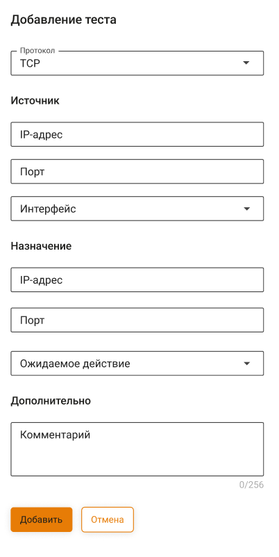
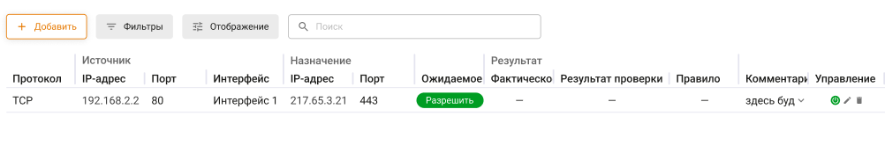
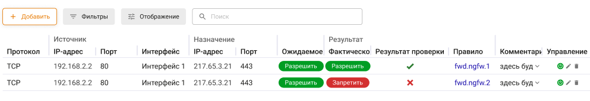
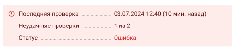

# Проверка работы правил

Кейс - это конкретный пример, в котором происходит тестирование доступа до определенного IP-адреса с учетом правил таблицы **Файрвола**. Кейс является единицей проверки.

На вкладке создаются кейсы для тестирования правил таблицы FORWARD и INPUT.

## Создание кейсов для тестирования



В качестве интерфейса источника можно выбрать следующие типы интерфейсов:

* Туннельные (GRE)
* Локальный Ethernet
* Внешний Ethernet
* Внешний Ethernet + PPTP
* Внешний Ethernet + L2TP
* Внешний Ethernet + PPPoE



Для создания кейса выполните действия:

1\. Перейдите в раздел **Правила трафика -> Файрвол -> Проверка работы правил** и нажмите **Добавить**:

2\. Заполните поля:

* **Протокол** (**TCP**/**UDP**);
* **IP-адрес** источника и назначения;
* **Порт** источника и назначения;
* **Интерфейс** источника;
* **Ожидаемое действие** (Разрешить или Запретить);
* **Комментарий**.

3\. Нажмите **Добавить проверку**.

Созданные кейсы добавляются в таблицу:

## Запуск и результат тестирования кейса

Запуск тестирования кейса не происходит автоматически при его добавлении. Для этого:

1\. Включите нужный кейс .

2\. Нажмите **Запустить тестирование** в левом нижнем углу вкладки.



Если кейс не включить, то его тестирование осуществляться не будет.



При совпадении ожидаемого и фактического действия тестирование кейса считается успешным:

Если у выбранного кейса **Интерфейс** источника был удален (отображается **Удалено** в столбце **Интерфейс**), тестирование кейса завершится с фактическим действием **Запретить**.



Если опция **Блокировать весь трафик в случае неудачной попытки** включена (**не рекомендуем**), любой неуспешный тест кейса приведет к блокировке всего трафика через NGFW. Единственный способ снятия блокировки - тестирование кейса без ошибок. Отключение опции нажатием на переключатель не сработает:



В правом нижнем углу вкладки представлены сведения о последней проверке: текущий статус (**Успешно**/**Ошибка**), время проведения и количество неуспешных кейсов (из числа включенных в столбце **Управление**):

Повторный запуск сбрасывает результаты предыдущей проверки.