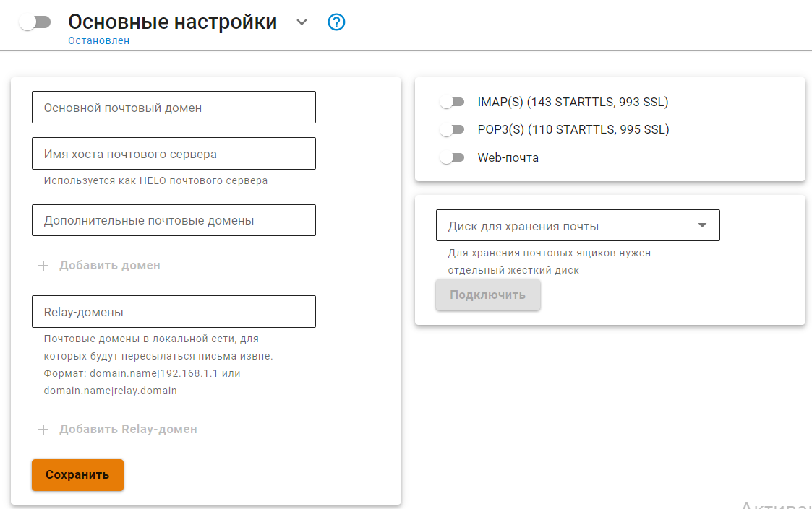

# Основные настройки



UTM не поддерживает кириллические почтовые домены.



В разделе **Основные настройки** представлены базовые параметры, необходимые для настройки почтового сервера, почтового релея и веб-почты. 

Ideco UTM можно настроить, как почтовый сервер, почтовый релей или воспользоваться почтовым клиентом UTM. В зависимости от необходимой функциональности, следуйте соответствующим инструкциям:

[{#T}](web-mail.md)

[{#T}](mail-server-settings.md)

[{#T}](mail-relay-settings.md)

