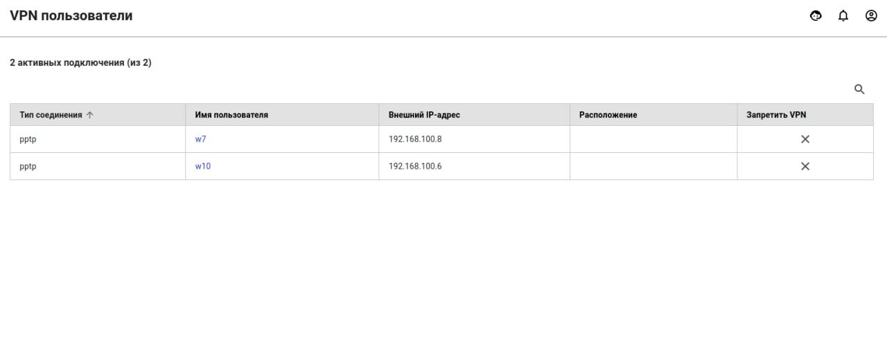

# Авторизованные пользователи

В разделе **Мониторинг -&gt; Авторизованные пользователи** отображен список всех пользователей, которые авторизовались в UTM, в виде таблицы.

Пример таблицы с авторизованными разными способами пользователями представлен на скриншоте ниже:

В столбце **Управление** можно разавторизовать пользователя при необходимости.

## VPN пользователи

В разделе **Мониторинг -&gt; VPN пользователи** отображен список всех пользователей, у которых в [настройках пользователя ](../users/customization-of-users.md#kategoriya-osnovnoe)отмечен пункт **Разрешить удаленный доступ по VPN**, и которые были авторизованы по VPN.

Пример таблицы с пользователями подключенными по VPN представлен на скриншоте ниже:

В столбце **Запретить** **VPN** можно запретить пользователю удаленный доступ по VPN при необходимости.

