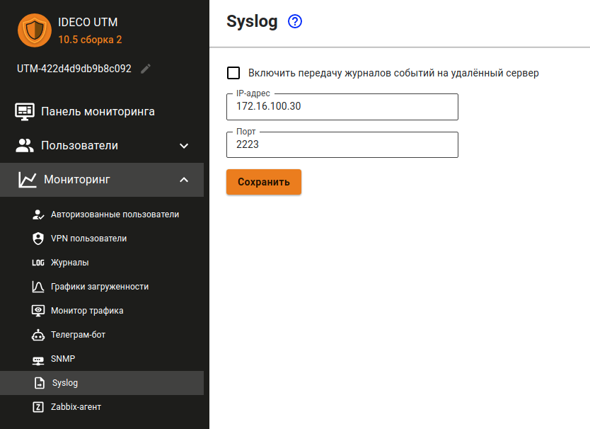

# Syslog

## Пересылка системных сообщений

В качестве коллектора можно указывать только IP-адрес из приватных диапазонов

В поле **Порт** укажите любой порт из диапазона от 1 до 65535.



Передача системных сообщений происходит согласно RFC-5424 (транспорт UDP).



