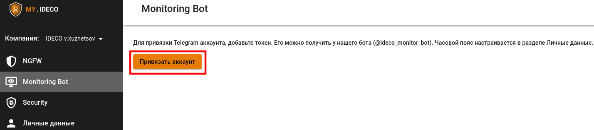

# Telegram-бот

Бот может отправлять оповещения:
* в личные сообщения;
* в беседы, где 2 и более пользователей (groups).

Привязка бота и настройка оповещений Ideco Monitoring Bot осуществляется в [личном кабинете](https://my.ideco.ru/).

## Привязка Ideco Monitоring Bot

{#top}



1\. Настроить интернет на Ideco NGFW.

2\. [Привязать лицензию](../../../ngfw/settings/server-management/license-management.md) к серверу.

3\. Перейти к диалогу с ботом: [@ideco_monitor_bot](https://telegram.im/@ideco_monitor_bot).

4\. Написать боту `/start`.

5\. Скопировать код привязки к аккаунту.

6\. Перейти в раздел **Ideco Monitoring Bot** в [личном кабинете](https://my.ideco.ru/#/ideco-monitoring-bot).

7\. Нажать на кнопку **Привязать аккаунт**.

8\. Ввести код в соответствующее поле и нажать на кнопку **Привязать**.



{#top}



1\. Настроить интернет на Ideco NGFW.

2\. [Привязать лицензию](../../../ngfw/settings/server-management/license-management.md) к серверу.

3\. Перейти в группу и добавить пользователя @ideco_monitoring_bot.

4\. Написать `/start` в группе.

5\. Скопировать код привязки к аккаунту.

6\. Перейти в раздел **Ideco Monitoring Bot** в [личном кабинете](https://my.ideco.ru/#/ideco-monitoring-bot).

7\. Нажать на кнопку **Привязать аккаунт**.

8\. Ввести код в соответствующее поле и нажать на кнопку **Привязать**.





При настройке подключения Ideco Monitoring Bot к беседе нельзя использовать подсказки для команд, поскольку требуется ввод команды `/start` вручную.





Уведомления начнут приходить в телеграм-аккаунт.



## Настройка оповещений Ideco Monitоring Bot

Настройте оповещения, которые приходят от Ideco Monitoring Bot, для каждой отдельной беседы.

Для настройки оповещений:

1\. Перейдите в раздел настройки, нажав на иконку .

2\. Выберите уведомления, которые хотели бы получать в выбранной беседе.



Если требуется временно отключить отправку уведомлений, нажмите на иконку . Оповещения перестанут приходить, пока снова не нажмете на эту иконку.



