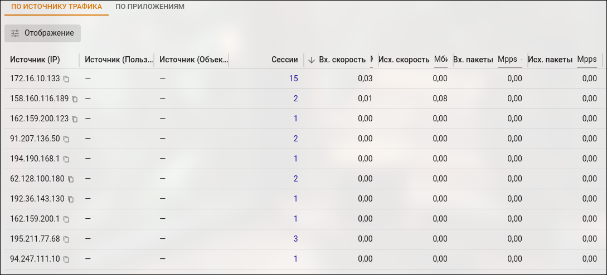
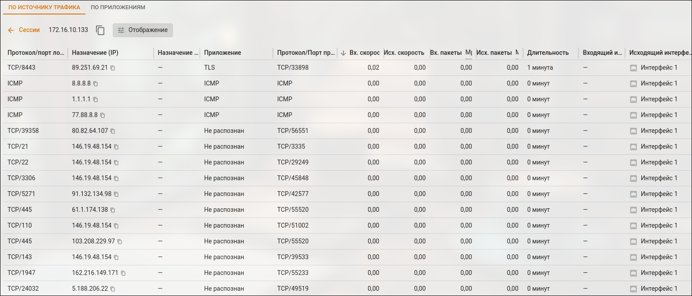
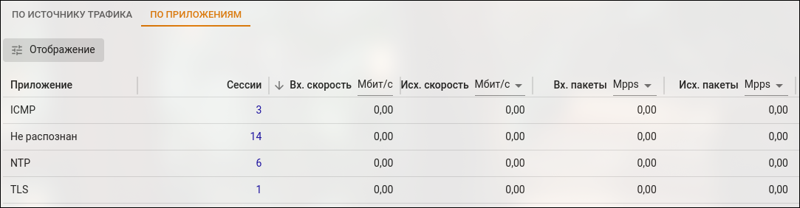
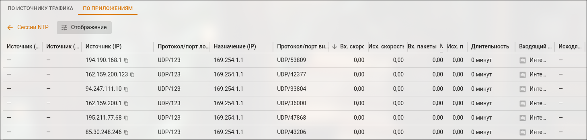

# Монитор трафика



Для включения мониторинга трафика необходимо запустить модуль [Контроля приложений](../../../ngfw/settings/security-profiles/application-control/README.md).



## По источнику трафика

Вкладка **По источнику трафика** позволяет отслеживать активность пользователей сети и выявлять тех, кто нагружает канал трафиком.

Для просмотра информации об активности определенного узла локальной сети нажмите на количество сессий в таблице:

## По приложениям

Вкладка **По приложениям** позволяет отслеживать активность приложений.

Например, если пользователь не загружает канал трафиком, но в таблице **По источнику трафика** присутствует большое количество пакетов данных, то на вкладке **По приложениям** можно выявить приложение с подозрительной активностью.

Для просмотра подробной информации об активности определенного приложения нажмите на количество сессий в таблице:

