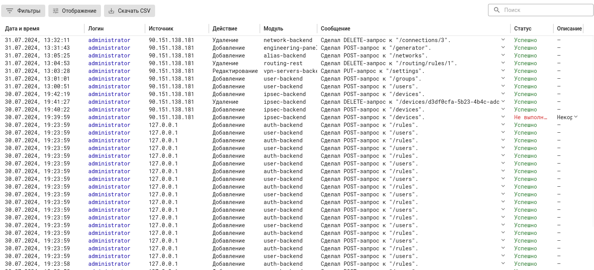

# Действия администраторов

Ideco NGFW логирует действия администраторов, которые вносят изменения в конфигурацию NGFW из веб-интерфейса, локального интерфейса и терминала. Действия, осуществляемые через локальное меню NGFW, отображаются в журнале действий администраторов с источником 127.0.0.1:

Для фильтрации логов воспользуйтесь кнопкой **Фильтры**.

При работе Ideco NGFW в режиме [кластера](../../../ngfw/settings/server-management/cluster/cluster.md) логи действия администраторов не передаются резервной ноде.



При бездействии в течение 15 минут администратор будет автоматически разавторизован.



