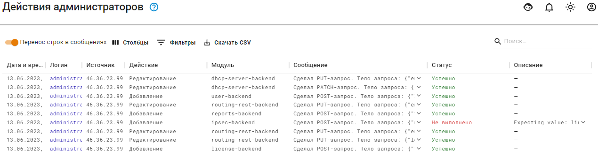

# Действия администраторов

Ideco UTM логирует действия администраторов, которые вносят изменения в конфигурацию UTM из веб-интерфейса, локального интерфейса и терминала.

При работе Ideco UTM в режиме [кластера](../../../ngfw/settings/server-management/cluster.md) логи действия администраторов не передаются резервной ноде.
