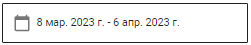
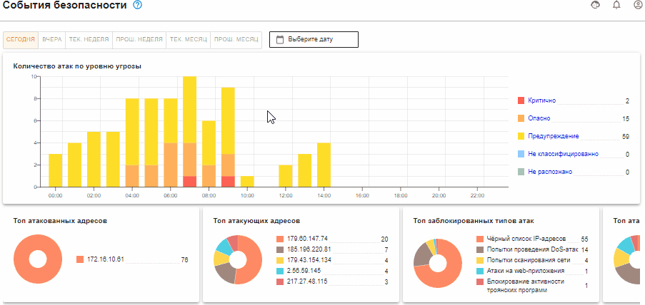
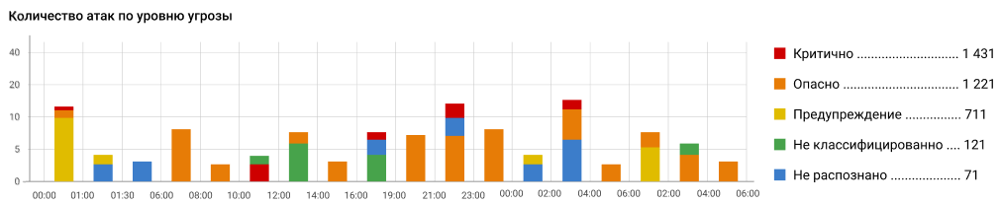
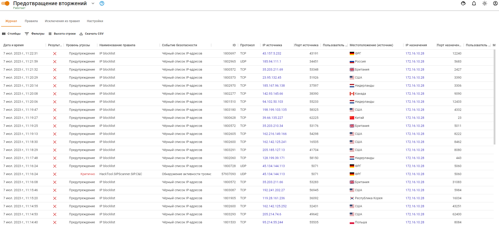

# События безопасности



Все графики формируются в часовом поясе сервера.



В разделе **События безопасности** представлены события модулей WAF и IPS, а также графики событий IPS.

## Выбор периода

Все отображаемые данные фильтруются по дате и времени. Например, выберите определенный временной период (по кнопке ) или воспользуйтесь одним из предустановленных фильтров:

<!-- Доступные варианты: сегодня, вчера, текущая неделя, прошлая неделя, текущий месяц, прошлый месяц. -->

Если не выбран ни один фильтр по дате и времени, то по умолчанию устанавливается интервал **Сегодня** в часовом поясе сервера.

## Графики IPS

В этом разделе представлены графики, содержащие краткую информацию раздела **Предотвращение вторжений**. Подробные сведения обо всех срабатываниях правил **Предотвращение вторжений** можно найти на вкладке **Журнал IPS** в виде таблицы.  

### График Количество атак по уровню угрозы

Информация представлена в виде графика с пятью значениями угрозы безопасности:
* **Критично** - уровень угрозы 1;
* **Важно** - уровень угрозы 2;
* **Предупреждение** - уровень угрозы 3;
* **Не классифицировано** - уровень угрозы 4;
* **Не распознано** - уровень угрозы 255.
  
Если нажать на уровень угрозы в правом списке, все графики будут отфильтрованы в соответствии с этим уровнем. Чтобы отменить фильтрацию, нажмите еще раз на выбранный уровень.

Пример графика *Количество атак по уровню угрозы*:

### Описание дополнительных графиков

{#top}



В топ атакованных попадают как внешние, так и внутренние адреса. Один из примеров, когда атакованный адрес является внешним, - работа трояна изнутри защищаемой сети.



{#top}



График подсчитывает статистику типов атак (например, типы атак *Черный список IP-адресов* или *Попытки получения привилегий администратора*) по количеству срабатываний с этим типом атаки.



{#top}



График содержит информацию о внешних адресах и количестве блокировок по ним.



{#top}



Топ атакующих стран строится по IP-адресам, полученным при срабатывании правил в разделе **Предотвращение вторжений**. Если IP-адрес не геокодируется в наименование страны, такой адрес не отображается в виджете. \
По этой причине локальные IP-адреса не отображаются в виджете.



{#top}



В топ попадают как авторизованные, так и не авторизованные пользователи, запросы которых блокировались.



## Журнал IPS

В разделе **Отчеты и журналы -> События безопасности -> Журнал IPS** можно просмотреть логи системы **Предотвращения вторжений**:

* Поле **Результат анализа** отображает действие системы: 
  * `Blocked` - пакет блокирован; 
  * Любая другая информация в этом поле - `Allowed`, информирование;
* В поле **Уровень угрозы** могут отображаться следующие значения:
  * <mark style="color:red;">Критично</mark>;
  * <mark style="color:orange;">Опасно</mark>;
  * Предупреждение;
  * <mark style="color:blue;">Не распознано</mark>;
  * Не классифицировано

IP-адреса в столбцах **Источник** и **Назначение** кликабельны и при нажатии ведут на сервис [Whois](https://www.nic.ru/whois/?searchWord) для получения информации о регистрации домена.

{#top}



1\. Скачайте CSV-файл с логами системы **Предотвращения вторжений** за определенный период по соответствующей кнопке.

2\. Откройте CSV-файл в MS Excel и выделите весь первый столбец.

3\. Перейдите на вкладку **Данные** и нажмите кнопку **Текст по столбцам**.

4\. В открывшемся окне выберите **с разделителями** и нажмите **Далее**:

5\. В блоке **Символом-разделителем является:**  выберите **запятая** и нажмите **Далее**:

6\. В блоке **Формат данных столбца** выберите **Текстовый** и нажмите **Готово**:



## Web Application Firewall

Раздел **Отчеты и журналы -> События безопасности -> Web Application Firewall** содержит информацию о срабатывании правил Web Application Firewall в виде таблицы:

IP-адреса в столбцах **Адрес источника** и **Адрес назначения** кликабельны и при нажатии ведут на сервис [Whois](https://www.nic.ru/whois/?searchWord) для получения информации о регистрации домена.



На вкладке **Web Application Firewall** отображается профиль WAF, параметры которого вызвали блокировку доступа к ресурсу.



