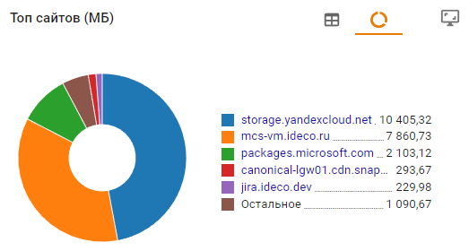

# Трафик
 
При переводе ползунка **Трафик** в левом верхнем углу в положение **Включен**, раздел начинает собирать статистику из [Контент-фильтра](../access-rules/content-filter/README.md) (категории и сайты) и [Контроля приложений](../access-rules/application-control.md) (протоколы) и отображает в виде виджетов. 

### Способ отображения информации:

#### Круговая диаграмма () и таблица () 

Содержит топ 6 объектов. Каждый объект кликабелен и ведет на страницу с виджетами, в которых статистика фильтруется по этому объекту. 
  
 

Единицу измерения можно изменить в левом верхнем углу:
 

#### Развернутый режим () 

Содержит данные по всем объектам из топа. Для поиска по объектам воспользуйтесь **Фильтром**().
   

Если в левом верхнем углу установлен флаг в строке **Запросы**, то объекты отфильтруются по убыванию по колонке **Запросы**. Если **Трафик**, то по убыванию в колонке **Входящий**.



Время и дата в виджете отображается в часовом поясе сервера.



**Примеры использования:** 

{#top}



* Откройте раздел **Отчеты и журналы -> Трафик**;
* В виджете **Топ пользователей** найдите нужного пользователя и кликните по нему. 
  
  Если пользователя нет в списке, то нажмите **Развернуть** () в правом верхнем углу виджета (откроется список всех пользователей);
* В виджете **Топ заблокированных сайтов** NGFW покажет топ-5 блокировок. Для просмотра полного списка блокировок нажмите **Развернуть** ().



{#top}



* Откройте раздел **Отчеты и журналы -> Трафик**;
* В виджете **Топ заблокированных протоколов** найдите требуемый протокол и кликните по нему. Если его нет в списке, то нажмите **Развернуть** ();
* Чтобы увидеть список всех пользователей, у которых был заблокирован этот протокол, то на открывшейся странице, найдите виджет **Топ пользователей** \
   и нажмите **Развернуть** ().



Подробнее создании собственных шаблонов со статистикой в статье [Конструктор отчетов](report-designer.md). 