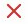
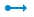
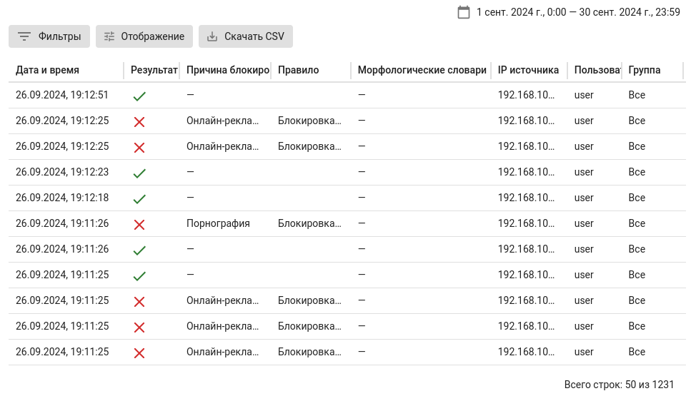

# Журнал веб-доступа

Раздел позволяет посмотреть результат обработки пользовательского запроса службой **Контент-фильтра**. Для просмотра **Журнала веб-доступа** перейдите в раздел **Отчеты и Журналы -> Журнал веб-доступа**.

{#top}



*  - **Разрешено**
*  - **Расшифровано**
*  - **Запрещено**
*  - **Перенаправлено на**





Если нет доступа к какому-либо интернет-ресурсу, воспользуйтесь разделом **Журнал веб-доступа** для поиска правила, блокирующего этот ресурс.





Для просмотра блокировок по конкретному правилу воспользуйтесь кнопкой **Фильтры**, указав в форме наименование правила и оператор.



