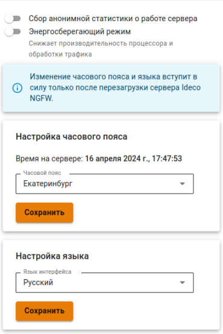

# Дополнительно



Изменение часового пояса вступит в силу только после перезагрузки сервера Ideco NGFW.





В интерфейсе [VCE](../../../ngfw/settings/server-management/vce.md) изменение настроек часового пояса и языка недоступно.



Настройка осуществляется через веб-интерфейс в разделе **Управление сервером -> Дополнительно**.

* **Настройка часового пояса** - установите часовой пояс для корректного сбора логов и статистики;
* **Сбор анонимной статистики о работе сервера** - включение этого параметра разрешает серверу отправлять информацию об используемых модулях. При этом не отправляется информация о пользователях, проходящем через сервер трафике, сетевых интерфейсах и идентификаторах сервера и лицензии;
* **Энергосберегающий режим** - включение этого режима снижает производительность процессора и обработки трафика;
* **Настройка часового пояса** - установите часовой пояс для корректного сбора логов и статистики;
* **Настройка языка** - укажите язык, удобный для работы в веб-интерфейсе;
* **Сбросить блокировки по IP** - используйте для сброса всех заблокированных IP-адресов. Если требуется разблокировать какой-то конкретный IP-адрес, воспользуйтесь командой `fail2ban-client unban <IP-адрес>` в терминале.