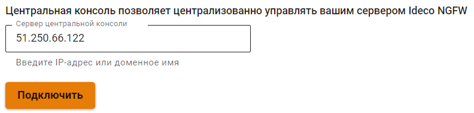

# Центральная консоль



Название службы раздела **Центральная консоль**: `ideco-central-console-backend`. \
Список служб для других разделов доступен по [ссылке](../../../../ngfw/settings/server-management/terminal.md).



Ideco Center - это центральная консоль, которая поможет в администрировании сразу нескольких серверов Ideco UTM. На данный момент не требует лицензирования и не имеет ограничений к использованию. Автоматически распространяет политики безопасности по всем подключенным Ideco UTM, даже если они были подключены после того, как политики были настроены.

**Возможности Ideco Center:**

* [x] Создание правил политик безопасности (файрвол, контроль приложений, контент-фильтр) и объектов, которые переносятся в подключенные сервера Ideco UTM одновременно;
* [x] Cоздание пользовательских категорий контент-фильтра; 
* [x] Переход из Ideco Center в веб-интерфейс подключенных Ideco UTM;
* [x] Обновление подключенных к Ideco Center UTM;
* [x] Управление правами доступа администраторов. При этом администраторы Ideco Center имеют доступ к подключенными UTM, а администраторы подключенных UTM не имеют доступ к Ideco Center.

Подробнее о работе политик безопасности и объектов в статье [Политики и объекты](policies-and-objects.md).

**Технические требования для серверов и виртуальных машин:**

<table><thead><tr><th width="100">Комплектующие</th><th>Минимальные системные требования</th></tr></thead><tbody><tr><td>Процессор</td><td>Intel i3/i5/i7/i9/Xeon с поддержкой SSE 4.2</td></tr><tr><td>Объем оперативной памяти</td><td>16 ГБ (16-64 ГБ в зависимости от количества пользователей)</td></tr><tr><td>Дисковая подсистема</td><td>SSD, объемом 150 Гб или больше, с интерфейсом SATA, mSATA, SAS, NVMe.</td></tr><tr><td>Сеть</td><td>Одна сетевая карта. Рекомендуется использовать карты на чипах Intel. Поддерживаются Realtek, D-Link и другие.</td></tr><tr><td>Гипервизоры</td><td>VMware, Microsoft Hyper-V (2-го поколения), VirtualBox, KVM, Citrix XenServer.</td></tr><tr><td>Дополнительно</td><td>Монитор и клавиатура</td></tr><tr><td>Замечания</td><td>Обязательна поддержка UEFI. Не поддерживаются программные RAID-контроллеры (интегрированные в чипсет). Для виртуальных машин необходимо использовать фиксированный, а не динамический размер хранилища и оперативной памяти.</td></tr></tbody></table>

Файл для установки центральной консоли доступен для скачивания в [личном кабинете](https://my.ideco.ru/#/utm/download). Процесс установки Ideco Center аналогичен [процессу установки Ideco UTM](../../../installation/installation-process.md).

## Подключение Ideco UTM к Ideco Center



Если в подключаемом Ideco UTM используется кластер, достаточно подключить только активную ноду, пассивная автоматически примет эту настройку. 

Сетевое подключение производится в направлении от Ideco UTM к Ideco Center, т.е. возможна связь и когда Ideco UTM за NAT. 



Для подключения Ideco UTM к Ideco Center:

1\. Перейдите в раздел **Управление сервером -> Центральная консоль**;

2\. Введите IP-адрес или доменное имя в строке **Сервер центральной консоли** и нажмите **Подключить**:

  

  Если вместо доменного имени указан IP-адрес Ideco Center, загрузите корневой сертификат Ideco Center в Ideco UTM:

  
  
  Скачать корневой сертификат можно в Ideco Center, раздел **Сервисы -> Сертификаты**.

3\. В интерфейсе Ideco Center перейдите в раздел **Серверы** и подтвердите подключение кнопкой .

  



Если сервер Ideco Center находится за NAT, укажите IP-адрес или доменное имя в разделе **Управление сервером -> Дополнительно -> Адрес центральной консоли**.



Удаление сервера Ideco UTM из Ideco Center разорвет привязку в интерфейсе Ideco UTM:



При подключении к Ideco Center сервера, настройки которого [восстановлены](../../../recipes/popular-recipes/transferring-data-to-another-server.md) из бекапа другого сервера, такой клон не появится в таблице серверов ЦК. Возникает конфликт с донором резервной копии из-за одинакового claster_id.
 
В случае возникновения такой проблемы обратитесь в [Техническую поддержку](../../../general/technical-support.md).



## Переход из веб-интерфейса Ideco Center в веб-интерфейс Ideco UTM

В Ideco Center предусмотрено два способа перехода в Ideco UTM:

1\. Перейдите в раздел **Серверы** нажмите на :

В новой вкладке откроется веб-интерфейс Ideco UTM.

2\. Нажмите на   в левом верхнем углу и выберите нужный UTM:



Для обновления серверов, подключенных к центральной консоли, перейдите в интерфейс UTM одним из указанных выше способов и воспользуйтесь статьей [Автоматическое обновление сервера](../../../../ngfw/settings/server-management/server-update.md). 



