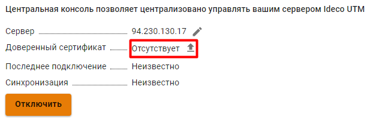

# Центральная консоль



Название службы раздела **Центральная консоль**: `ideco-central-console-backend`. \
Список служб для других разделов доступен по [ссылке](../../../../ngfw/settings/server-management/terminal.md).



Ideco Center - это центральная консоль, которая поможет в администрировании сразу нескольких серверов Ideco UTM. На данный момент не требует лицензирования и не имеет ограничений к использованию. Автоматически распространяет политики безопасности по всем подключенным Ideco UTM, даже если они были подключены после того, как политики были настроены.

**Возможности Ideco Center:**

* [x] Создание правил политик безопасности (файрвол, контент-фильтр и др.) и объектов, которые переносятся в подключенные сервера Ideco UTM одновременно;
* [x] Переход из Ideco Center в веб-интерфейс подключенных Ideco UTM;
* [x] Управление правами доступа администраторов. При этом администраторы Ideco Center имеют доступ к подключенными UTM, а администраторы подключенных UTM не имеют доступ к Ideco Center.

Подробнее о работе политик безопасности и объектов в статье [Политики и объекты](policies-and-objects.md).

**Технические требования для серверов и виртуальных машин:**

* [x] Оперативная память - 8 ГБ;
* [x] UEFI;
* [x] Диск - 64 ГБ;
* [x] Два ядра процессора;
* [x] Одна сетевая карта;
* [x] Гипервизоры, которые поддерживаются: kvm, esxi, hyper-v

Файл для установки центральной консоли доступен для скачивания в [личном кабинете](https://my.ideco.ru/#/utm/download). Процесс установки Ideco Center аналогичен [процессу установки Ideco UTM](../../../installation/installation-process.md).

## Подключение Ideco UTM к Ideco Center



Если в подключаемом Ideco UTM используется кластер, достаточно подключить только активную ноду, пассивная автоматически примет эту настройку. 

Сетевое подключение производится в направлении от Ideco UTM к Ideco Center, т.е. возможна связь и когда Ideco UTM за NAT. 



Для подключения Ideco UTM к Ideco Center:
* Перейдите в раздел **Управление сервером -> Центральная консоль**;
* Введите IP-адрес или доменное имя в строке **Сервер центральной консоли** и нажмите **Подключить**:

  

  Если вместо доменного имени указан IP-адрес Ideco Center, загрузите корневой сертификат Ideco Center в Ideco UTM:

  
  
  Скачать корневой сертификат можно в Ideco Center, раздел **Сервисы -> Сертификаты**.

* В интерфейсе Ideco Center перейдите в раздел **Серверы** и подтвердите подключение кнопкой .

  



Если сервер Ideco Center находится за NAT, укажите IP-адрес или доменное имя в разделе **Управление сервером -> Дополнительно -> Адрес центральной консоли**.



Удаление сервера Ideco UTM из Ideco Center разорвет привязку в интерфейсе Ideco UTM:

## Переход из веб-интерфейса Ideco Center в веб-интерфейс Ideco UTM

В Ideco Center предусмотрено два способа перехода в Ideco UTM:

1\. Перейдите в раздел **Серверы** нажмите на :

В новой вкладке откроется веб-интерфейс Ideco UTM.

2\. Нажмите на  в левом верхнем углу и выберите нужный UTM:

