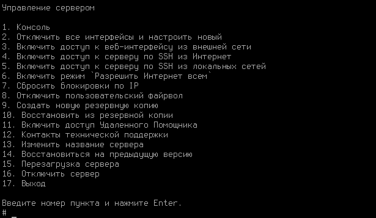

# Установка

## Процесс установки



При установке Ideco Center с загрузочного USB диска выберите загрузку с USB диска в настройках UEFI компьютера.



Для установки Ideco Center выполните действия:

1\. Перейдите к установке, нажав **Install Ideco CC**.

2\. Выберите диск для установки и ознакомьтесь с **предупреждением об уничтожении данных на диске**:

3\. Выберите временную зону, в которой вы находитесь:

4\. Настройте дату и время в соответствии с вашей временной зоной. **Обязательно проверьте правильность даты и времени**:



Не забудьте извлечь USB диск после установки Ideco Center, чтобы загрузка с USB диска не началась заново.



## Создание учетной записи администратора

Для входа в веб-интерфейс Ideco CC нужно создать учетную запись администратора с соблюдением требований к паролю:

{#top}



* **Минимальная длина пароля** - 12 символов;
* **Cодержит только строчные и заглавные латинские буквы**;
* **Содержит цифры**;
* **Содержит специальные символы** (! # $ % & ' * + и другие).





Если пароль не соответствует требованиям политики безопасности, то появится надпись с информацией, что пароль ненадежен. Потребуется ввести новый пароль с учетом требований к паролю.

Не используйте Numpad при введении пароля, поскольку в будущем это может привести к проблемам при авторизации администратора.



## Настройка локального интерфейса



При использовании сетевых карт одного производителя могут возникнуть трудности при идентификации сетевой карты для настройки сетевого интерфейса.
Для корректной идентификации сетевой карты используйте ее MAC-адрес.



Для настройки Ideco Center через веб-интерфейс нужно настроить локальный интерфейс в локальном меню:

1\. Введите номер сетевого адаптера под локальный интерфейс:

2\. Настройте локальную сеть автоматически через DHCP, введя **y**, или настройте вручную, введя **n**:

3\. Введите локальный IP-адрес и маску подсети в формате `ip/маска` и нажмите **Enter**:

4\. Введите адрес шлюза или оставьте поле пустым:

5\. Задайте тег VLAN (стандарт VLAN 802.3q) или оставьте поле пустым:

После создания локального интерфейса откроется локальное меню управления: 

