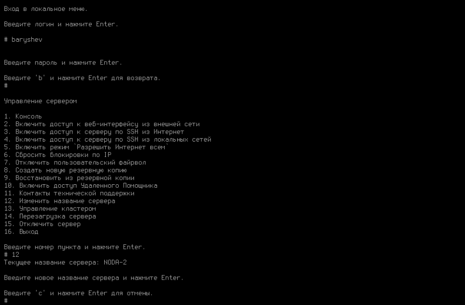
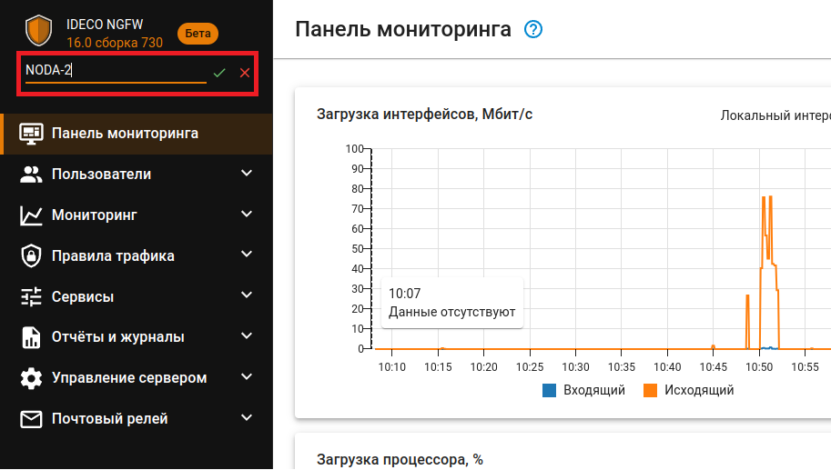
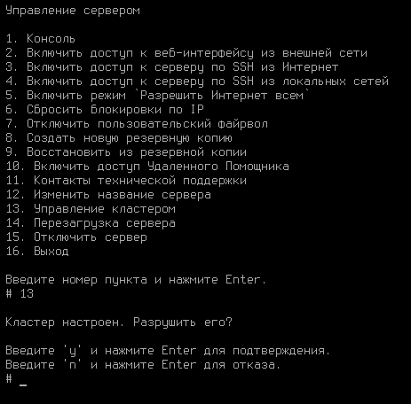

# Кластеризация



Название службы раздела **Кластеризация**: `ideco-cluster-backend`; `ideco-cluster-backup-pusher`. \
Список служб для других разделов доступен по [ссылке](terminal.md).



Каждое из двух устройств Ideco NGFW, объединенных в кластер, называется нодой.

Кластер работает в режиме active-passive. Активной является нода, обрабатывающая трафик в данный момент. В свою очередь, резервная нода находится в предзагруженном состоянии и непрерывно мониторит состояние активной ноды, а при отсутствии связи с ней переводит текущие задачи обработки трафика на себя. 



В любой момент заниматься обработкой трафика может только одна из нод.



Сетевое взаимодействие между нодами осуществляется по *Кластерной сети*. Это физический канал, под который на каждой из нод резервируется по одному физическому порту. Веб-сервер активной ноды управляет кластером, а резервная нода постоянно готова принимать данные.  

Переключение нод происходит, когда пассивная нода перестает фиксировать работу активной - при отказе (полном зависании или перезагрузке) активной ноды, а также при потере связи между нодами по кластерной сети. В этом случае пассивная нода полностью прогружается и становится активной.

Если IP-адреса кластера настроены вручную, он имеет один общий IP на внутреннем интерфейсе и другой общий IP на внешнем интерфейсе. В случае автоматической конфигурации по DHCP адреса будут отличаться в зависимости от ноды.



Для корректной работы кластера необходимо постоянное наличие связи между нодами.





**Особенности работы кластера:**

* **Почта будет доступна для работы только в режиме почтового релея. Хранение почтовых ящиков отключено**;
* **Все данные, в том числе отчетность из ClickHouse, синхронизируются между двумя нодами. Исключение - логи из journald, мониторинг и аппаратные данные**;
* **При синхронизации двух NGFW происходит копирование данных активной ноды в резервную ноду с последующим перезаписыванием всей информации на резервной ноде**;
* **Синхронизация данных происходит автоматически в фоновом режиме**;
* **Синхронизация двух NGFW не производится при разных версиях**;
* **Не рекомендуется объединять в кластер геораспределенные ноды**;
* **При работе NGFW на гипервизорах используйте средства отказоустойчивости гипервизора**;
* **При различных размерах жестких дисков могут возникнуть проблемы при синхронизации из-за нехватки места**;
* **Невозможно восстановление из бэкапов. При этом можно создать резервную копию и после разрушения кластера восстановить на нее ноду, которая была активной**;
* **Невозможно восстановиться на предыдущую версию**;
* **Запрещено добавлять сетевые интерфейсы, но РАЗРЕШЕНО отключать и редактировать. Удаление сетевого интерфейса кластера, использующегося для связи между нодами, сделает его недееспособным**;
* **Если у провайдера имеется привязка по MAC-адресу, то при переключении нод будет отсутствовать доступ в интернет**;
* **Для настройки кластеризации нужна только одна лицензия на Ideco NGFW.**



## Требования

Для создания кластера необходимо соблюдение следующих требований:

* В кластере может быть только 2 ноды Ideco NGFW;
* Обе ноды должны иметь одну версию системы, идентичную вплоть до номера сборки;
* Интерфейсы для создания кластерной сети на каждом Ideco NGFW должны быть в одном сегменте локальной сети, в котором нет других устройств;
* Количество используемых физических сетевых карт на обоих серверах должно совпадать. В ином случае создать кластер нельзя. При этом само наличие дополнительных физических сетевых карт на нодах на создание кластера никак не влияет.



Не используйте в качестве кластерной сети общедоступную сеть, используемую для передачи стороннего трафика. Обмен данными между нодами не защищен от подмены и прослушивания.



## Настройка кластера

Если на момент создания кластера у вас уже есть настроенный Ideco NGFW, рекомендуем выбрать его в качестве активной ноды. Все настройки резервной ноды в процессе создания кластера будут удалены.

### Шаг 1 - Конфигурация резервной ноды

{#top}



1\. При входе в локальное меню резервной ноды увидите следующее сообщение:

2\. Введите **y** и нажмите **Enter**;

3\. Выберите сетевую карту:

4\. Подтвердите создание кластера, введя **y** и нажав **Enter**:

5\. NGFW предложит изменить название сервера. При положительном  ответите на вопрос _Изменить название сервера?_, появится надпись с предложением ввести новое название сервера.\
Минимальное количество символов в названии - 2.\
Максимальное количество символов в названии - 62.

После ввода нового названия нажмите **Enter** для продолжения диалога.

6\. Появится сообщение, что процесс создания кластера запущен:

Необходимо зайти в веб-интерфейс активной ноды и выполнить настройки (см. пункт _Конфигурация активной ноды_). Для этого выделяется 3600 секунд.



{#top}



1\. Перейдите в локальное меню;

2\. Выберите пункт **Управление кластером**. Подтвердите создание кластера, введя **y** и нажав **Enter**:

Если на ноде нет свободных сетевых карт, создание кластера будет недоступно.\
Если кластер на ноде уже настроен, при выборе пункта *Управление кластером* будет доступно только его разрушение.

3\. Выберите свободную физическую сетевую карту для создания кластерной сети и подтвердите выбор:

4\. NGFW предложит изменить название сервера. При положительном ответите на вопрос _"Изменить название сервера?"_ появится надпись с предложением ввести новое название сервера.\
Минимальное количество символов в названии - 2.\
Максимальное количество символов в названии - 42.

После ввода нового названия нажмите **Enter** для продолжения диалога.

5\. Появится сообщение, что процесс создания кластера запущен.

Необходимо зайти в веб-интерфейс активной ноды и выполнить настройки (см. пункт _Конфигурация активной ноды_). Для этого выделяется 3600 секунд.



### Шаг 2 - Конфигурация активной ноды

Для конфигурации активной ноды в веб-интерфейсе Ideco NGFW выполните следующие действия:

1\. Перейдите в раздел **Управление сервером -> Кластеризация** и нажмите кнопку **Настроить кластер отказоустойчивости**.

2\. Подтвердите, что топология сети соответствует схеме ниже:

3\. Выберите сетевую карту для соединения между нодами:

4\. Сопоставьте сетевые карты. Для этого выберите в каждом столбце по одной сетевой карте и нажмите **Сопоставить**:

5\. После применения настроек резервная нода перезагрузится, и в веб-интерфейсе активной ноды отобразится информация о том, что связь с сервером установлена.



Локальное меню резервной ноды недоступно в NGFW, начиная с версии 16.0.



## Изменение названия сервера

Изменить название сервера можно у той ноды, которая в данный момент является активной. Сделать это можно из локального меню или из веб-интерфейса. 

* В локальном меню выберите соответствующий пункт и введите новое название:\
  

* В веб-интерфейсе поменять название можно, нажав кнопку **Редактировать** рядом с названием сервера в левом верхнем углу экрана:\
  

## Разрушение кластера

Разрушить кластер можно только из локального меню или веб-интерфейса *активной* ноды. При этом она продолжит работать, а вторая нода (резервная) сбросит настройки до состояния только что установленного Ideco NGFW.

{#top}



1\. Выберите пункт локального меню **Управление кластером**, введите **y** и нажмите **Enter**;

2\. Подтвердите выбор.



{#top}



1\. Перейдите в раздел **Управление сервером -> Кластеризация** и нажмите кнопку **Разрушить кластер**.

2\. Появится окно с предупреждением:

3\. Нажмите **ОК**:



## Процедура обновления нод

Чтобы обновить NGFW до последней версии в режиме кластера, необходимо выполнить следующие действия:

1. Запустите обновление активной ноды - в разделе **Управление сервером -> Автоматическое обновление** нажмите соответствующую кнопку. В процессе обновления произойдет перезагрузка ноды. Резервная нода станет активной, переведя текущие задачи обработки трафика на себя.

    Обмен данными между нодами будет остановлен, как только первая нода обновилась и перезагрузилась. Для синхронизации оба устройства должны иметь одну версию системы, идентичную вплоть до номера сборки.
2. Дождитесь, когда активная нода скачает обновление, и запустите его. После завершения обновления кластер вновь будет работоспособен.



Обновление активной ноды кластера будет заблокировано, если она не синхронизирована с резервной нодой или с момента последней синхронизации прошло более 30 минут. В случае блокировки обновлений произойдет переключение нод кластера. Нода с младшей версией сможет обновиться без синхронизации.



