# Настройка кластера

Если на момент создания кластера у вас уже есть настроенный Ideco NGFW, рекомендуем выбрать его в качестве активной ноды. Все настройки резервной ноды в процессе создания кластера будут удалены.

## Требования

Для создания кластера необходимо соблюдение следующих требований:

* В кластере может быть только две ноды Ideco NGFW;
* Обе ноды должны иметь одну версию системы, идентичную вплоть до номера сборки;
* Количество **используемых** физических сетевых карт на обоих серверах должно совпадать. В ином случае создать кластер нельзя. При этом само наличие дополнительных физических сетевых карт на нодах на создание кластера никак не влияет;
* Сетевые карты для использования в кластере желательно соединять напрямую, т.к. на основе линка происходит ускоренное переключение нод, поэтому не рекомендуется использовать коммутаторы для кластерной сети. Как минимум сеть должна быть изолирована;
* Не рекомендуется объединять в кластер геораспределенные ноды;
* При работе NGFW на гипервизорах используйте средства отказоустойчивости гипервизора.



* Интерфейсы для создания кластерной сети на каждом Ideco NGFW должны быть в одном сегменте локальной сети, в котором нет других устройств. Не используйте в качестве кластерной сети общедоступную сеть, используемую для передачи стороннего трафика. Обмен данными между нодами не защищен от подмены и прослушивания.

* При настройке кластеризации с использованием гипервизора убедитесь, что сетевая карта, предназначенная для связи между нодами, подключена к изолированной IPv6 сети.

* Запрещено добавлять сетевые интерфейсы, но РАЗРЕШЕНО отключать и редактировать. Удаление сетевого интерфейса, использующегося для связи между нодами, разрушит кластер.



## Шаг 1 - Конфигурация резервной ноды

{#top}



1\. При входе в локальное меню резервной ноды, увидев следующее сообщение, введите **y** и нажмите **Enter**:

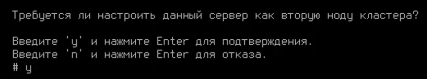

2\. Выберите сетевую карту:

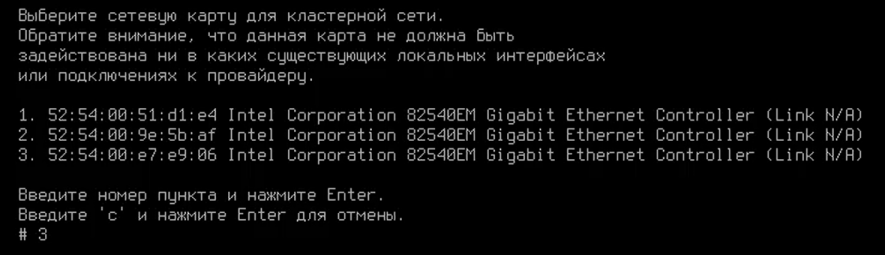

3\. Подтвердите создание кластера, введя **y** и нажав **Enter**:

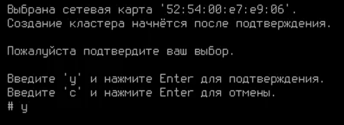

4\. NGFW предложит изменить название сервера. При положительном  ответе на вопрос _Изменить название сервера?_, появится надпись с предложением ввести новое название.\
Допустимое количество символов в названии - от 2 до 62:

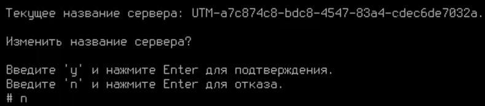

После ввода нового названия нажмите **Enter** для продолжения.

5\. Появится сообщение, что процесс создания кластера запущен:

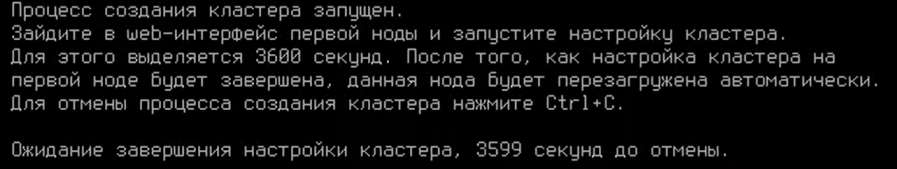

Необходимо зайти в веб-интерфейс активной ноды и выполнить настройки (см. пункт _Конфигурация активной ноды_). Для этого выделяется 3600 секунд.



{#top}



1\. Перейдите в локальное меню;

2\. Выберите пункт **Управление кластером**. Подтвердите создание кластера, введя **y** и нажав **Enter**:

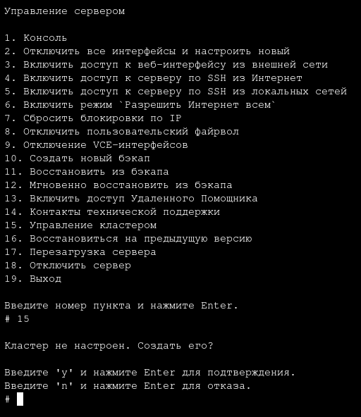

Если на ноде нет свободных сетевых карт, создание кластера будет недоступно.\
Если кластер на ноде уже настроен, при выборе пункта *Управление кластером* будет доступно только его разрушение.

3\. Выберите свободную физическую сетевую карту для создания кластерной сети и подтвердите выбор:

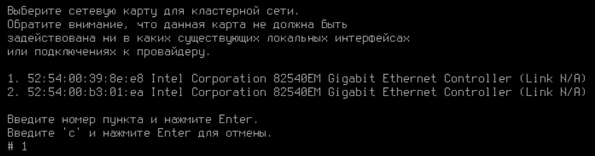

4\. NGFW предложит изменить название сервера. При положительном ответе на вопрос _"Изменить название сервера?"_ появится надпись с предложением ввести новое название.\
Допустимое количество символов в названии - от 2 до 42:

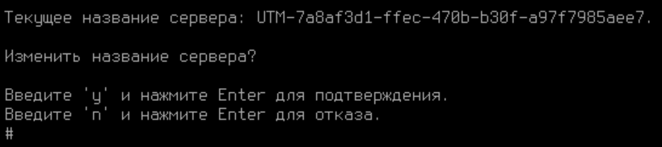

После ввода нового названия нажмите **Enter** для продолжения.

5\. Появится сообщение, что процесс создания кластера запущен:

Необходимо зайти в веб-интерфейс активной ноды и выполнить настройки (см. пункт *Конфигурация активной ноды*). Для этого выделяется 3600 секунд.



## Шаг 2 - Конфигурация активной ноды

Для конфигурации активной ноды в веб-интерфейсе Ideco NGFW выполните следующие действия:

1\. Перейдите в раздел **Управление сервером -> Кластеризация** и нажмите кнопку **Настроить кластер отказоустойчивости**.

2\. Подтвердите, что топология сети соответствует схеме:

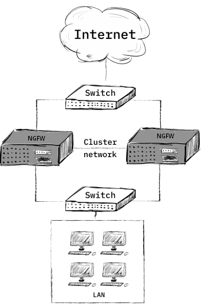

3\. Выберите тип кластера и сетевую карту для соединения между нодами:

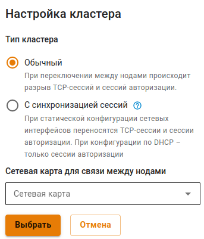



Если был настроен **Обычный** тип кластера, то при переключении между нодами происходит разрыв TCP-сессий пользователей и сессий авторизации.

Если был настроен тип кластера **С синхронизацией сессий**, то при статической конфигурации сетевых интерфейсов все TCP-сессии пользователей и сессии авторизации перенесутся на резервную ноду. При конфигурации по DHCP - перенесутся только сессии авторизации.



4\. Сопоставьте сетевые карты. Для этого выберите в каждом столбце по одной сетевой карте и нажмите **Сопоставить**:

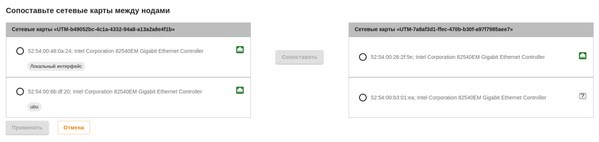

5\. После применения настроек резервная нода перезагрузится, и в веб-интерфейсе активной ноды отобразится информация о том, что связь с сервером установлена.

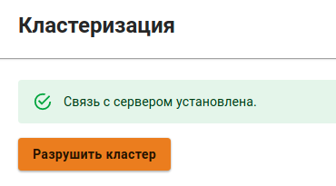



Локальное меню резервной ноды недоступно в NGFW, начиная с версии 16.0.



## Изменение названия кластера

Изменить название кластера можно в веб-интерфейсе активной ноды, нажав на кнопку **Редактировать** рядом с названием кластера в левом верхнем углу экрана:

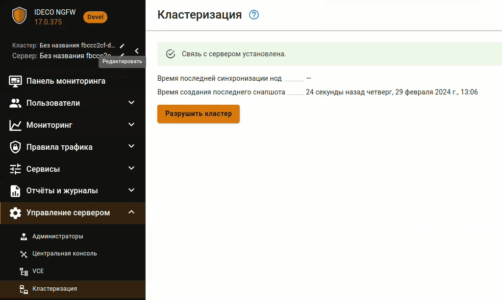

<!-- После ввода нового названия нажмите . -->

## Изменение названия сервера

Изменить название сервера можно у активной ноды из веб-интерфейса, нажав кнопку **Редактировать** рядом с названием сервера в левом верхнем углу экрана:

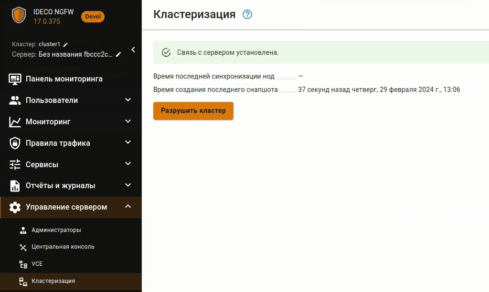

<!-- После ввода нового названия нажмите . -->

## Разрушение кластера

Разрушить кластер можно только из локального меню или веб-интерфейса *активной* ноды. При этом она продолжит работать, а вторая нода (резервная) сбросит настройки до состояния только что установленного Ideco NGFW.

**Разрушение кластера из локального меню:**

1\. Выберите пункт локального меню **Управление кластером**, введите **y** и нажмите **Enter**;

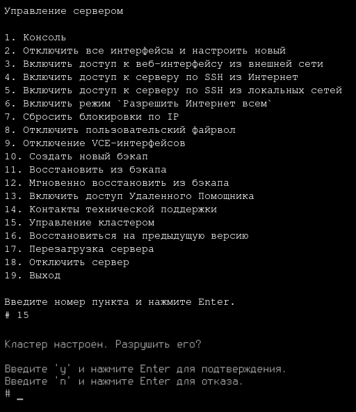

2\. Подтвердите выбор.

**Разрушение кластера из веб-интерфейса:**

1\. Перейдите в раздел **Управление сервером -> Кластеризация** и нажмите кнопку **Разрушить кластер**.

2\. Появится окно с предупреждением:

3\. Нажмите **ОК**:

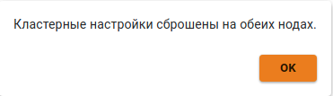

## Процедура обновления нод

Чтобы обновить NGFW до последней версии в режиме кластера, выполните действия:

1\. Запустите обновление активной ноды - в разделе **Управление сервером -> Автоматическое обновление** нажмите соответствующую кнопку. В процессе обновления произойдет перезагрузка ноды. Резервная нода станет активной, переведя текущие задачи обработки трафика на себя. \
Обмен данными между нодами будет остановлен, как только первая нода обновилась и перезагрузилась. Для синхронизации оба устройства должны иметь одну версию системы, идентичную вплоть до номера сборки.



При офлайн-обновлении кластера с синхронизацией сессий обновления баз **Предотвращения вторжений**, **Контент-фильтра** и **Антивирусов веб-трафика** не синхронизируются, каждая нода обновляется отдельно. Вторая нода обновится после того, как станет активной.



    
2\. Дождитесь, когда активная нода скачает обновление, и запустите его. После завершения обновления кластер вновь будет работоспособен.



Обновление активной ноды кластера будет заблокировано, если она не синхронизирована с резервной нодой или с момента последней синхронизации прошло более 30 минут. В случае блокировки обновлений произойдет переключение нод кластера. Нода с младшей версией сможет обновиться без синхронизации.



