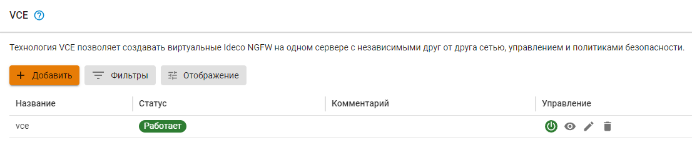
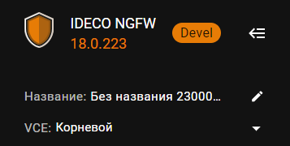
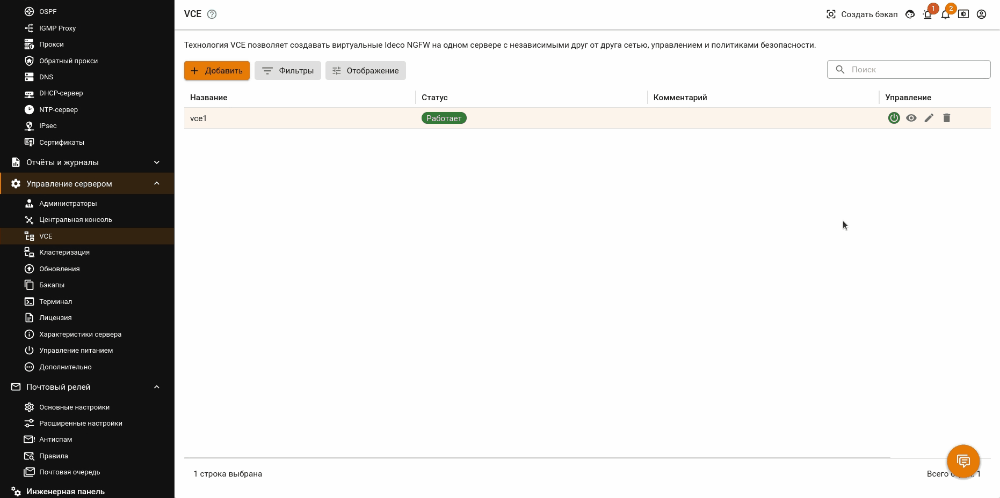
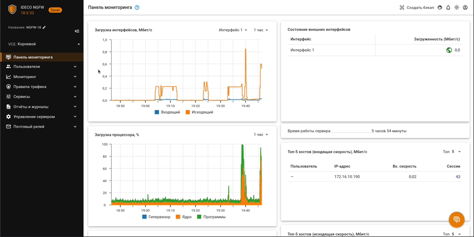
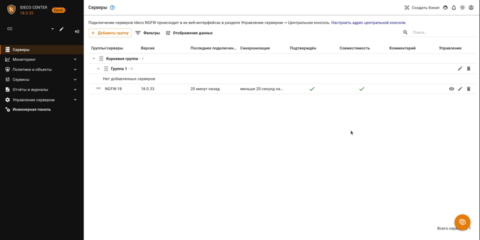

# VCE



Название службы раздела **VCE**: `ideco-vce-backend`. \
Список служб для других разделов доступен по [ссылке](../../../ngfw/settings/server-management/terminal/README.md).



VCE (virtual context engine) - это функция Ideco NGFW, которая позволяет создавать виртуальные серверы на одном корневом NGFW. Это дает возможность разбить одну локальную сеть на несколько независимых подсетей, индивидуально создавать для каждой из этих сетей политики безопасности и объекты, а также разграничивать доступ и независимо управлять дочерними VCE. При этом нет необходимости устанавливать и настраивать для этого отдельные физические серверы.



Не предоставляйте доступ к VCE сторонним организациям, поскольку полная изоляция VCE не реализована и не предусмотрена. Предоставление доступа сторонним организациям может привести к угрозе безопасности сервера.





Сейчас для каждого созданного VCE загружается файл лицензии корневой системы. Это значит, что на Ideco NGFW с лицензией на 100 пользователей можно создать неограниченное количество VCE, каждый из которых также будет поддерживать по 100 пользователей.



Функциональность созданных внутри NGFW виртуальных VCE почти не отличается от функциональности NGFW.

**Возможности VCE:**
* Создание виртуальных серверов Ideco NGFW и настройка независимых сетевых интерфейсов; 
* Независимая настройка политик безопасности и прав доступа различным виртуальным NGFW;
* Связь с Ideco Center;
* Запуск и остановка виртуальных серверов с одного корневого NGFW.

**В интерфейсе VCE недоступно**:

* Создание [кластера](../../../ngfw/settings/server-management/cluster/cluster.md);
* Полное восстановление из бэкапов (как в локальном меню, так и в веб-интерфейсе Ideco NGFW). Доступно только быстрое восстановление;
* Изменение статуса **Разрешить интернет всем** (настраивается в корневой системе);
* Переход в **Профиль** через иконку  в шапке веб-интерфейса (настраивается в корневой системе);
* Возможность выключения и перезагрузки (настраивается в корневой системе);
* Энергосберегающий режим (настраивается в корневой системе);
* Изменение настроек часового пояса и языка (настраивается в корневой системе).



В [бэкап](../../../ngfw/settings/server-management/backup.md) корневого VCE не входят данные и настройки, которые содержатся в дочерних VCE. Чтобы обеспечить полное сохранение данных, создайте бэкапы корневого NGFW и каждого из дочерних VCE.

Нельзя добавлять LACP-интерфейсы в VCE.



## Создание VCE



Для работы VCE требуется минимум 8 ГБ оперативной памяти, а максимум можно выделить 16 ГБ.



Чтобы создать виртуальный сервер в рамках VCE, перейдите в раздел **Управление сервером -> VCE** и выполните действия:

1\. Нажмите кнопку **Добавить**.

2\. Введите название сервера и нажмите **Добавить**. Виртуальный сервер появится в таблице:

3\. Перейдите в раздел **Сервисы -> Сетевые интерфейсы** и на вкладке **VCE** создайте интерфейс для виртуального сервера. Для работы VCE нужна минимум одна сетевая карта, их максимальное количество не ограничено. Подробнее о создании VCE-интерфейсов в [статье](../../../ngfw/settings/services/connection-to-provider/README.md#vce-interfeisy).



Сетевая карта без тега VLAN, подключенная к VCE, будет недоступна для использования корневым NGFW.

Если VCE выключен, переданные ему сетевые карты становятся вновь доступны корневому NGFW, их можно использовать для создания нового виртуального сервера. При этом VCE, которому они принадлежали ранее, станет недоступен после включения.



Чтобы отредактировать VCE, нажмите на . При редактировании можно менять название виртуального сервера. Редактирование доступно в том числе для работающего VCE.

Если в таблице большое количество VCE, воспользуйтесь кнопкой **Фильтры**.

## Переход в веб-интерфейс VCE

После создания VCE текущий сервер NGFW, в котором VCE был создан, будет обозначен как корневой:

Перейти в веб-интерфейс созданного VCE из веб-интерфейса NGFW можно двумя способами:

1\. Перейдите в **Управление сервером -> VCE** и нажмите на :

<!-- После этого веб-интерфейс VCE откроется в новой вкладке браузера. -->

В новой вкладке откроется веб-интерфейс VCE.

2\. Нажмите на  в левом верхнем углу и выберите нужный VCE:

<!-- После этого веб-интерфейс VCE откроется в текущей вкладке браузера. Меню интерфейса корневого NGFW будет свернуто, вернуться к нему можно, кликнув на панель слева. -->

Также перейти в веб-интерфейс VCE можно из веб-интерфейса Ideco Center. Для этого сначала перейдите из интерфейса Ideco Center в интерфейс корневого NGFW одним из способов, указанных в [статье](../../../settings-cc/servers.md).

Пример перехода:

<!-- В интерфейсе Ideco Center нажмите на  в левом верхнем углу и выберите нужный NGFW. В открывшемся веб-интерфейсе NGFW нажмите на  в левом верхнем углу и выберите нужный VCE. -->

## Удаление VCE

Удалить VCE можно, нажав на  в корневом VCE.



После удаления VCE все его настройки, журналы и внутренние данные будут безвозвратно утеряны. Восстановить их будет невозможно.



