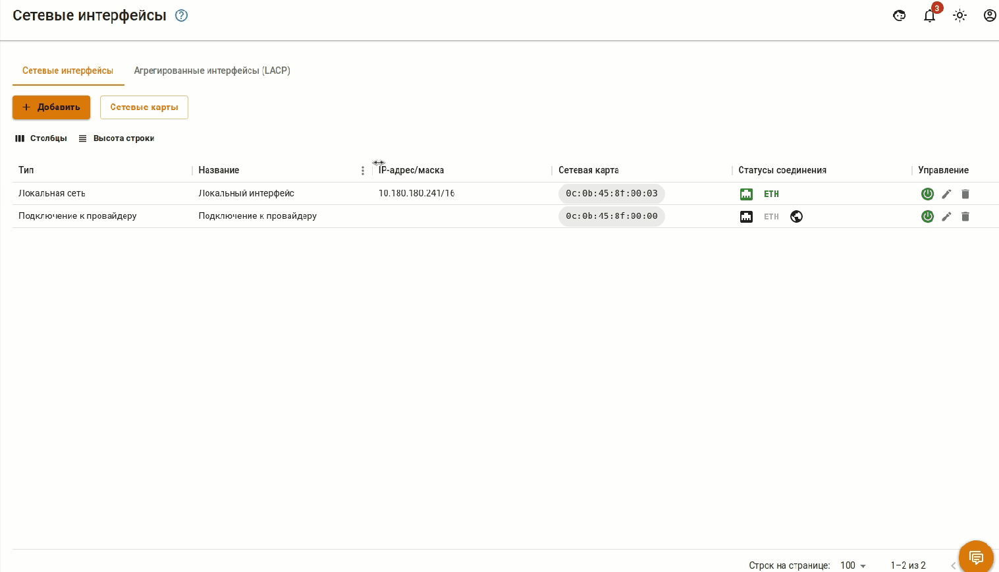

# Сетевые интерфейсы



Название службы раздела *Сетевые интерфейсы*: `ideco-network-backend`; `ideco-network-nic`. \
Список имен служб для других разделов доступен по [ссылке](../../../../ngfw/settings/server-management/terminal.md).



Сетевой порт становится активным только после создания сетевого интерфейса (внешнего или локального). До этого момента индикаторы на подключенных сетевых портах не горят и Ethernet-кадры не передаются.

Все созданные интерфейсы представлены в виде таблицы:

{#top}



*  - сигнал есть;
*  - статус сигнала не определен;
*  - сигнала нет;

*  - IP-адрес назначен;

*  - соединение с интернетом установлено;
*  - соединение с интернетом отсутствует.



В режиме редактирования появляется возможность смены названия, сетевой карты (по кнопке ), зоны и настроек конфигурации (вручную или автоматически): 

<!-- Для перехода к редактированию интерфейса нажмите на  в столбце редактирования. -->

Если сетевая карта уже используется каким-либо интерфейсом, то NGFW выведет окно с ошибкой **Комбинации сетевой карты/vlan тега должны быть уникальны**:



При миграции NGFW с одной физической машины на другую (перенос диска или восстановление резервной копии на новом оборудовании), будут восстановлены настройки всех сетевых интерфейсов, указанные до миграции. Для удаления ненужных интерфейсов воспользуйтесь кнопкой .

**Например:** исходная версия NGFW 16.Х -> провели миграцию NGFW на новое оборудование -> настроили новое оборудование -> провели обновление -> в разделе Сетевые интерфейсы будут отображаться старые (до миграции) и новые (после миграции и настройки) сетевые интерфейсы.



В зависимости от объема оперативной памяти на сервере в Ideco NGFW есть ограничения на количество сетевых интерфейсов:

* на количество сетевых VLAN-интерфейсов:
  * до 8 ГБ - 14 VLAN-интерфейсов,
  * от 8 до 16 ГБ - 33 VLAN-интерфейса,
  * 16 ГБ и более - 66 VLAN-интерфейсов. \
При создании большего количества VLAN-интерфейсов могут возникнуть проблемы в работе Контроля приложений и Ограничения скорости.

* на количество сетевых интерфейсов (не VLAN):
  * до 16 ГБ - 40 сетевых интерфейсов.



При создании, редактировании или удалении сетевого интерфейса перевыпускается [SSL-сертификат](../../../../ngfw/settings/services/certificates/README.md), поэтому вероятно снижение скорости работы веб-интерфейса Ideco NGFW. В этом случае рекомендуем нажать F5.



## Агрегированные интерфейсы



Агрегированные интерфейсы реализованы по стандарту LACP (IEEE **802.3ad**). 

Используется **active** режим - постоянная рассылка LACP пакетов. 

Проверка соседства осуществляется в режиме **slow** - раз в 30 секунд. 

Количество сетевых карт, объединяемых в агрегированный интерфейс, не ограничено.



Чтобы объединить несколько сетевых интерфейсов в один агрегированный, перейдите в раздел **Сервисы -> Сетевые интерфейсы** и в таблице **Агрегированные интерфейсы (LACP)** нажмите **Добавить**. Укажите название, выберите сетевые карты и нажмите **Сохранить**.

При выборе сетевой карты обращайте внимание на пиктограммы:

*  - сетевая карта уже используется другим интерфейсом;
*  - сетевая карта не используется.

Если были выбраны уже использующиеся сетевые интерфейсы, то при нажатии на кнопку **Сохранить** появится сообщение:

При нажатии на **Да** сетевая карта будет использоваться агрегированным интерфейсом и станет недоступна для ранее созданного сетевого интерфейса:

На основе созданного агрегированного интерфейса можно создавать любой логический интерфейс, в том числе с указанием VLAN.
