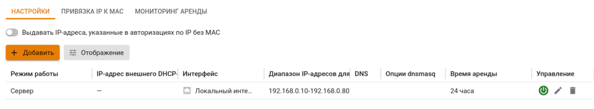
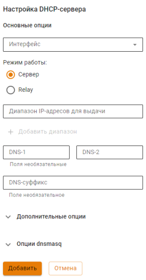
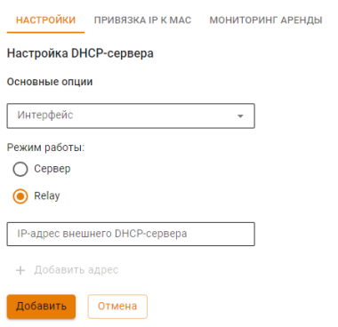
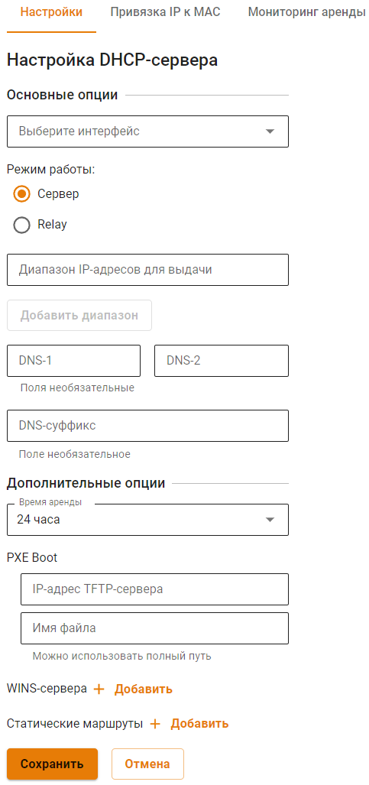
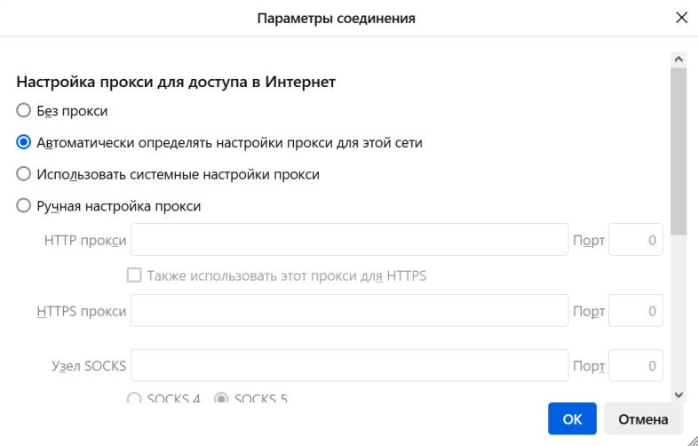
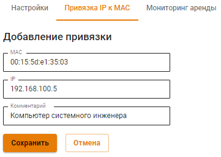
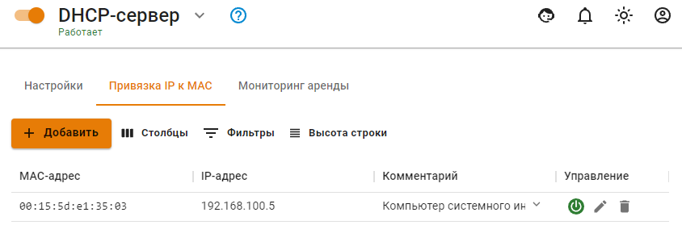
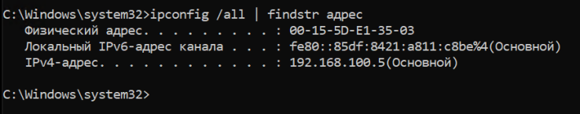
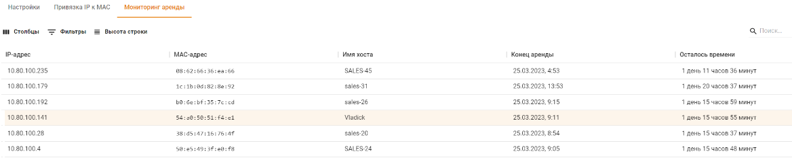

# DHCP-сервер



Название службы раздела **DHCP**: `ideco-dnsmasq`. \
Список служб для других разделов доступен по [ссылке](../../../ngfw/settings/server-management/terminal/README.md).



#### Интерфейс Ideco NGFW:

* [x] Вкладка **Настройки** - позволяет настроить диапазон IP-адресов для автоматического назначения
* [x] Вкладка **Привязка IP к MAC** - позволяет сформировать статические привязки IP-адресов к MAC-адресам
* [x] Вкладка **Мониторинг аренды** - позволяет получить сведения об аренде IP-адреса для устройства

Сетевые устройства в локальной сети должны быть настроены на автоматическое получение сетевых реквизитов от DHCP-сервера. Таким образом, клиенты отправляют широковещательный запрос в сегмент локальной сети, а сервер перехватывает и отправляет на эти запросы ответы, содержащие необходимые настройки для клиента.



Для сортировки строк таблицы по определенному столбцу нажмите на этот столбец в заголовке таблицы.



Для управления настройками DHCP-сервера перейдите в раздел **Сервисы -> DHCP-сервер**.



На локальном интерфейсе Ideco NGFW, участвующем в раздаче адресов, должен быть настроен статический IP адрес.



При использовании DHCP-сервера переключите ползунок в левом верхнем углу в положение **Включен**:



## Настройки

Если сервер Ideco NGFW является шлюзом и DNS-сервером для всех сетевых устройств локальной сети, настройка службы ограничивается определением диапазона IP-адресов. 



При включении опции **Выдавать IP-адреса, указанные в авторизациях по IP без MAC**, будут выдаваться IP-адреса (исключение - правило с IP+MAC), использованные в качестве фактора авторизации пользователя (раздел [Авторизация](../../../ngfw/settings/users/authorization/README.md)).



Если на Ideco NGFW настроен [перехват DNS](dns/#perekhvat-dns-zaprosov), то резолвинг имен будет производиться при помощи сервера, указанного в настройках перехвата DNS.

Настройка DHCP-сервера делится на три блока:

* **Основные опции** - задаются диапазоны IP-адресов и DNS-серверы;
* **Дополнительные опции** - статические маршруты, адреса WINS-серверов, время аренды, PXE Boot и WPAD;
* **Опции dnsmasq** - предназначены для ручного задания опций DHCP, передаваемых сервером клиенту при получении сетевых реквизитов от DHCP-сервера.

### Основные опции

{#top}



Выберите режим работы **Сервер**, чтобы настроить выдачу IP-адресов на Ideco NGFW. Заполните следующие поля:



* **Интерфейс** - выберите интерфейс, который будет участвовать в раздаче адресов;
* **Диапазон IP-адресов для выдачи** - укажите диапазон IP-адресов, которые будут выданы устройствам в локальной сети, должен входить в одну из подсетей выбранного интерфейса. Размер диапазона не должен превышать 256 адресов;
* **DNS-1** и **DNS-2** - укажите IP-адреса DNS-серверов для устройств локальной сети. Если ни одно из полей не заполнено, то DNS-сервером для всех сетевых устройств локальной сети будет являться Ideco NGFW;
* **DNS-суффикс** - введите домен, прибавляющийся к запрашиваемому имени устройства в локальной сети. Поле не обязательное. Нужен, для того, чтобы в локальной сети вводить не полное имя компьютера вместе с доменом, а только само имя.



{#top}



Выберите режим работы **Relay**, если IP-адреса будет выдавать внешний DHCP-сервер. Выберите интерфейс, который будет участвовать в раздаче IP-адресов, и введите IP-адрес внешнего DHCP-сервера:





Включить/выключить, редактировать или удалить правила для выдачи IP-адресов можно кнопками управления в колонке **Управление**.

### Дополнительные опции



* **Шлюз** - шлюз для направления трафика по умолчанию. Если поле не заполнено, шлюзом будет выступать IP-адрес выбранного интерфейса;
* **Время аренды** - время, на которое выдается IP-адрес;
* **PXE Boot** - IP-адрес TFTP-сервера для настройки загрузки образа по сети;
* **WINS-сервера** - IP-адрес WINS-сервера;
* **Статические маршруты** -  подсеть и шлюз для указания статического маршрута;
* **WPAD** - протокол автоматической настройки прокси. 
  
При включении опции WPAD Ideco NGFW будет автоматически генерировать файл с настройками подключения к прокси и передавать его хостам в локальной сети, на которых настроено получение IP по DHCP. Локальные сети в файле конфигураций будут добавлены в исключения из прокси.



Для работы WPAD необходимо разрешить прямые подключения к прокси в разделе **Сервисы -> Прокси**.





Браузеры Google Chrome и Microsoft Edge автоматически примут настройки прокси, переданные хостам по DHCP. В Mozilla Firefox необходимо будет дополнительно зайти в **Настройки браузера -> Настройки прокси** и выбрать пункт **Автоматически определять настройки прокси для этой сети**:





### Опции dnsmasq



Опция dnsmasq имеет больший приоритет чем опция, внесенная в блок **Основные опции** или **Дополнительные опции**.

Строка **Значение** может содержать только одну опцию.



Формат записи опции соответствует части записи опции в конфигурации dnsmasq - `[vendor:[<vendor-class>],][<opt>|option:<opt-name>],[<value>[,<value>]]`, где:
* `[vendor:[<vendor-class>],]` - вендор, необязательно: 
* `[<opt>|option:<opt-name>]` - числовое или строковое (напр. option:nis-server) обозначение опции;
* `[<value>[,<value>]]` - одно или несколько значений опции через запятую.

Установите флаг **Force** если требуется отправлять опцию DHCP-клиенту, даже если он ее не запрашивал.



**Важно**: некорректно заданные dnsmasq-опции могут привести к остановке работы раздела **DHCP-сервер**. Статус раздела сменится на `Модуль "dnsmasq" не смог запуститься` и 
`Служба 'ideco-dnsmasq' остановлена`. 



Для поиска некорректно заданной опции выполните действия:

* Перейдите в раздел **Отчеты и журналы -> Системный журнал**;
* В столбце **Сообщение** найдите запись формата `bad option at line 15 of /run/ideco-dhcp-server-backend/dnsmasq.conf`. В записи указано, на какую строку в конфиге нужно обратить внимание;
* Перейдите в раздел **Управление сервером -> Терминал**;
* Откройте конфиг `/run/ideco-dhcp-server-backend/dnsmasq.conf` и найдите нужную строку.

{#top}



Для IP-телефонов Avaya может потребоваться передать оборудованию опции 176 и 242. Для ознакомления со списком опций для конкретной модели обратитесь к [документации нужной модели Avaya](https://support.avaya.com/support/en/public).

1\. Перейдите к созданию настройки DHCP-сервера (**Сервисы -> DHCP-сервер -> Настройки -> Добавить**).

2\. Заполните **Основные** и **Дополнительные** опции.

3\. Нажмите **Добавить опцию** и заполните 176 опцию. Она используется для указания голосового сервера:

```
176,"MCIPADD=1.2.3.4,MCPORT=1719"
```

4\. После добавления 176 опции добавьте 242. Она используется для серверов передачи данных:

```
242,"MCIPADD=1.1.1.2,MCPORT=1719"
```

После сохранения настроек IP-телефония Avaya будет получать от DHCP-сервера расширенный список опций.



## Привязка IP к MAC

Для настройки в DHCP-сервере привязки IP-адреса к MAC-адресу необходимо:

1\. В разделе **Сервисы -> DHCP** выберите вкладку **Привязка IP к MAC**.

2\. Создайте правило привязки **IP к MAC**:



Пример созданного правила привязки показан ниже на скриншоте:



Для проверки созданного правила на компьютере с указанным в правиле MAC-адресом получите IP-адрес по DHCP и проверьте результат с помощью команды `ipconfig /all` (для операционной системы Windows):



При наличии большого количества привязок в таблице воспользуйтесь кнопкой **Фильтры**.



Будьте внимательны при согласовании настроек клиентских устройств и DHCP-сервера на Ideco NGFW.

Некоторые устройства предоставляют MAC-адрес с разделенными с помощью дефиса октетами (`01-02-03-04-05-06`). В настройках Ideco NGFW октеты MAC-адреса разделяются только двоеточиями (`01:02:03:04:05:06`). 



**Настройка DHCP-сервера для Wi-Fi сетей:**

При настройке Wi-Fi сетей может понадобиться настройка DHCP-сервера. Для получения подробной информации перейдите в раздел [Wi-Fi-сети](../../../ngfw/settings/users/wifi-network.md).

## Мониторинг аренды

Содержит информацию об аренде IP-адресов для устройств. Для поиска воспользуйтесь кнопкой **Фильтры**:



Для привязки IP к MAC нажмите на кнопку  в столбце **Управление**.