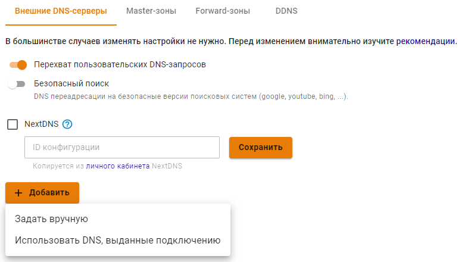
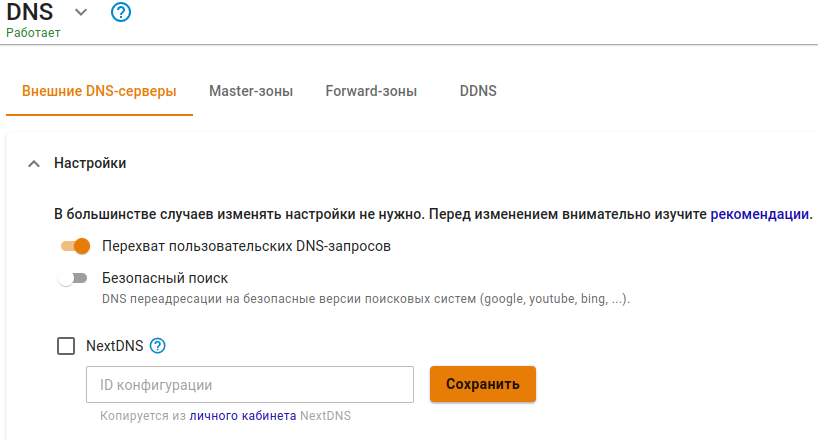

# Внешние DNS-серверы 

Для корректной работы резолвинга имен через Ideco NGFW указывать DNS-серверы в этом разделе не требуется. 

Если DNS-серверы не указаны, то сервер будет разрешать имена в сети интернет, используя [корневые DNS-серверы](https://ru.wikipedia.org/wiki/%D0%9A%D0%BE%D1%80%D0%BD%D0%B5%D0%B2%D1%8B%D0%B5_%D1%81%D0%B5%D1%80%D0%B2%D0%B5%D1%80%D1%8B_DNS) в интернете. 

Данная конфигурация не будет работать, если вышестоящий роутер перехватывает DNS-запросы. В этом случае рекомендуем:

* указать DNS-серверы вручную (нажмите **Добавить -> Задать вручную** и укажите IP-адрес DNS-сервера);
* использовать опцию **Использовать DNS, выданные подключению**, указав нужное подключение;
* использовать NextDNS.

#### Рекомендации:

1\. В Ideco NGFW встроен кеширующий DNS-сервер. Рекомендуется использовать его в качестве DNS-сервера для локальной сети.

2\. Не указывайте `8.8.8.8`, `1.1.1.1` или подобные без особой необходимости. Ideco NGFW справится с резолвингом самостоятельно.

3\. Не указывайте DNS-серверы от внутреннего сервера Active Directory, даже если он может самостоятельно резолвить доменные имена в интернете. При интеграции с AD Ideco NGFW автоматически настроит все необходимое (forward-зону) для работы AD и резолвинга внутренних имен домена. Для резолвинга каких-то особых зон, не связанных с AD, создавайте forward-зону.

4\. Не рекомендуем использовать DNS, выданные интернет-провайдером, так как они превышают TTL и долго отвечают. Ideco NGFW настроит автоматически все необходимое для подключения к PPTP/L2TP через доменное имя. Если нужна особая внутренняя доменная зона провайдера, то создавайте forward-зону.

5\. Можно указывать DNS-серверы занимающиеся фильтрацией, если это необходимо (SkyDNS или Яндекс-DNS).

6\. Если все DNS-серверы отключены или удалены, то DNS будет работать нормально (Ideco NGFW резолвит имена самостоятельно).

7\. Если интернет-провайдер или вышестоящее устройство блокирует DNS-запросы, то использование стандартной конфигурации с корневыми серверами невозможно. Рекомендуем задать серверы вручную или использовать DNS-серверы, выданные подключению.

### Перехват DNS-запросов



Включение перехвата пользовательских DNS-запросов блокирует использование DNS-over-TLS (DoT), DNS-over-QUIC (DoQ) и DNS-over-HTTPS (DoH).



Если на рабочей станции пользователя указаны сторонние DNS-серверы (например, с целью обхода блокировок), включите опцию **Перехват пользовательских DNS-запросов** в разделе **Внешние DNS-серверы**.

Опция включается глобально для всех хостов в локальной сети для избежания возможной подмены адреса ресурса при резолвинге его домена. \
Также перехват позволит контролировать процесс резолвинга доменных имен в интернете исключительно средствами NGFW. Запрос будет перенаправлен на DNS-сервер NGFW, и он же сформирует ответ (вместо исходного DNS-сервера). 

Перехват DNS-запросов также блокирует возможность туннелирования через DNS (DNS-tunneling) и блокирует использование DNS-over-TLS.

{#top}



* SkyDNS `193.58.251.251`;
* Yandex DNS `77.88.8.88`, `77.88.8.2`;
* Google DNS `8.8.8.8`, `8.8.4.4`;
* Open DNS `208.67.222.222`, `208.67.220.220`, `208.67.222.220`, `208.67.220.222`;
* Cloudflare DNS `1.1.1.1`, `1.0.0.1`.



### Безопасный поиск

При резолвинге через DNS-сервер NGFW будет возвращать адреса поисковых систем с включенной фильтрацией неподобающего контента.