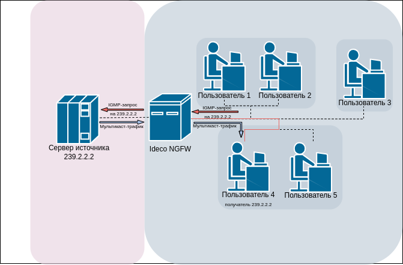
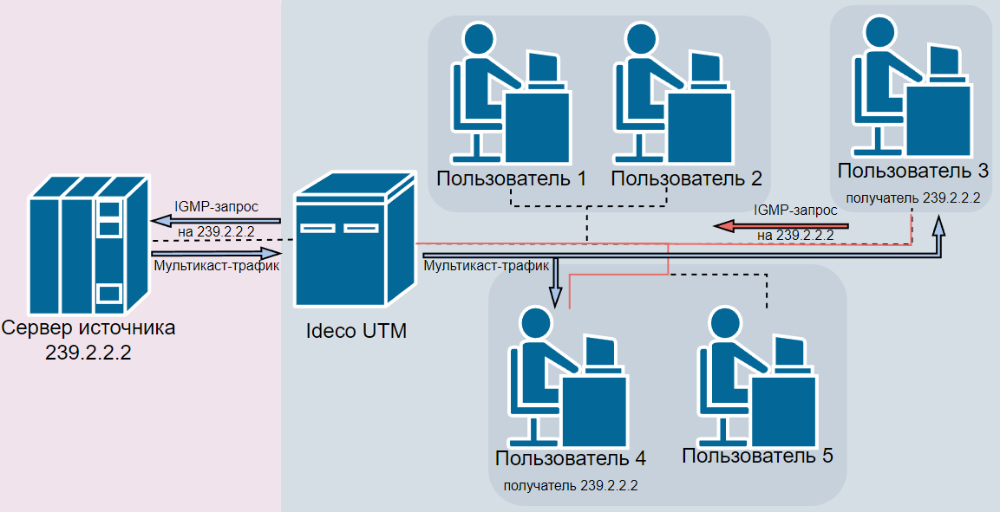
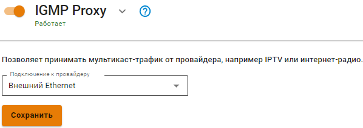

# IGMP Proxy



Название службы раздела **IGMP Proxy**: `igmpproxy`. \
Список служб для других разделов доступен по [ссылке](../../../ngfw/settings/server-management/terminal.md).





IGMP Proxy работает только с Ethernet-интерфейсами и не работает на интерфейсах VLAN, PPPoE или VPN (L2TP, PPTP).



IGMP Proxy - служба, которая проксирует (передаёт) мультакаст-трафик сквозь роутер. Это сокращает объем трафика, что влияет на скорость работы и нагрузку сети. 

## Принцип работы

Со стороны клиентов IGMP Proxy поддерживает версии IGMPv1 и IGMPv2.

Принцип работы на примере подключения двух пользователей к мультикаст-потоку одного источника: 
* *Сервер источника* начинает трансляцию мультикаст-трафика с адреса из диапазона 224.0.0.0/4. 
* *Пользователь 4* хочет подключиться к трафику и генерирует IGMP-запрос (Join) на *Ideco UTM* для получения мультикаст-трафика от сервера источника. 
* *Ideco UTM* получает IGMP-запрос и отправляет аналогичный запрос к серверу источника;
* Сервер источника получает запрос и начинает транслировать мультикаст-трафик на *Ideco UTM*;
* *Ideco UTM* пропускает трафик с адреса 239.2.2.2 в подсеть с *Пользователем 4* и *Пользователь 4* становится его получателем. \

* *Пользователь 3*, находящийся в другой подсети, также решает подключиться к этой трансляции и генерирует IGMP-запрос (Join) на Ideco UTM;
* *Ideco UTM* получает этот запрос и дублирует *Пользователю 3* поступающий трафик *Пользователю 4*; \

Ideco UTM периодически проверяет, есть ли получатели, отправляя пользователям IGMP-запрос (Query). Пользователи в ответ отправляют Join, как при подключении. \
Если на Ideco UTM приходит хотя бы один Join, то мультикаст-трафик продолжает транслироваться получателям.

## Настройка в Ideco UTM

Для настройки перейдите в раздел **Сервисы -> IGMP Proxy**. Переведите опцию **IGMP Proxy** в положение **Включен**. В строке **Подключение к провайдеру** выберите Ethernet-подключение.

