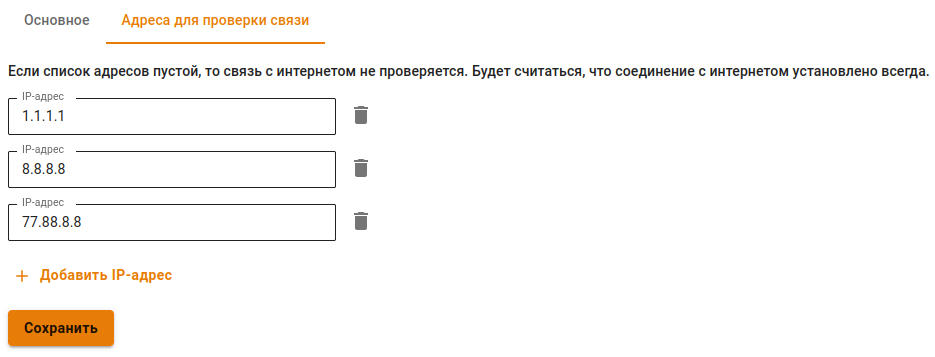

# Балансировка и резервирование



Название службы раздела **Балансировка и резервирование**: `ideco-routing-backend`. \
Список служб для других разделов доступен по [ссылке](../../../ngfw/settings/server-management/terminal.md).



При наличии нескольких подключений к интернет-провайдерам балансировку и резервирование можно осуществлять следующими способами:
 
* Резервирование одного из подключений, при отключении которого трафик пойдёт через другие доступные подключения;
* Статическая балансировка трафика между несколькими подключениями. При этом часть пользователей локальной сети будет выходить в сеть Интернет через одного провайдера, часть через другого;
* Динамическая балансировка трафика между несколькими подключениями. При этом подключения будут поочередно переключаться в зависимости от нагрузки, а сессии от всех пользователей будут равномерно распределяться между ними.

Перед настройкой убедитесь, что на сервере уже созданы минимум два подключения к сети интернет. Если нет, то создайте дополнительное подключение. Подробнее о создании подключения в статье [Настройка Внешнего Ethernet](../../../ngfw/settings/services/connection-to-provider/ethernet-connection.md) 

Для работы с трафиком в Ideco UTM важно учитывать 2 момента: маршрутизация и NAT. Это касается как балансировки, так и резервирования.

## Основное

На вкладке доступен выбор одного из двух режимов - **Балансировка** или **Резервирование**.

При **Резервировании** Ideco UTM использует каналы в соответствии с их приоритетом. Приоритет задается порядком подключений в таблице, сверху вниз. Если интернет стал недоступен через используемое подключение, то UTM будет перебирать подключения сверху вниз (до первого рабочего подключения).

При **Балансировке** сервер балансирует трафик в зависимости от загрузки подключений.

### Резервирование каналов

Перейдите в раздел **Сервисы -> Балансировка и резервирование** и выбрать режим **Резервирование**.

Подключение, которое используется в данный момент, отмечено тегом **Используется**. Для смены приоритета используйте соответствующие элементы управления ().

### Динамическая балансировка. Распределение нагрузки по нескольким подключениям 

Действия для настройки:

1\. Перейдите в раздел **Сервисы -> Балансировка и резервирование**.

2\. Выберите режим работы **Балансировка**.

Для равномерного распределения сессий между подключениями необходимо указать значение **Пропускной способности** - максимальной скорости интернета по тарифам провайдеров. Ideco UTM будет автоматически балансировать трафик в зависимости от загрузки подключений.



Создавать маршруты или выполнять еще какие-либо настройки для динамической балансировки трафика не требуется. Трафик прокси-сервера также будет балансироваться автоматически.





Для проверки скорости подключения перейдите в раздел **Управление сервером -> Терминал** и введите `speedtest-cli`. 

Пример вывода команды:



### Статическая балансировка. Доступ к сети интернет через определенное подключение к провайдеру 

Способы применения:

* Направление части трафика через интернет-провайдера, чья тарификация для этого трафика дешевле.
* Предоставление доступа к внутренним сетям одного из провайдеров для определенных пользователей/групп пользователей.

Действия для настройки:

1\. Перейдите в раздел меню **Сервисы -> Маршрутизация -> Внешних сетей**.

2\. Добавьте правила маршрутизации для определенного списка ресурсов, трафик к которым необходимо направить через нужное подключение к провайдеру, нажав кнопку **Добавить**.

Пример направления трафика к ресурсу **vk.com** от пользователя **Иван Петров** через подключение к провайдеру **Подключение к провайдеру №1**:

## Адреса для проверки связи

На вкладке задаются IP-адреса, которые Ideco UTM будет использовать для проверки связи с интернетом. По умолчанию заданы три IP-адреса - DNS-серверы Cloudflare, Google и Яндекс:

Сервер посылает на эти адреса ping-запросы. Cоединение с Инернетом считается установленным, если проходит пинг хотя бы до одного адреса из списка. Если этого не происходит, UTM считает, что соединение с интернетом у интерфейса отсутствует - статус интерфейса меняется с  на .



Если список адресов будет пустым, то связь с интернетом проверяться не будет. Будет считаться, что соединение с интернетом установлено всегда.



