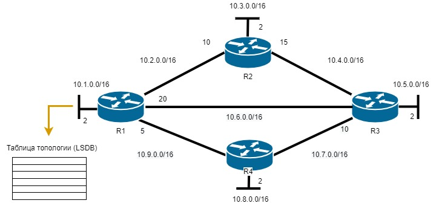
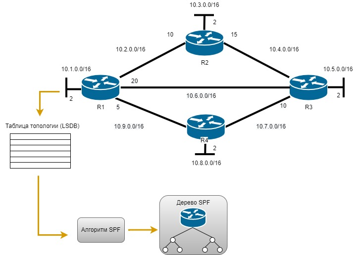
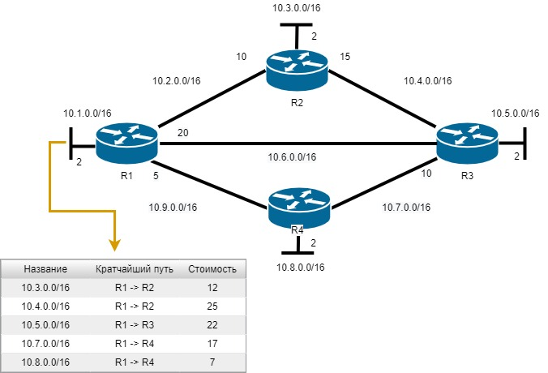

# OSPF

В Ideco UTM реализована поддержка OSPF (Open Shortest Path First) - протокола маршрутизации по состоянию каналов. Канал — это интерфейс маршрутизатора или сегмент сети, который соединяет два маршрутизатора. Данные о состоянии этих каналов называются состоянием канала.

Использование данного модуля лучше всего подойдет для сетей, имеющих балансировку нагрузки на сеть и резервирование каналов.

Пример топологии с использованием OSPF представлен на схеме ниже:

{#top}



**1. Установление отношений смежности с соседними устройствами**

Маршрутизатор, использующий OSPF, отправляет пакеты приветствия для определения всех соседних устройств в пределах этих каналов. При наличии соседнего устройства маршрутизатор пытается установить с ним отношения смежности.

**2. Обмен объявлениями о состоянии каналов**

После установления смежности устройства выполняют обмен объявлениями о состоянии канала (LSA). LSA содержат информацию о состоянии и стоимости каждого канала с прямым подключением.

**3. Создание базы данных состояния связи**

На основе объявления LSA маршрутизаторы собирают базу данных, в которой содержатся данные о топологии сети в области.

**4. Исполнение алгоритма SPF**

Затем на устройствах выполняется алгоритм SPF, результатом которого является создание дерева кратчайших путей.

**5. Выбор лучшего маршрута**

На основании данных дерева SPF предлагаются наилучшие пути для таблицы IP-маршрутизации. Маршрут добавляется в таблицу маршрутизации, если отсутствует источник маршрута к той же сети с меньшим административным расстоянием, например статический маршрут. Решения по маршрутизации принимаются на основе записей в таблице маршрутизации.



## Основное

{#top}



**Router ID** - IP-адрес маршрутизатора. Присваивается автоматически в виде самого большого IP-адреса локальной сети, заданной в разделе [Сетевые интерфейсы](connection-to-provider/README.md).

Для того чтобы настроить OSPF на UTM, выполните следующие действия:

1. В веб-интерфейсе UTM перейдите в раздел **Сервисы –> OSPF** и нажмите кнопку **Добавить**;
2. Заполните следующие поля:

    * **Интерфейс** - выберите локальный интерфейс, подключенный к роутеру;
    * **Название зоны** - введите номер зоны (для небольших сетей введите зону 0). Наименование зоны можно ввести в виде числа или IP-адреса, нажав иконку ;
    * **Вес** введите стоимость маршрута.
  
3. Нажмите **Сохранить.**

Пример настройки:

Пример готовой таблицы:



{#top}



1\. Установите и запустите RouterOS:

* Поставьте крестик на модуле **Routing**;
* Укажите необходимые интерфейсы, но БЕЗ статичных маршрутов:
    
* Для начала установки введите **i** и нажмите **Enter**;
* Появится сообщение **All data on the disk will be erased. Continue?**, ведите **y** и нажмите **Enter**:
    

2\. После установки RouterOS, требуется его перезагрузить, нажав **Enter**:

3\. По умолчанию *логин* - `admin`, а *пароль* - пустое значение;

4\. Установите логин/пароль администратора;

5\.  Выполните следующую команду:

`routing ospf area add area-id=х.х.х.х default-cost=1 disabled=no inject-summary-lsa=no name=area1 type=default`\
, где `х.х.х.х` - **название зоны, которое указали при настройке Ideco UTM** в пределах сети;

6\. Для передачи любых других сетей соседним устройствам по динамической маршрутизации, введите следующую команду:

`routing ospf network add network=(другие подсети)/24 area=area1`

7\. Повторите команду из п. 6 для добавления каждой подсети;

8\.  Для вывода таблицы маршрутизации введите команду:

`ip route print`

**\*** ID роутера должен быть уникален для **каждого** роутера.



