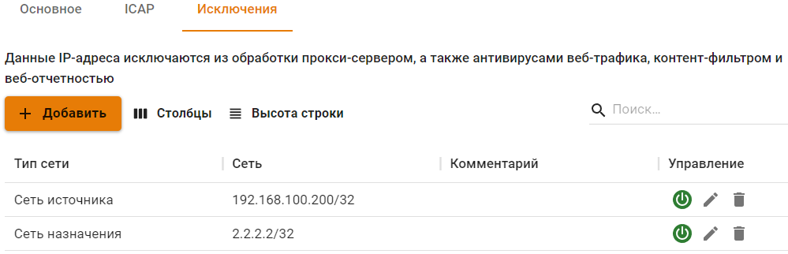

# Исключения



Исключения ресурсов из обработки прокси-сервером работают только для прозрачного режима прокси. При прямых подключениях к прокси-серверу исключить что-либо из обработки прокси нельзя.



На вкладке **Исключения** возможно исключить ресурсы из обработки прокси-сервером и всеми связанными службами (контент-фильтр, веб-отчетность, антивирусы).

* **Сети источника:** указываются сети, трафик из которых исключается из обработки прокси-сервером;
* **Сети назначения:** прокси-сервер исключается из обработки запросов на внешние сети или IP-адреса (как правило адреса веб-сайтов или веб-сервисов).



**Настоятельно не рекомендуем исключать из обработки прокси-сервером ВСЮ локальную сеть.**





При прямом подключении к прокси-серверу нельзя исключить трафик из обработки прокси. Исключать трафик нужно в настройках прокси-сервера на устройстве (в веб-браузере или системных настройках прокси-сервера).



Исключение трафика всех хостов в локальной сети, обслуживаемой NGFW, до определенных ресурсов во внешних сетях (**Сети назначения**).

Указывать можно только IP-адреса или IP-сети.

Трафик, исключенный из обработки прокси, не будет участвовать в **Отчетах**, а также не может быть проверен на вирусы и обработан модулем **Контент-фильтра**. В то же время такой трафик будет проверен файрволом, службами предотвращения вторжений и контролем приложений.

## Программы, работающие по протоколам, отличным от HTTP(S) через веб-прокси

Некоторые программы, отправляющие трафик на свои серверы по портам 80 и 443, но при этом работающие по протоколам, отличным от HTTP(S), не могут быть обработаны веб-прокси сервером на UTM с включенной фильтрацией HTTPS трафика. Трафик таких программ следует исключать из обработки прокси в поле **Сети назначения**.

{#top}



* 185.104.248.141/32;
* 185.151.243.218/32;
* 185.99.140.108/32;
* 185.99.140.101/32;
* 185.99.140.102/32; 
* 185.99.140.103/32;
* 185.99.140.104/32;
* 185.99.140.105/32;
* 185.99.140.106/32;
* 185.99.140.107/32;
* 185.99.140.108/32;
* 185.99.140.114/32;
* 185.99.140.115/32;
* 193.107.238.195/32;
* 77.223.98.83/32;
* 77.244.213.204/32;
* 78.155.206.40/32;
* 78.155.218.78/32;
* 80.249.148.135/32;
* 88.198.27.15/32;
* 88.198.27.27/32;
* 88.221.132.128/32;
* 92.242.35.35/32;
* 46.4.207.211/32;
* 2.16.154.81/32;
* 185.188.183.87/32;
* 185.24.93.122/32;
* 185.244.173.25/32; 
* 185.143.172.61/32.



{#top}



* 46.48.116.196/32;
* 94.213.21.144/32;
* 194.213.21.144/32;
* 91.220.57.3/32;
* 212.49.126.110/32.



{#top}



* 185.45.80.0/22;
* 37.130.192.0/22.



{#top}



* 195.248.236.141/32.



{#top}



* 185.165.123.176;
* 5.8.69.70/32.



{#top}



* 185.165.123.40.



{#top}



* 194.54.14.137;
* 194.186.207.182;
* 195.8.62.178;
* 194.54.15.90;
* 10.21.132.124/32;
* 92.38.2.37.



