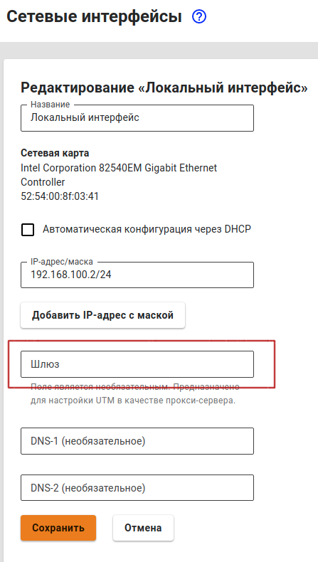
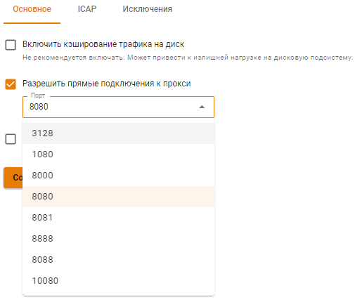

## Настройка прокси с одним интерфейсом

При необходимости можно использовать Ideco NGFW в качестве прокси-сервера с прямыми подключениями клиентов к прокси, с одним интерфейсом. Для этого выполните действия:

1\. При создании локального интерфейса в разделе **Сервисы -> Сетевые интерфейсы** укажите **Шлюз**:

2\. Разрешите прямые подключения к прокси-серверу в разделе **Сервисы -> Прокси**, выбрав нужный порт из списка:

