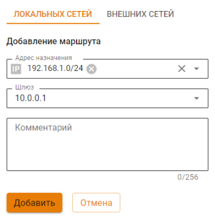
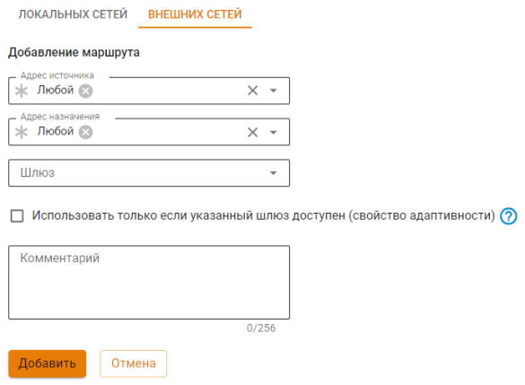
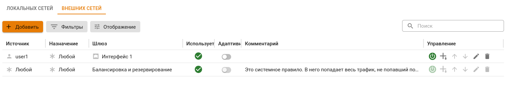
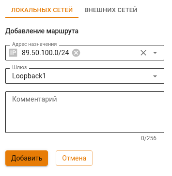
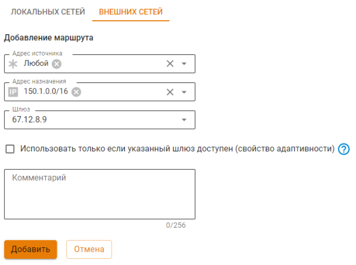
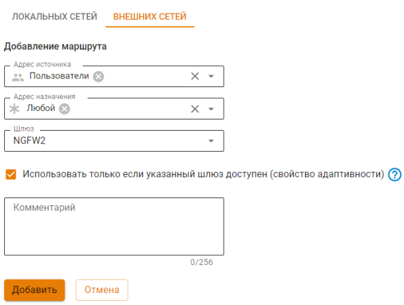

# Маршрутизация



Название службы раздела **Маршрутизация**: `ideco-routing-backend`. \
Список служб для других разделов доступен по [ссылке](../../../ngfw/settings/server-management/terminal/README.md).



Преимущества маршрутизации Ideco NGFW:

* Возможность указывать сеть источника при маршрутизации внешних сетей;
* Функция адаптивности (в случае недоступности шлюза или интерфейса поиск маршрута продолжится по следующим правилам в таблице маршрутизации).



Доступность шлюза проверяется с помощью отправки ARP-запроса на получение MAC-адреса для IP, указанного в качестве шлюза. 



В веб-интерфейсе Ideco NGFW есть возможность маршрутизировать локальные и внешние сети. Создавать и редактировать маршруты можно в разделе **Сервисы -> Маршрутизация**.

Для организации доступа в удаленные сети через роутер в локальной сети читайте статью по [ссылке](../../../ngfw/settings/users/authorization/vpn-connection/features.md).



При маршрутизации локальных и внешних сетей доступны GRE-интерфейсы в качестве шлюза.



**Видеоинструкция по настройке Маршрутизации Ideco NGFW**:
{% embed url="https://rutube.ru/video/53bc798950849f68d1f92ac0600ddf47/

<!-- [Ссылка на видеоинструкцию по маршрутизации Ideco NGFW](https://rutube.ru/video/53bc798950849f68d1f92ac0600ddf47/) -->

## Маршрутизация локальных сетей

Маршрутизация локальных сетей действует внутри локальных сетей. Поэтому при добавлении маршрута отсутствует поле **Адрес источника**. Для добавления нового маршрута перейдите в раздел **Сервисы -> Маршрутизация -> Локальных сетей** и нажмите **Добавить**:

* **Адрес назначения** - выберите объекты, при обращении к которым будет применяться это правило. Возможные типы объектов: IP-адрес, подсеть, домен, список IP-объектов, диапазон IP-адресов;
* **Шлюз** - выберите объект, через который направляется трафик. Возможные типы объектов: IP-адрес, пользователь;
* **Комментарий** - необязательное поле описания маршрута. Значение - не длиннее 128 символов.

При наличии большого количества маршрутов в таблице воспользуйтесь кнопкой **Фильтры**.



При создании IPSec-подключения в разделе **Сервисы -> IPsec** с включенной опцией **Автоматическое создание маршрутов** будут добавляться маршруты до локальных сетей NGFW в таблицу **Маршрутизации локальных сетей**.



## Маршрутизация внешних сетей

Для добавления нового маршрута перейдите в раздел **Сервисы -> Маршрутизация -> Внешних сетей** и нажмите кнопку **Добавить**. На странице откроется форма создания маршрута:

Опишем назначение каждой опции:

* **Адрес источника** - выберите объекты, для которых будет применяться правило. Возможные типы объектов: группы, пользователи, IP-адрес, список IP-адресов, диапазон IP-адресов, подсеть, домен;
* **Адрес назначения** - выберите объекты, при обращении к которым будет применяться правило. Возможные типы объектов: группы, пользователи, IP-адрес, список IP-адресов, диапазон IP-адресов, подсеть, домен;
* **Шлюз** - выберите объект, через который будет направлен трафик. Возможные типы объектов: сетевой интерфейс, IP-адрес;
* **Использовать только если шлюз доступен (адаптивность)** - если свойство включено, то при недоступности шлюза или интерфейса поиск маршрута продолжится по следующим правилам маршрутизации. Если свойство отключено (по умолчанию), то трафик отправляется в выбранный шлюз или интерфейс. Если шлюз недоступен или интерфейс не работает, то трафик будет отброшен (destination unreachable);
* **Комментарий** - необязательное поле описания маршрута. Значение не должно быть длиннее 128 символов.

После сохранения маршрута страница выглядит так:

Кнопки  и  повышают или понижают приоритет правила.

При наличии большого количества маршрутов в таблице воспользуйтесь кнопкой **Фильтры**.

Статусы в столбце **Используется**:

*  - маршрут активен и трафик, попадающий под условия маршрута, будет перенаправлен в указанный Шлюз;
*  - маршрут не активен и трафик, попадающий под условия маршрута, не будет обработан правилом.



Трафик, не попавший под условия правил маршрутизации, или с объектом **Любой** в качестве шлюза, будет отправлен в [Балансировку и резервирование](multiple-simultaneous-connections.md).



#### Примеры популярных маршрутов

При маршрутизации трафика через подключения к провайдеру важно понимать, что чаще всего одного маршрута недостаточно. Понадобится также переопределить адрес с помощью SNAT, иначе такой маршрут не будет работать. SNAT можно настроить с помощью [Файрвола](../../../ngfw/settings/access-rules/firewall.md).

{#top}



На вкладке **Маршрутизация локальных сетей** создайте правило Null route:

Укажите Loopback-интерфейс в качестве шлюза. В этом случае весь входящий на NGFW трафик, предназначенный для подсети `89.50.100.0/24`, будет отбрасываться.



{#top}





{#top}



Если настраивается маршрут в удаленную сеть через дополнительный роутер, расположенный в одной локальной сети с клиентами, то убедитесь, что нет "асимметричной маршрутизации" и роутер вынесен в DMZ. Подробнее в статье [Доступ в удаленные сети через роутер в локальной сети](../../../ngfw/recipes/popular-recipes/access-to-remote-networks.md)



{#top}



Для доступа в интернет пользователям NGFW1 укажите в качестве шлюза IPsec-подключение к NGFW2:



{#top}



Если установка подключения site-to-site до сетей филиала недоступна, в Ideco NGFW можно настроить подключение роутера client-to-site. В этом случае при добавлении маршрута локальных сетей в качестве шлюза используется роутер, который подключается по VPN.

Для настройки подключения выполните действия:

1\. В разделе **Пользователи -> Учетные записи** создайте учетную запись для роутера с разрешенным доступом к VPN.

2\. При добавлении маршрута в разделе **Сервисы -> Маршрутизация -> Локальных сетей** выберите созданного пользователя в поле **Шлюз**:

Сети за роутером станут доступны после установки VPN-подключения через Ideco NGFW.

Информация об особенностях маршрутизации и организации доступа при настроенном VPN-подключении представлена в [статье](../../../ngfw/settings/users/authorization/vpn-connection/features.md).



