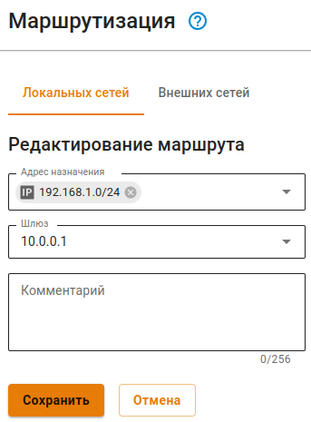

# Маршрутизация



Название службы раздела **Маршрутизация**: `ideco-routing-backend`. \
Список служб для других разделов доступен по [ссылке](../../../ngfw/settings/server-management/terminal.md).



Преимущества маршрутизации Ideco NGFW:

* Возможность указывать сеть источника при маршрутизации внешних сетей;
* Функция адаптивности (в случае недоступности шлюза или интерфейса поиск маршрута продолжится по следующим правилам в таблице маршрутизации).



Доступность шлюза проверяется с помощью ICMP-запросов к набору IP-адресов, который определяется производителем сетевой карты.



В веб-интерфейсе Ideco NGFW есть возможность маршрутизировать локальные и внешние сети. Создавать и редактировать маршруты можно в разделе **Сервисы -> Маршрутизация**.

Для организации доступа в удаленные сети через роутер в локальной сети читайте статью по [ссылке](../../../ngfw/settings/users/authorization/vpn-connection/features.md).

**Видеоинструкция по настройке Маршрутизации Ideco NGFW**:
{% embed url="https://rutube.ru/video/53bc798950849f68d1f92ac0600ddf47/

<!-- [Ссылка на видеоинструкцию по маршрутизации Ideco NGFW](https://rutube.ru/video/53bc798950849f68d1f92ac0600ddf47/) -->

## Маршрутизация локальных сетей

Маршрутизация локальных сетей действует внутри локальных сетей. Поэтому при добавлении маршрута отсутствует поле **Адрес источника**. Для добавления нового маршрута перейдите на вкладку маршрутизации **Локальных сетей** и нажмите **Добавить**:

* **Адрес назначения** - выберите объекты, при обращении к которым будет применяться это правило. Возможные типы объектов: IP-адрес, подсеть;
* **Шлюз** - выберите объект, через который направляется трафик. Возможный тип объекта: IP-адрес
* **Комментарий** - необязательное поле для описания маршрута. Значение - не длиннее 128 символов.

При наличии большого количества маршрутов в таблице воспользуйтесь кнопкой **Фильтры**.



При создании IPSec-подключения в разделе **Сервисы -> IPsec** с включенной опцией **Автоматическое создание маршрутов** будут добавляться маршруты до локальных сетей NGFW в таблицу **Маршрутизации локальных сетей**.



## Маршрутизация внешних сетей

Для добавления нового маршрута перейдите на вкладку маршрутизации **Внешних сетей** и нажмите кнопку **Добавить**. На странице откроется форма создания маршрута:

Опишем назначение каждой опции:

* **Адрес источника** - выберите объекты, для которых будет применяться правило. Возможные типы объектов: группы, пользователи, IP-адрес, домен, диапазон IP-адресов, подсеть, список адресов;
* **Адрес назначения** - выберите объекты, при обращении к которым будет применяться правило. Возможные типы объектов: группы, пользователи, IP-адрес, домен, диапазон IP-адресов, подсеть, список адресов;
* **Шлюз** - выберите объект, через который будет направлен трафик. Возможный тип объекта: сетевой интерфейс, IP-адрес;
* **Использовать только если шлюз доступен (адаптивность)** - если свойство включено, то при недоступности шлюза или интерфейса поиск маршрута продолжится по следующим правилам маршрутизации, а если свойство отключено (по умолчанию), то трафик отправляется в выбранный шлюз или интерфейс. Если шлюз недоступен или интерфейс не работает, то трафик будет отброшен (destination unreachable);
* **Комментарий** - необязательное поле для описания маршрута. Значение не должно быть длиннее 128 символов.

После сохранения маршрута страница выглядит так:

Кнопки  и  повышают или понижают приоритет правила.

При наличии большого количества маршрутов в таблице воспользуйтесь кнопкой **Фильтры**.

Статусы в столбце **Используется**:

*  - маршрут активен и трафик, попадающий под условия маршрута, будет перенаправлен в указанный Шлюз;
*  - маршрут не активен и трафик, попадающий под условия маршрута, не будет обработан правилом.



Трафик, не попавший под условия правил маршрутизации, или с объектом **Любой** в качестве шлюза, будет отправлен в [Балансировку и резервирование](multiple-simultaneous-connections.md).



#### Примеры популярных маршрутов

При маршрутизации трафика через подключения к провайдеру важно понимать, что чаще всего одного маршрута недостаточно, понадобится также переопределить адрес с помощью SNAT, иначе такой маршрут просто не будет работать. SNAT можно настроить с помощью [файрвола](../../../ngfw/settings/access-rules/firewall.md).

{#top}





{#top}



Если настраивается маршрут в удаленную сеть через дополнительный роутер, расположенный в одной локальной сети с клиентами, то убедитесь, что нет "асимметричной маршрутизации" и роутер вынесен в DMZ. Подробнее в статье [Доступ в удаленные сети через роутер в локальной сети](../../../ngfw/recipes/popular-recipes/access-to-remote-networks.md)



{#top}



Для доступа в интернет пользователям NGFW1 укажите в качестве шлюза IPsec-подключение к NGFW2:



