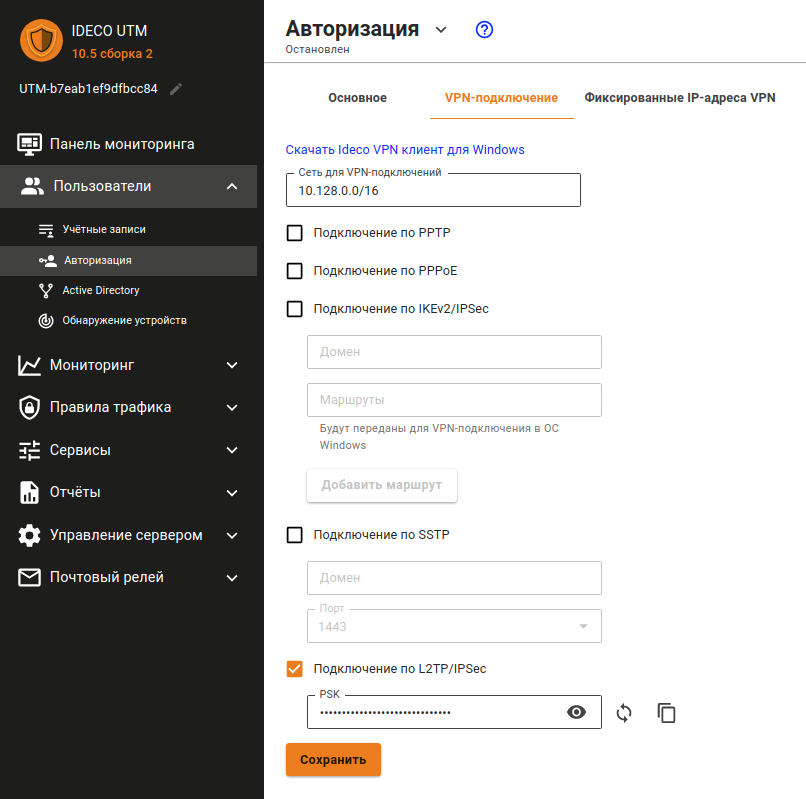

# Подключение пользователей



Настройки для подключения пользователей \(client-to-site VPN\) описаны в статье [Подключение по VPN L2TP-IPSec](../../client-to-site/l2tp-ipsec.md).



## Разрешить подключение удалённых пользователей по протоколу L2TP/IPsec

1\. Перейдите в раздел **Пользователи -&gt; Авторизация -&gt; VPN-подключение**.

2\. Отметьте чекбокс **Подключение по L2TP/IPSec**. Снятие флаг отключает всех подключенных по L2TP/IPsec пользователей и делает их подключение невозможным.

3\. Смените PSK по умолчанию. Pre-shared key - это строка, которую необходимо будет ввести в настройках подключения по L2TP/IPsec на конечных устройствах.



При смене Pre-shared key все подключённые удалённо пользователи будут отключены. Для восстановления возможности подключения – укажите новый PSK на удаленных пользовательских устройствах.



