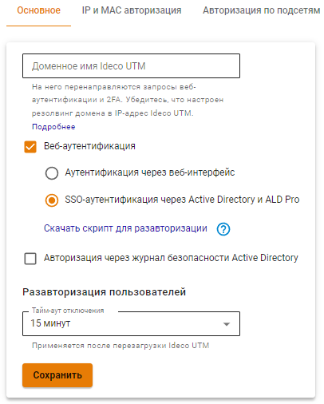
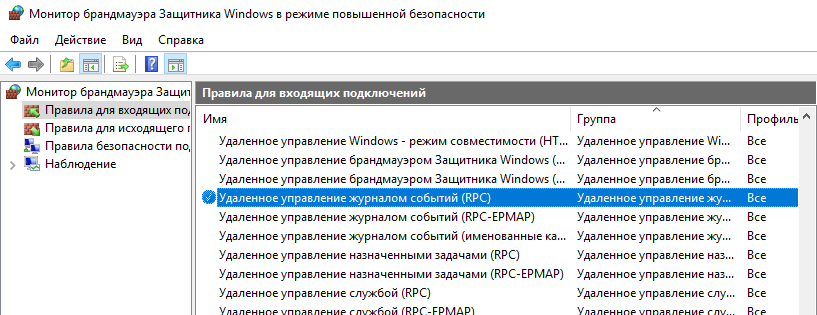
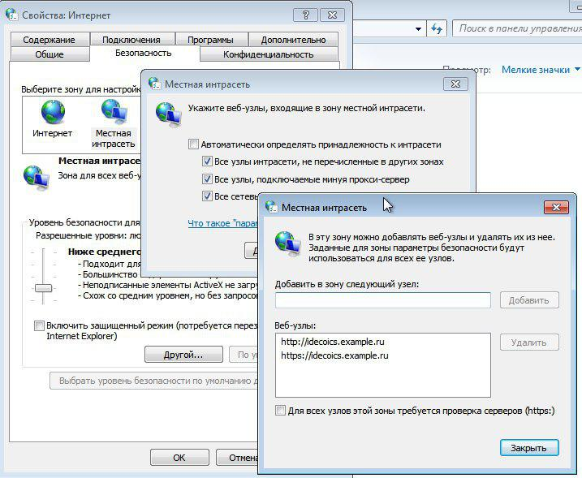
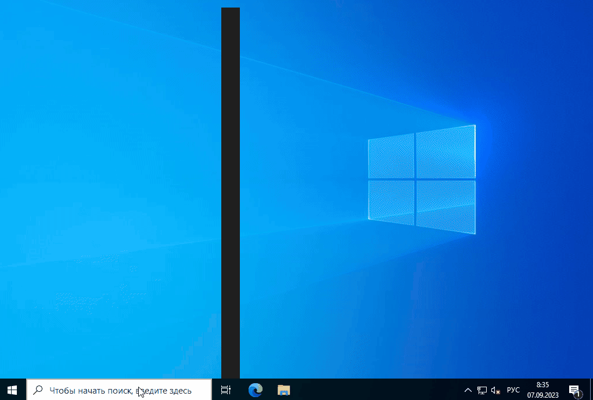

# Авторизация пользователей Active Directory



Импортируйте учетные записи из Active Directory, подробнее в статье [Импорт пользователей](user-import.md).





Cинхронизация с Active Directory(AD) приостанавливается, если локальные пользователи Ideco UTM находятся в группах AD. \
Для возобновления синхронизации вынесите локальных пользователей из групп AD. Автоматическая синхронизация произойдет через 15 минут.



## Настройка авторизации пользователей

Для пользователей, импортированных из AD, доступны все типы авторизации. Наиболее часто используемые варианты авторизации:
* [X] Через веб-браузер при использовании Kerberos или NTLM (SSO аутентификация через AD);
* [X] Через журнал безопасности AD.



Рекомендуется одновременное использование обоих типов авторизации





Если на контроллере домена отключить пользователя, который уже импортирован в AD, то после включения ему присвоится новый ID и ранее настроенные правила фильтрации перестанут работать.



## Настройка Ideco UTM

Для включения **SSO аутентификации** и **Авторизации через журнал безопасности Active Directory** перейдите на вкладку **Пользователи -> Авторизация -> Основное** и включите эти типы авторизации. Нажмите кнопку **Сохранить**.



После заполнения поля *Имя домена* и сохранения настроек будет выдан Let’s Encrypt сертификат, и пользователь будет перенаправляться на окно авторизации, минуя страницу исключения безопасности:

Если сертификат для такого домена уже загружен в разделе [Сертификаты](../../services/certificates/README.md), то будет использоваться загруженный сертификат, новый сертификат выдаваться не будет.



## Настройка компьютеров пользователей и политик домена
### Авторизация через журнал безопасности Active Directory



Поддерживается с версии контроллера домена 2008 standard edition.



При авторизации через журнал безопасности контроллера домена AD пользователи будут аутентифицированы при попытке выхода в интернет. Автоматической аутентификации без прохождения трафика через NGFW не происходит, т. к. используется конкурентная политика аутентификации.



Особенности работы авторизации через журнал безопасности Active Directory:

* При включении (перезагрузке) компьютера в домене AD происходит автоматическая аутентификация под последним аутентифицированным пользователем.
* При смене пользователя компьютера в домене AD служба аутентификации `ideco-auth-backend` не будет аутентифицировать нового пользователя. Для аутентификациии пользователя перезагрузите службу `ideco-auth-backend`.

Используйте Ideco Client совместно с SSO-аутентификацией на Ideco NGFW.



Для работы авторизации через журнал безопасности выполните настройку на основном контроллере домена:

1. В настройках брандмауэра Windows на всех контроллерах домена (или доменов) разрешите **удаленное управление журналом событий (Remote Event Log Management)**

2. Добавьте Ideco UTM в группу безопасности **Читатели журнала событий (Event Log Readers)**.

3. После настройки доступа к журналу перезапустите службу **Авторизация через журнал безопасности Active Directory** на Ideco UTM. Отключите эту настройку и заново включите;

При изменении стандартной политики безопасности контроллеров домена выполните действия:

**Англоязычная версия:**

**Русскоязычная версия:**



Для обновления политик контроллеров доменов выполните `gpupdate /force`;\
Если авторизация пользователей при логине не происходит, нужно проверить в журнале безопасности наличие событий 4768, 4769, 4624.



### Веб-аутентификация (SSO или NTLM)

Для работы аутентификации через веб-браузер (с использованием Kerberos или NTLM) настройте Internet Explorer (остальные браузеры подхватят его настройки).\



Обязательно используйте эти настройки, т.к в некоторых случаях будет необходима аутентификация пользователей через браузер (даже при авторизации через журнал безопасности).



Для настройки аутентификации через веб-браузер, выполните следующие действия:

1. Зайдите в свойства браузера на вкладку **Безопасность**.
2. Выберите **Местная интрасеть -> Сайты -> Дополнительно**.
3. Добавьте в открывшемся окне ссылку на Ideco UTM под тем именем, под которым ввели его в домен. Нужно указывать два URL: c `http://` и с `https://`.

Пример введения Ideco UTM в домен `example.ru` под именем `idecoics`.

Для применения настройки ко всем пользователям AD выполните действия:

1.  В групповых политиках для пользователей перейдите по пути:
{#top}



**Edit group policy -> Computer Configuration -> Administrative Templates -> Windows Components -> Internet Explorer -> Internet Control Panel -> Security Page -> Site to Zone Assignment List**



{#top}



**Изменение локальной групповой политики -> Политика "Локальный компьютер" -> Административные шаблоны -> Компоненты Windows -> Internet Explorer -> Панель управления браузером -> Вкладка безопасность -> Список назначений зоны для веб-сайтов**



1. Введите назначение зоны для DNS-имени Ideco UTM (в примере idecoics.example.ru) со значением равным 1 (интрасеть). Укажите два назначения для схем работы по http и https.



При входе на HTTPS-сайт необходимо разрешить браузеру доверять сертификату Ideco UTM. Чтобы не делать это каждый раз, можно добавить корневой сертификат Ideco UTM в доверенные корневые сертификаты устройства.



На странице настроек браузера **Mozilla Firefox** (about:config в адресной строке) настройте следующие параметры:

* **network.automatic-ntlm-auth.trusted-uris** и **network.negotiate-auth.trusted-uris** добавьте адрес локального интерфейса Ideco UTM (например `idecoUTM.example.ru`);
* **security.enterprise\_roots.enabled** в значении `true` позволит Firefox доверять системным сертификатом и авторизовать пользователей при переходе на HTTPS-сайты.

Также для пользователей, импортированных через AD, возможны следующие способы аутентификации:

* **Через Ideco Agent** - подходит для аутентификации пользователей терминальных серверов (с использованием Remote Desktop IP Virtualization на терминальном сервере);
* **Авторизация по IP-адресу** - подходит для пользователей с фиксированным IP-адресом. IP-адреса на UTM необходимо прописать вручную каждому пользователю;
* **Авторизация по VPN** - подходит для авторизации пользователей удаленных сетей.

## Настройка аутентификации пользователей при прямых подключениях к прокси-серверу

Настройка прозрачной аутентификации пользователей при прямых подключениях к прокси-серверу аналогична настройке прозрачной **SSO** аутентификации.\
Единственная особенность - указание в качестве адреса прокси-сервера **DNS-имени Ideco UTM**.

{#top}



Для аутентификации компьютеров, которые **не находятся в домене Active Directory**, под доменным пользовательским аккаунтом на странице настроек браузера **Mozilla Firefox** (about:config в адресной строке) укажите следующие параметры:

* **network.automatic-ntlm-auth.allow-proxies** = false;
* **network.negotiate-auth.allow-proxies** = false.

Не отключайте данные опции для компьютеров, входящих в домен Active Directory, т.к. в таком случае будет использоваться устаревший метод авторизации по NTLM.



{#top}



Если в Internet Explorer появляется окно с текстом **Для получения доступа требуется аутентификация**, и аутентификация происходит только при ручном переходе по ссылке. Установите параметр **Активные сценарии** в Internet Explorer в значение **Включить**.

Доменному пользователю должно быть разрешено аутентифицироваться на Ideco UTM. На контроллере домена зайдите в свойства выбранных пользователей во вкладку **Учетная запись** -> **Вход на...**, выберите пункт **только на указанные компьютеры** и пропишите имя рабочей станции для входа в систему.

Пример данной настройки представлен на скриншоте ниже:

При аутентификации через журнал безопасности контроллера домена AD пользователи будут аутентифицированы при попытке выхода в Интернет. Автоматической аутентификации без прохождения трафика через UTM не происходит, т.к. используется конкурентная политика аутентификации.



