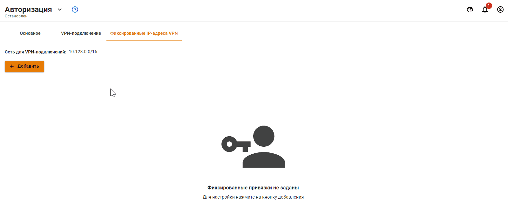

# Авторизация по PPPoE

Авторизация по протоколу PPPoE предполагает авторизацию по защищенному сетевому туннелю между сетевым устройством пользователя и сервером Ideco UTM. Аутентификация пользователя осуществляется по связке Логин/Пароль. При данном типе авторизации не требуется назначение IP-адреса рабочей станции, так как IP-адрес будет автоматически назначен в случае успешной аутентификации и создания защищенного сетевого туннеля.

Для настройки авторизации по протоколу PPPoE необходимо выполнить следующие действия:

1. Перейдите в раздел **Пользователи -> Авторизация**.
2. Откройте вкладку **VPN-авторизация**.
3. Установите флажок у пункта **Авторизация PPPoE** и нажмите кнопку **Сохранить**.

Редактирование логина и пароля возможно на вкладке **Пользователи -> Учетные записи** при выделении нужного пользователя.

IP-адрес пользователю назначается автоматически из пула адресов для VPN, настраиваемого в разделе **Пользователи -> Авторизация -> VPN-авторизация** (например 10.128.0.0/16).

Чтобы настроить **статическую** привязку адресов выдаваемых по VPN определенным пользователям, необходимо перейти в раздел **Пользователи -> Авторизация -> Фиксированные IP-адреса VPN**, нажать иконку  и указать нужного пользователя и IP-адрес. Пример настройки фиксированного IP-адреса VPN представлен ниже:



Авторизация по PPPoE возможна только в одном ethernet-сегменте с локальными интерфейсами Ideco UTM.



