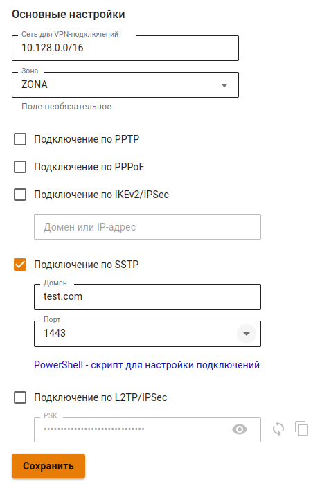

# Подключение по SSTP



По возможности не используйте этот тип подключения. Этот способ подключения лучше других проходит через NAT, но при нестабильном качестве связи работает значительно хуже, чем другие VPN (особенно при передаче звука/видео), так как инкапсулирует все данные внутри TCP. Рекомендуется использовать IPsec-IKEv2 вместо SSTP.

NGFW не поддерживает подключение MikroTik по SSTP, так как MikroTik использует устаревший и небезопасный алгоритм SHA-1.



## Настройка Ideco NGFW



Запрещено использовать домен `.local`. Подключение по SSTP поддерживается только из внешних сетей.



1\. Для включения авторизации по SSTP установите флаг **Подключение SSTP** в веб-интерфейсе в разделе **Пользователи -> VPN-подключение -> Основное**.

2\. Подключение возможно только по DNS-имени, поэтому IP-адрес внешнего интерфейса Ideco NGFW должен резолвиться в одно из имен вашей внешней доменной зоны. В поле **Домен** необходимо указать данное DNS-имя (используйте реальное имя с правильной А-записью, т. к. оно необходимо для выписки сертификата Let’s Encrypt).

3\. **Порт** - выберите предлагаемый порт (из вариантов: 1443, 2443, 3443, 4443):



Инструкции по настройке VPN-подключений на разных ОС, доступны по [ссылке](../../../../../ngfw/recipes/popular-recipes/vpn/README.md).





Не рекомендуем использовать для VPN-подключений кириллические логины.



### Если VPN-соединение установлено, но не получается получить доступ к ресурсам локальной сети

Выполните рекомендации статьи [Особенности маршрутизации и организации доступа](features.md).
