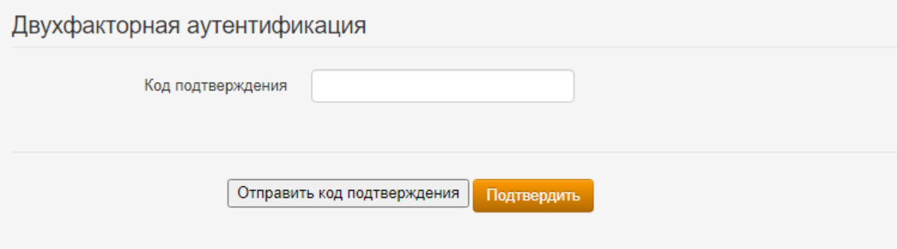

# Двухфакторная аутентификация



Название службы раздела **Двухфакторная аутентификация**: `ideco-web-authd`.\
Список служб для других разделов доступен по [ссылке](../../../../../ngfw/settings/server-management/terminal.md).





При отключении типа аутентификации, который используется в таблице **Доступ по VPN**, будет выведено предупреждение **Используется для доступа по VPN**. При этом аутентификация пройдет без второго фактора.



**В Ideco NGFW реализовано три типа двухфакторной аутентификации:**

* [x] **TOTP-токен** - аутентификация осуществляется сканированием QR-кода или с помощью токена;
* [x] **SMS Aero** - аутентификация при помощи ввода кода из SMS;
* [x] **Мультифактор** - аутентификация происходит путем подтверждения личности в приложении.



Для двухфакторной аутентификации SMS Aero и Мультифактор требуется указать номер телефона в карточке пользователя. С версии 17.4 и выше при использовании Мультифактора указывать номер телефона не обязательно.

Для корректной работы двухфакторной аутентификации с использованием TOTP-токена необходимо, чтобы совпадало время на Ideco NGFW и устройстве пользователя с приложением для второго фактора.





Двухфакторная аутентификация не работает для пользователей RADIUS-сервера.

При добавлении прав доступа по VPN для группы пользователей RADIUS-сервера появится предупреждение, что для этой группы пользователей двухфакторная аутентификация отключена.



## Настройки Ideco NGFW c разными типами аутентификации

Для работы двухфакторной аутентификации выполните действия:

1\. Укажите домен в Ideco NGFW для перенаправления запроса двухфакторной аутентификации с IP-адреса Ideco NGFW:

* Перейдите в раздел **Пользователи -> Авторизация**;
* Включите веб-аутентификацию;
* Введите домен в поле **Доменное имя Ideco NGFW**.

2\. Настройте VPN-подключение в разделе **Пользователи -> VPN-подключения -> Основное**, воспользовавшись [инструкцией](../../../../../ngfw/settings/users/authorization/vpn-connection/README.md).

3\. Перейдите в раздел **Пользователи -> VPN-подключения -> Двухфакторная аутентификация**. Включите необходимые типы аутентификации и заполните соответствующие поля:

{#top}



**Видеоинструкция по настройке двухфакторной аутентификации Ideco NGFW c использованием TOTP-токена**:

{% embed url="https://rutube.ru/video/151a2179c4649bd0fb2349d64841c6f1/

<!-- [Ссылка на видеоинструкцию настройке двухфакторной аутентификации Ideco NGFW c использованием TOTP-токена](https://rutube.ru/video/151a2179c4649bd0fb2349d64841c6f1/) -->

Флаг **Разрешить инициализацию секретного ключа из внешних сетей** разрешит генерацию QR-кода в личном кабинете пользователя из внешней сети.



{#top}



**Видеоинструкция по настройке двухфакторной аутентификации Ideco NGFW c использованием SMS Aero**:

{% embed url="https://rutube.ru/video/a756ffc91fc7c0d8cebcbac83df0b9fc/

<!-- [Ссылка на видеоинструкцию настройке двухфакторной аутентификации Ideco NGFW c использованием SMSAero](https://rutube.ru/video/a756ffc91fc7c0d8cebcbac83df0b9fc/) -->

1\. Зарегистрируйтесь в [личном кабинете](https://smsaero.ru/) SMS Aero.

2\. Введите E-mail и API-ключ от [личного кабинета](https://smsaero.ru/) SMS Aero. API-ключ можно найти в разделе **Настройки -> API и SMPPI**.

3\. Нажмите **Сохранить**.



{#top}



**Видеоинструкция по настройке двухфакторной аутентификации Ideco NGFW c использованием Мультифактора**:

{% embed url="https://rutube.ru/video/181dc7eed9cf30b3088b22ff591ebe59/

<!-- [Ссылка на видеоинструкцию настройке двухфакторной аутентификации Ideco NGFW c использованием Мультифактора](https://rutube.ru/video/181dc7eed9cf30b3088b22ff591ebe59/)-->

Помимо приложения Multifactor для аутентификации можно использовать Telegram, Яндекс.Ключ, Биометрию и U2F. Подробное описание регистрации и аутентификации этими методами доступно в [документации Multifactor](https://multifactor.ru/docs/methods/).

1\. Зарегистрируйтесь в [системе управления Мультифактором](https://admin.multifactor.ru/account/login), установите приложение [Multifactor](https://play.google.com/store/apps/details?id=ru.multifactor.app) и активируйте его, отсканировав QR-код.

2\. Заполните **API Key** и **API Secret**. Для этого скопируйте значение полей в личном кабинете пользователя Multifactor в разделе **Настройки -> Расширенное API -> Включить API**.

3\. Нажмите **Сохранить**.

Для дальнейшей аутентификации пользователям потребуется установить и настроить приложения, указанные администратором в настройках группы. Корректировать способы аутентификации для пользователей можно в личном кабинете Multifactor, в разделе **Группы -> Параметры -> Редактировать**.



4\. Разрешите доступ по VPN нужным группам пользователей в таблице **Доступ по VPN**, воспользовавшись [инструкцией](../../../../../ngfw/settings/users/authorization/vpn-connection/README.md).

## Настройка аутентификации на пользовательских устройствах

Для настройки определенного типа аутентификации на устройстве пользователя воспользуйтесь инструкциями ниже:

{#top}



1\. Настройте VPN-подключение на устройстве пользователя, воспользовавшись [инструкцией](../../../../../ngfw/recipes/popular-recipes/vpn/README.md).

2\. Войдите в личный кабинет NGFW, указав логин и пароль пользователя.

3\. Нажмите кнопку **Настроить двухфакторную аутентификацию** и выберите **Сгенерировать QR-код**:

4\. Войдите в приложение для аутентификации (Яндекс Ключ, Google Authenticator или Microsoft Authenticator и т.п.), отсканируйте код или введите секретный ключ, который находится под QR-кодом. При вводе ключа выберите тип ключа **По времени**. Если выбрать тип **По счетчику**, то пользователь не сможет пройти аутентификацию. Убедитесь, что время на устройстве пользователя с приложением и на Ideco NGFW совпадает.

**Если вернуться в личный кабинет, не отсканировав QR-код, то повторно он появится только после сброса секретного ключа в карточке пользователя.**

5\. Подключитесь к VPN и откройте любой сайт, кроме личного кабинета пользователя. В появившемся поле введите код, который вы получили в приложении:

 





Чтобы сбросить секретный ключ TOTP-токена, который сгенерировал пользователь, перейдите в раздел **Пользователи -> Учетные записи**. Выберите нужного пользователя и нажмите **Сбросить секретный ключ**:



{#top}



1\. Настройте VPN-подключение на устройстве пользователя, воспользовавшись [инструкцией](../../../../../ngfw/recipes/popular-recipes/vpn/README.md).

2\. Если требуется, чтобы подключение использовалось только для ресурсов подключаемой сети, убедитесь, что настройки VPN-подключения соответствуют следующим требованиям:

**Для Windows 10**:

* Откройте параметры и перейдите в раздел **Сеть и Интернет -> VPN -> Настройка параметров адаптера**;
* Нажмите правой кнопкой мыши по созданному подключению и выберите **Свойства**;
* Перейдите во вкладку **Сеть**;
* Нажмите на **IP версии 4 (TCP/IPv4) -> Свойства -> Дополнительно**;
* Снимите флаг с пункта **Использовать основной шлюз в удаленной сети**;
* Нажмите **ОК**.

**Для Ubuntu**:

* Перейдите в раздел **Настройки -> Сеть**;
* Откройте настройки VPN-подключения;
* Перейдите во вкладку **IPv4**;
* Установите флаг в пункте **Использовать это подключение для ресурсов этой сети**.

3\. Включите созданное VPN-подключение.

4\. Перейдете в браузер, откроется страница аутентификации:

5\. Нажмите **Отправить код подтверждения**. На номер телефона, указанный в учетной записи, придет SMS с кодом:

* Если номер телефона в карточке пользователя отсутствует, то на странице аутентификации появится предупреждение:

* Если номер телефона сохранен, то на указанный номер телефона поступит SMS. Введите код из SMS и нажмите **Подтвердить**:

* Если код введен неверно, то появится соответствующее предупреждение:

* Если код введен верно, то появится следующее окно:

<mark style="color:red;">Для настройки таймкодов отправки сообщений перейдите в личный кабинет SMS Aero во вкладку</mark> <mark style="color:red;"></mark><mark style="color:red;">**Настройки**</mark> <mark style="color:red;"></mark><mark style="color:red;">и переведите опцию</mark> <mark style="color:red;"></mark><mark style="color:red;">**Исключать множественную отправку**</mark> <mark style="color:red;"></mark><mark style="color:red;">в положение включен. Затем введите лимит и период отправки сообщений:</mark>



{#top}



1\. Настройте VPN-подключение на устройстве пользователя, воспользовавшись [инструкцией](../../../../../ngfw/recipes/popular-recipes/vpn/README.md).

2\. Включите созданное VPN-подключение.

3\. При переходе в браузер откроется страница аутентификации:

4\. После нажатия **Далее** появится страница с предложением установить приложение на устройство пользователя. Если приложение установлено, нажмите **Далее**.

5\. Отсканируйте QR-код или откройте ссылку, которая появится на экране.

6\. Нажмите **Выполнить вход**:

7\. В окне **Двухфакторная аутентификация** выберите способ аутентификации:

8\. В зависимости от выбранного способа подтвердите вход.



