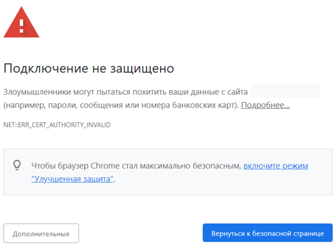

# Веб-аутентификация



Поддерживаемые браузеры:
* Google Chrome, версия >= 76;
* Firefox, версия >= 71;
* Safari, версия >= 13.



Данный тип авторизации предполагает, что запрос неавторизованного пользователя, отправленный через web-браузер, будет переадресован на страницу авторизации Ideco UTM. После успешной авторизации произойдет переход по указанному запросу.

Для этого типа авторизации у пользователя на сетевой карте в качестве шлюза (объединенных в цепочку нескольких шлюзов) или при прямых подключениях к прокси по умолчанию должен быть указан IP-адрес локального сетевого интерфейса Ideco UTM. Также до подключения к Интернету должен работать **DNS-резолвинг адресов**, иначе запрос браузера на адрес *example.com* не будет перенаправлен на шлюз и в браузере не появится запрос логина и пароля.

Проверить разрешение имен в Windows можно командой: `nslookup ya.ru`. Вывод данной команды должен содержать IP-адреса.

Для того чтобы настроить авторизацию через веб-интерфейс, в разделе **Пользователи -> Авторизация** выберите пункты **Веб-аутентификация -> Аутентификация через веб-интерфейс**: 

После заполнения поля **Имя домена** и сохранения настроек, будет выдан Let’s Encrypt сертификат и пользователь будет перенаправляться на окно авторизации, минуя страницу исключения безопасности:

 

Если сертификат для такого домена уже загружен в разделе [Сертификаты](../../services/certificates/README.md), то будет использоваться он, новый сертификат выдаваться не будет.

Далее, попробуйте выйти в Интернет через веб-браузер. Должно появиться окно авторизации, где необходимо ввести логин и пароль от учетной записи пользователя, созданного на Ideco UTM. Окно авторизации представлено на скриншоте ниже:

После прохождения пользователем веб-аутентификации доступ в сеть Интернет будет предоставлен до тех пор, пока авторизация не будет принудительно отменена или прекращена по неактивности пользователя.



При входе на HTTPS-сайт, пользователь должен подтвердить доверие к сертификату Ideco UTM. Либо сертификат должен быть добавлен в доверенные корневые центры сертификации на устройстве (например через политики домена).





Рекомендуется указывать в качестве DNS-сервера на компьютерах и устройствах локальной сети IP-адрес локального интерфейса Ideco UTM.



Подробнее об авторизации пользователей **Active Directory** ([SSO-аутентификация](../active-directory/active-directory-user-authorization.md#veb-avtorizaciya-sso-ili-ntlm)), можно узнать по [ссылке](../active-directory/active-directory-user-authorization.md).
