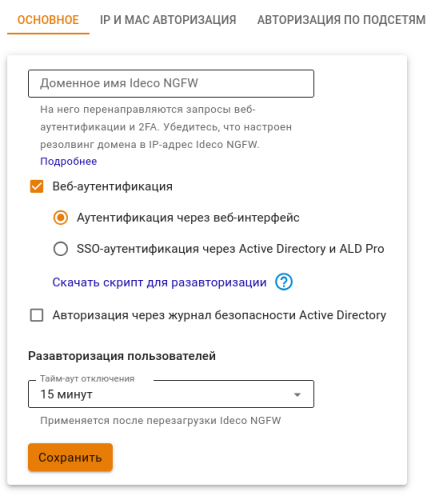

# Веб-аутентификация



Название службы раздела **Веб-аутентификация**: `ideco-web-authd`.\
Список служб для других разделов доступен по [ссылке](../../../../ngfw/settings/server-management/terminal/README.md).





Поддерживаемые браузеры:

* Google Chrome, версия >= 90;
* Firefox, версия >= 78;
* Safari, версия >= 14.



Веб-аутентификация в Ideco NGFW - тип авторизации, который предполагает, что отправленный через веб-браузер запрос неавторизованного пользователя будет переадресован на страницу авторизации Ideco NGFW. Переход по указанному запросу произойдет после успешной авторизации.

Для этого типа авторизации должны быть выполнены условия:
* На сетевой карте у пользователя в качестве шлюза/объединенных в цепочку нескольких шлюзов или при прямых подключениях к прокси по умолчанию указан IP-адрес локального сетевого интерфейса Ideco NGFW;
* До подключения к интернету работает **DNS-резолвинг адресов**. Иначе запрос браузера на адрес _example.com_ не будет перенаправлен на шлюз, и в браузере не появится запрос логина и пароля.

Проверить разрешение имен в Windows можно командой: `nslookup ya.ru`. Вывод данной команды должен содержать IP-адреса.



Рекомендуемые настройки для корректной работы веб-аутентификации:
* При входе на HTTPS-сайт пользователь должен подтвердить доверие к сертификату Ideco NGFW, либо сертификат должен быть добавлен в доверенные корневые центры сертификации на устройстве (например, через политики домена);
* Рекомендуется указывать в качестве DNS-сервера на компьютерах и устройствах локальной сети IP-адрес локального интерфейса Ideco NGFW.



Чтобы настроить авторизацию через веб-интерфейс, выполните действия:

1\. В разделе **Пользователи -> Авторизация** выберите пункты **Веб-аутентификация -> Аутентификация через веб-интерфейс**:

После заполнения поля **Имя домена** и сохранения настроек будет выдан Let’s Encrypt сертификат. Пользователь будет перенаправляться на окно авторизации, минуя страницу исключения безопасности:



Если NGFW не подключен к интернету или доменное имя не соответствует внешнему IP-адресу NGFW, страница авторизации будет подписана корневым сертификатом NGFW.

Если сертификат для такого домена уже загружен в разделе [Сертификаты](../../../../ngfw/settings/services/certificates/), то будет использоваться он, новый сертификат выдаваться не будет.



2\. Откройте веб-браузер с устройства пользователя. Должно появиться окно авторизации, где необходимо ввести логин и пароль от созданной на Ideco NGFW учетной записи пользователя:

После прохождения пользователем веб-аутентификации доступ в интернет будет предоставлен до тех пор, пока авторизация не будет принудительно отменена или прекращена по неактивности пользователя.

Статьи с информацией об опции **SSO-аутентификация через Active Directory и ALD Pro**:

* [Аутентификация пользователей AD/Samba DC](../../../../ngfw/settings/users/active-directory/active-directory-user-authorization.md#veb-avtorizaciya-sso-ili-ntlm);
* [ALD Pro](../../../../ngfw/settings/users/ald-pro.md#autentifikaciya-polzovatelei).
