# Профили устройств

Профили устройств позволяют задать критерии проверки устройств, которые подключаются к NGFW только через [Ideco Client](../../../ngfw/settings/users/ideco-client/README.md). Для других сессий авторизации профили не назначаются.

С помощью HIP-профилей реализуется ZTNA (Zero Trust Network Access) - технология обеспечения безопасного доступа к сети, основанная на принципе *нулевого доверия*. ZTNA позволяет контролировать и аутентифицировать устройства пользователей перед предоставлением доступа к ресурсам сети. 



Если подключенное устройство соответствует какому-либо HIP-профилю, за сессией авторизации закрепляется этот профиль, информация об этом отображается в таблице [Авторизованные пользователи](../../../ngfw/settings/monitor/authorized-users.md).  

Если ни один HIP-профиль в таблице HIP-профилей не совпал с сессией авторизации, то на сессию авторизации назначается специальный HIP-профиль **Устройство без профиля**. Эта информация также отображается в таблице **Авторизованные пользователи**.





- Информация, собираемая Ideco Client
* Версия Windows;
* Наличие установленного пакета обновлений;
* Наличие установленного антивируса;
* Наличие актуальной базы антивируса;
* Дата последней проверки антивируса;
* Версия межсетевого экрана и вендор;
* Информация о процессах, запущенных на устройстве;
* Информация о запущенных службах;
* Информация о ключах реестра;
* Добавление устройства в домен.

- Критерии проверки, доступные на NGFW
* Операционная система;
* Пакет обновлений Windows;
* Антивирус;
* Межсетевой экран;
* Процесс, запущенный на устройстве;
* Запущенная служба Windows;
* Ключ реестра Windows.



HIP-объекты и профили не влияют на правила трафика до момента их использования в правилах **Файрвола**. Чтобы с помощью профилей ограничить или разрешить доступ к ресурсами сети, необходимо:

1\. В разделе **Профили устройств -> HIP-объекты** создать HIP-объекты.

2\. В разделе **Профили устройств -> HIP-профили** сгруппировать созданные в пункте 1 объекты в профили.

3\. В разделе **Правила трафика -> Файрвол -> FORWARD** создать и включить правило с использованием одного или нескольких профилей, созданных в пункте 2.

## HIP-объекты

На вкладке создаются объекты, каждый из которых - совокупность критериев проверки устройства. HIP-объекты используются для создания HIP-профиля.

Для создания HIP-объекта выполните действия:

1\. Перейдите в раздел **Профили устройств -> HIP-объекты** и нажмите **Добавить**.

2\. Введите **Название HIP-объекта** и выберите критерии для проверки:

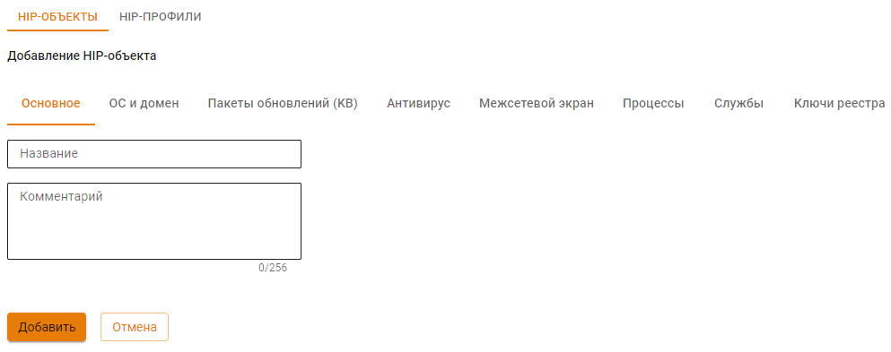

3\. Нажмите **Включить проверку** для проверки выбранного критерия и заполните поля, указав оператор (**Содержит**, **Не содержит**, **Не проверять**):

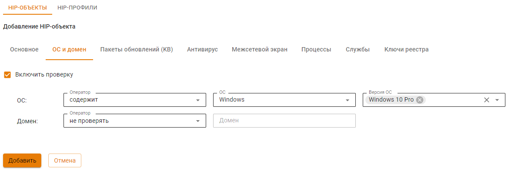

Критерий может не содержать операторов:

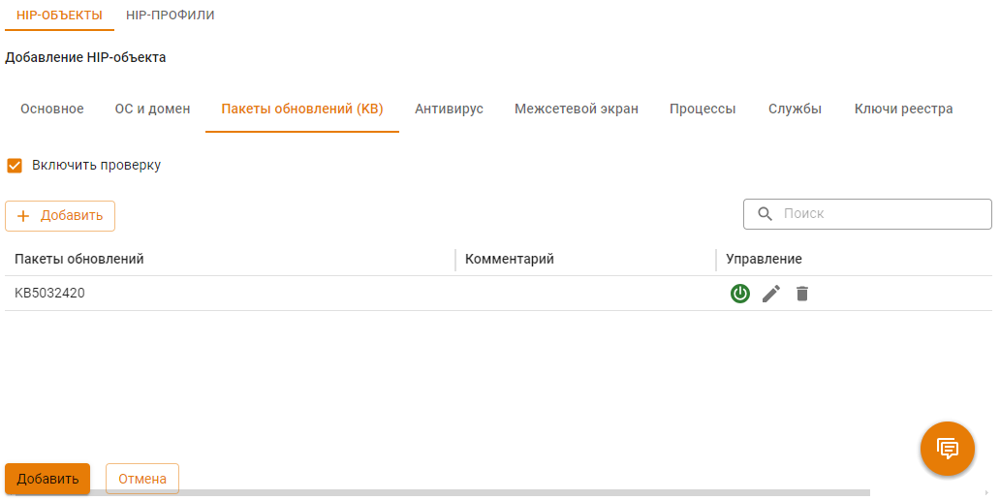

4\. После этого нажмите **Добавить**.



При создании критерия проверки **Ключи реестра** используйте корневые разделы реестра Windows:

* HKEY_LOCAL_MACHINE;
* HKEY_CURRENT_USER;
* HKEY_CLASSES_ROOT;
* HKEY_USERS;
* HKEY_CURRENT_CONFIG.



Каждый из HIP-объектов возвращает логическое значение. Если критерии HIP-объекта выполнены, то объект возвращает положительный результат.

## HIP-профили

На вкладке создаются HIP-профили, каждый из которых - совокупность HIP-объектов, сгруппированных с помощью логических операций **И/ИЛИ**. Если при проверке устройства пользователя логическое выражение HIP-профиля возвращает положительный результат, то этот профиль закрепляется за сессией авторизации этого пользователя и отображается в таблице [Авторизованные пользователи](../../../ngfw/settings/monitor/authorized-users.md). На одну сессию авторизации может быть назначено несколько профилей при совпадении.

Для создания HIP-профиля выполните действия:

1\. Перейдите в раздел **Профили устройств -> HIP-профили** и нажмите **Добавить**.

2\. Введите **Название HIP-профиля**:

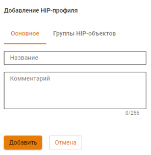

3\. Перейдите на вкладку **Группы HIP-объектов**, нажмите **Добавить группу**:

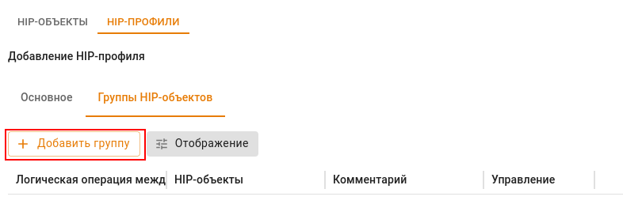

4\. Выберите HIP-объекты, указав логическую операцию между объектами **И/ИЛИ**:

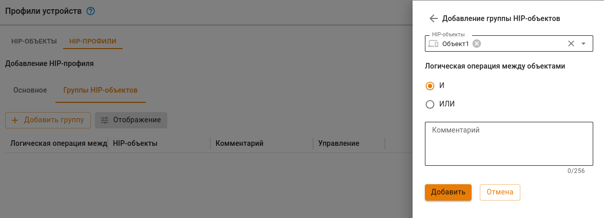

5\. Нажмите **Добавить**.



HIP-профили можно использовать в качестве дополнительного условия в правиле FORWARD **Файрвола**. Правило сработает, если трафик исходит от устройства, которому назначен хотя бы один профиль, указанный в правиле.



## Примеры использования

{#top}



Устройствам, которые не прошли проверку на соответствие ни одному из созданных HIP-профилей, назначается специальный HIP-профиль **Устройство без профиля**. Доступ таких устройств к сети можно ограничить правилом **Файрвола**. Для этого:

1\. Перейдем в раздел **Правила трафика -> Файрвол -> FORWARD**.

2\. Создадим и включим правило вида:

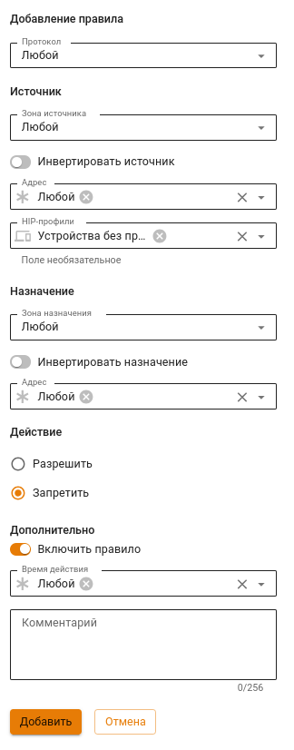

**Важно!**
Если в таблице правил **Файрвола** выше запрещающего правило находится другое правило, которому соответствует трафик одного или нескольких устройств без профиля (например, правило для пользователя или группы пользователей без указания HIP-профиля), то к трафику будет применено правило, расположенное выше в таблице. Например:



{#top}



В качестве примера настроим **Файрвол** так, чтобы пользователи имели доступ к сети, только если их устройства соответствуют HIP-профилю `Profile1`. Для этого:

1\. Перейдите в раздел **Пользователи -> Профили устройств -> HIP-объекты** и создайте требуемые HIP-объекты:

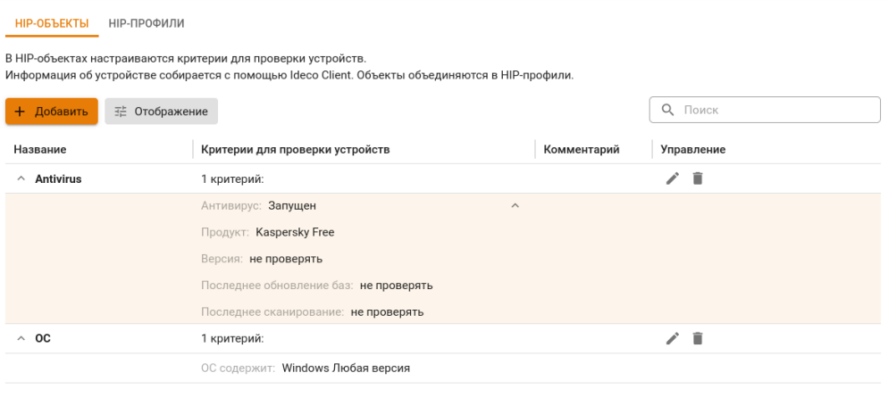

2\. Перейдите на вкладку **HIP-профили** и создайте профиль с созданными ранее HIP-объектами:

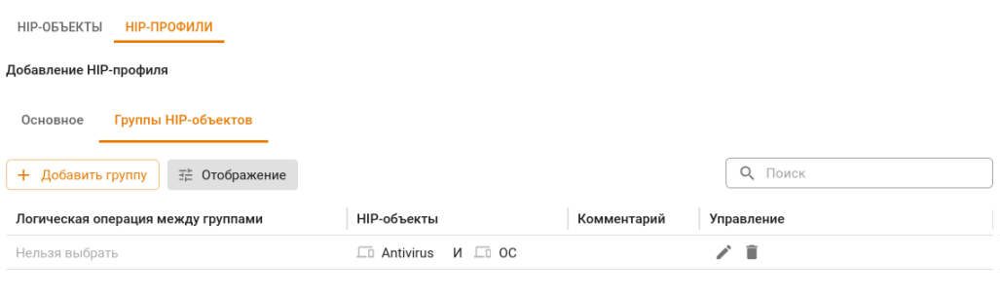

3\. Перейдите в раздел **Правила трафика -> Файрвол -> FORWARD**, создайте и включите правило, разрешающее доступ к сети всем пользователям, чьи устройства соответствуют профилю `Profile1`:

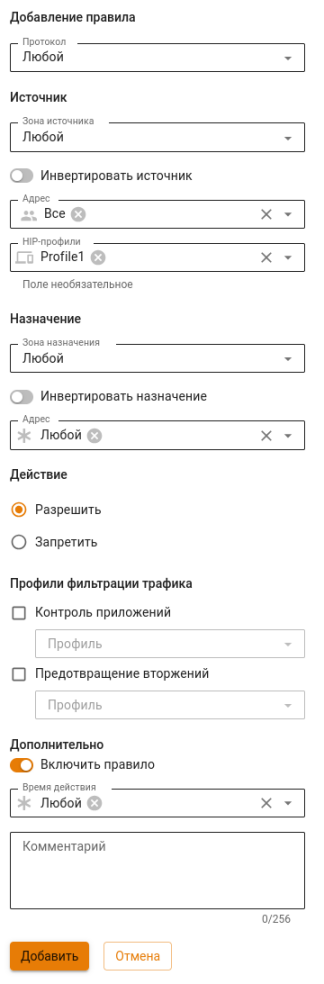

4\. Ниже создайте и включите правило, запрещающее весь трафик:

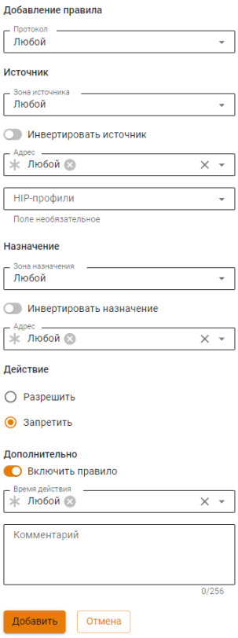

В результате трафик всех пользователей, чьи устройства соответствуют HIP-профилю `Profile1`, подпадет под разрешающее правило. Остальной трафик подпадет под запрещающее правило.



